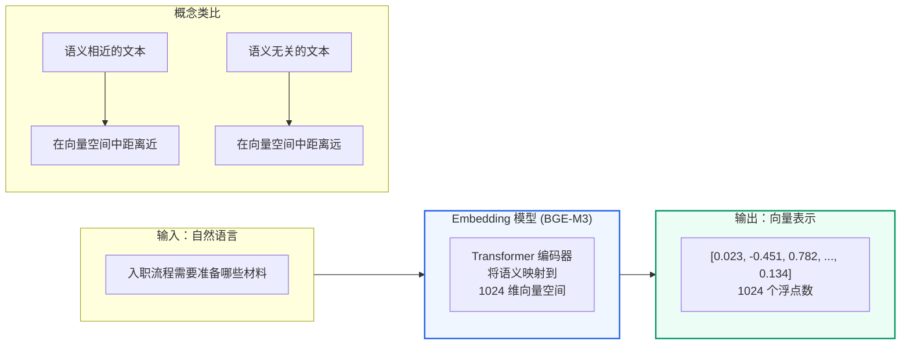
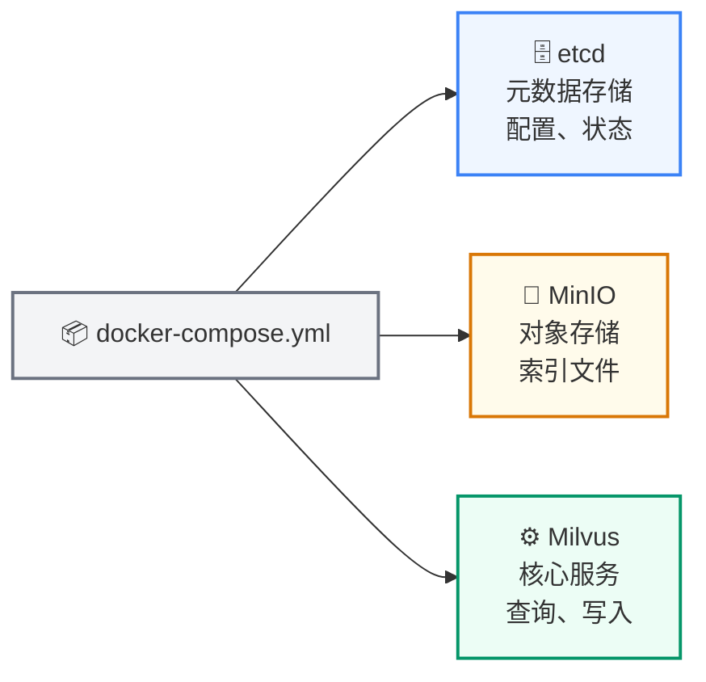
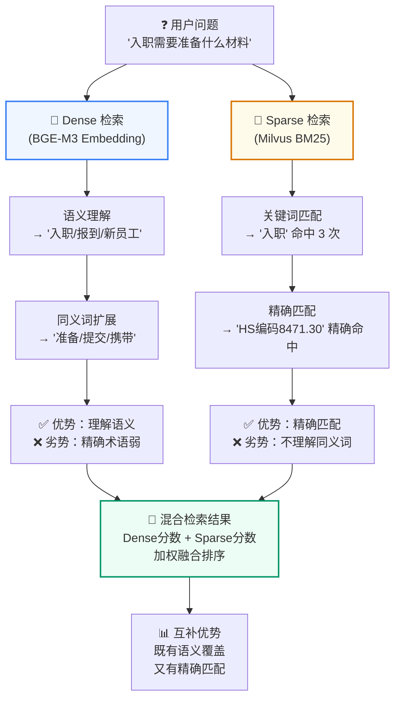
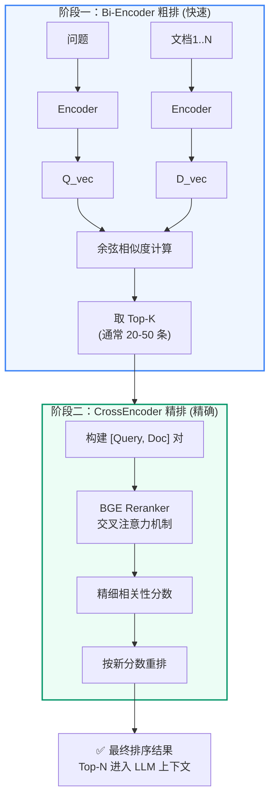
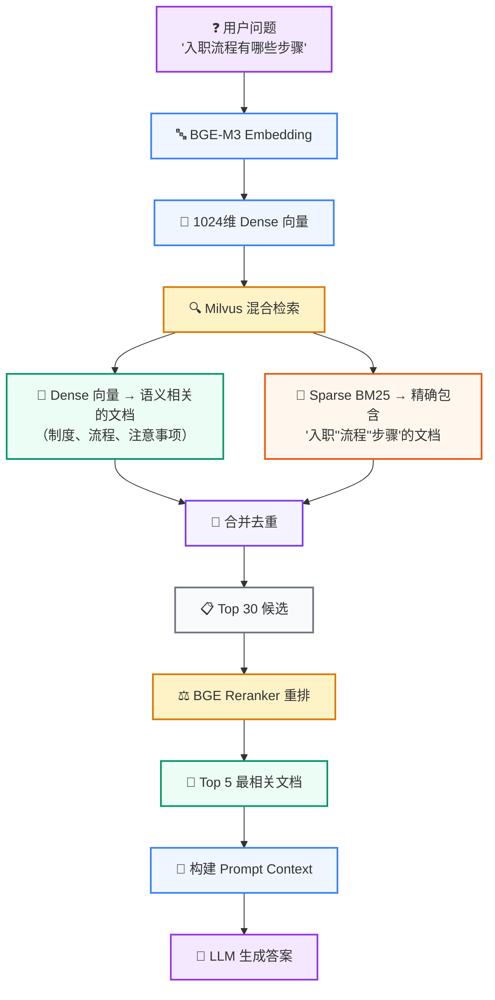

# 第2讲：RAG 核心概念深入

**上一讲**：[项目概述与环境搭建](./01-project-overview.md)  
**下一讲**：[LangChain 生态系统](./03-langchain-ecosystem.md)

## 本讲目标

- 深入理解向量检索的数学原理
- 掌握 Embedding 模型的工作机制
- 理解 Dense 检索和 Sparse 检索的区别与互补
- 了解 Reranker（重排）在 RAG 链路中的作用

---

## 第一部分：前置知识 — Embedding 模型

### 1.1 什么是 Embedding

**Embedding（嵌入）** 是将非结构化数据（文本、图片、音频）转换为固定长度的浮点数向量的技术。



在文本领域，Embedding 模型接收一段文字，输出一串数字（通常是 512 到 4096 维的向量），这个向量在数学空间中代表了这段文字的"语义位置"。

### 1.2 为什么要 Embedding

计算机本质上只能做数值计算。要让计算机"理解"两段文字是否相似，必须先把文字变成它可以计算的数字。

早期方法（如 TF-IDF、Bag-of-Words）只统计词频和共现关系，无法理解语义：
- "我很开心" 和 "我非常高兴" 的词完全不同，但语义相同
- "银行利率很高" 和 "河边的银行很美" 词相同，但语义完全不同

现代 Embedding 模型基于 Transformer 架构，通过大规模预训练学会了理解上下文中的语义。同一个词在不同上下文中会产生不同的向量表示。

### 1.3 向量相似度计算

衡量两个向量有多"近"，常用三种方法：

**余弦相似度 (Cosine Similarity)** — 最常用

$$\text{cosine}(A, B) = \frac{A \cdot B}{||A|| \times ||B||}$$

- 取值范围 [-1, 1]
- 1 表示方向完全一致，0 表示正交（不相关），-1 表示方向相反
- 只看方向不看长度，适合文本语义比较

**欧几里得距离 (Euclidean Distance)** — 适合 L2 归一化后的向量

$$d(A, B) = \sqrt{\sum_{i=1}^{n}(A_i - B_i)^2}$$

**内积 (Inner Product / Dot Product)** — Milvus 默认

$$IP(A, B) = \sum_{i=1}^{n}A_i \times B_i$$

```python
import numpy as np

# 两个语义相近的句子的向量
A = np.array([0.5, 0.3, 0.8, ...])  # "入职需要什么材料"
B = np.array([0.48, 0.32, 0.79, ...])  # "入职要准备哪些文件"

cosine_sim = np.dot(A, B) / (np.linalg.norm(A) * np.linalg.norm(B))
# 结果 ≈ 0.95（很高）

# 两个语义不同的句子的向量
C = np.array([-0.3, 0.7, -0.2, ...])  # "今天天气怎么样"

cosine_sim_ac = np.dot(A, C) / (np.linalg.norm(A) * np.linalg.norm(C))
# 结果 ≈ 0.1（很低）
```

### 1.4 BGE-M3 模型介绍

本项目使用的是 **BGE-M3**（BAAI General Embedding M3），由北京智源研究院（BAAI）开发。

> 📖 **深入学习**：如果你想了解 Embedding 模型的完整工作原理（Tokenization → Transformer → Pooling → 向量输出）、维度选择、模型对比和 L2 归一化，请阅读 [附录G：Embedding 模型深入](./appendix/appendix-g-embedding-models.md)。

**BGE-M3 的核心特点**：

| 特性 | 说明 |
|------|------|
| 多语言 | 支持中英双语及 100+ 语言 |
| 多粒度 | 支持短句到长文档（最多 8192 token）的向量化 |
| 多功能 | 同时支持 Dense 检索、Sparse 检索和 Multi-Vector 检索 |
| 维度 | 默认输出 1024 维 Dense 向量 |
| 部署 | 可在本地 GPU/CPU 上运行，不需要调用外部 API |

在本项目中，BGE-M3 部署在 `models/bge-m3/` 目录下，通过 LangChain 的 Embedding 接口调用：

```python
# qa_core/retrieval/models.py — 获取 Embedding 模型
from langchain_huggingface import HuggingFaceEmbeddings

def get_embeddings():
    return HuggingFaceEmbeddings(
        model_name="models/bge-m3",
        model_kwargs={"device": "cpu"},  # 或 "cuda"
        encode_kwargs={"normalize_embeddings": True},  # L2 归一化
    )
```

---

## 第二部分：前置知识 — 向量数据库

### 2.1 为什么需要专门的向量数据库

初看可能会问：PostgreSQL 不是也有 pgvector 插件吗？为什么还要用 Milvus？

答案是**性能和规模**：

| 对比维度 | pgvector | Milvus |
|---------|----------|--------|
| 百万级向量检索 | 较慢（秒级） | 毫秒级 |
| 索引类型 | IVFFlat, HNSW | HNSW, IVF, DiskANN 等 11 种 |
| 混合检索 | 不支持 | Dense + Sparse 原生混合 |
| 分布式 | 需额外配置 | 原生支持分布式 |
| 过滤表达式 | 基础 | 丰富的标量过滤 |

在本项目中，每个业务场景有数千条 FAQ 和数万个文档 chunk，且需要同时进行 Dense 向量检索和 BM25 关键词检索。Milvus 的 Hybrid Search 在一个查询中同时完成这两种检索，是最合适的选择。

### 2.2 Milvus 核心概念

> **前置知识**：如果你不熟悉 HNSW 图索引原理，请先阅读 [附录C：HNSW 图索引原理](./appendix/appendix-c-hnsw-index.md)。如果你想了解 Milvus 各种索引类型的图解和 pymilvus 基本操作代码，请阅读 [第4讲：Milvus 索引机制与基本操作](./04-milvus-index-and-operations.md)。

**Collection（集合）**：类似关系数据库中的"表"。一个 Collection 存储一组相同结构的数据。

**Field（字段）**：Collection 中的列。包括：
- 主键字段 (Primary Key)
- 向量字段 (Vector Field) — 用于相似度搜索
- 标量字段 (Scalar Field) — 用于过滤（如 source, kb_version）

**Index（索引）**：加速向量检索的数据结构。Milvus 支持多种索引类型：
- HNSW：基于图的索引，适合高召回率场景
- IVF_FLAT：基于聚类的索引，内存占用小
- 本项目使用默认的 HNSW 索引

**Partition（分区）**：Collection 的物理分片，用于提高查询效率。

### 2.3 Milvus 的部署架构



- **etcd**：分布式键值存储，Milvus 用它存储元数据（Collection 定义、索引状态、节点信息）
- **MinIO**：S3 兼容的对象存储，Milvus 用它存储向量索引文件、日志和 binlog
- **Milvus Standalone**：核心引擎，处理向量写入、索引构建和相似度搜索

---

## 第三部分：Dense 检索 vs Sparse 检索

这是本项目最核心的检索概念。让我们用一个具体的例子来理解。



### 3.1 场景设定

假设知识库中有以下文档片段：

| ID | 内容 |
|----|------|
| D1 | "忘记密码时，可以通过绑定的邮箱或手机号自助重置" |
| D2 | "管理员可以在后台重置任何用户的密码" |
| D3 | "Webhook 回调地址配置在系统设置-集成管理页面" |
| D4 | "API 密钥在个人设置-安全页面中生成和管理" |

### 3.2 Dense 检索（语义相似度）

用户提问：**"我怎么修改自己的登录密码"**

Dense 检索使用 Embedding 模型将问题和文档都转成向量，计算余弦相似度：

```
问题向量   vs  D1 向量 → 相似度 0.91  ← 最高！语义非常接近
问题向量   vs  D2 向量 → 相似度 0.72
问题向量   vs  D3 向量 → 相似度 0.15
问题向量   vs  D4 向量 → 相似度 0.22
```

D1 排第一，因为"忘记密码→自助重置"与"修改登录密码"语义高度相关。

**Dense 检索的优势**：
- 理解语义，同义词和改写都能识别
- "重置密码"、"修改密码"、"改密码"、"忘记密码怎么办"等表达都能召回

**Dense 检索的局限**：
- 对专业术语、编号、代码等精确匹配较弱
- 例如搜索"API v3.2 变更"，Dense 检索可能召回所有和 API 相关的文档，难以精确定位到特定版本

### 3.3 Sparse 检索（关键词匹配）

Sparse 检索（本项目使用 BM25 算法）基于词频和逆文档频率，对关键词做精确匹配：

```
问题："API 密钥在个人设置-安全页面中生成和管理"

D4 包含：API(1次), 密钥(1次), 个人设置(1次), 安全页面(1次), 生成(1次), 管理(1次)
→ BM25 分数最高

D3 包含：Webhook(1次), 回调(1次), API(0次), 密钥(0次)
→ BM25 分数较低
```

**Sparse 检索的优势**：
- 精确匹配专业术语、编号（如 "API v3.2"、"HS 编码 8471.30"）
- 对生僻词和专有名词效果极好
- 计算效率高，不需要 GPU

**Sparse 检索的局限**：
- 无法理解语义：搜"修改密码"不会召回"忘记密码怎么办"
- 同义词需要手动维护

### 3.4 Hybrid Search（混合检索）

**混合检索 = Dense + Sparse**，取长补短：

```
问题："HS 编码 8471.30 的进口关税是多少"

Dense 检索贡献：
  → 召回语义相关的文档：关税政策、进口流程、税率表

Sparse 检索贡献：
  → 精确匹配 "8471.30" 的文档：该编码对应的具体税率记录

合并结果 → 既有精确的编码匹配，又有相关的背景信息
```

在本项目中，Milvus 2.6.x 原生支持混合检索，并通过 BM25BuiltInFunction 提供 Sparse 召回能力：

```python
# 一次查询同时走 Dense 向量和 Sparse 向量
results = milvus_store.similarity_search_with_score(
    query,
    k=top_k,
    expr=filter_expression,  # 同时过滤 source、kb_version、tenant 等
)
# Milvus 内部自动融合 Dense 和 Sparse 的分数
```

---

## 第四部分：Reranker（重排器）



### 4.1 为什么需要重排

Embedding 模型的检索是**双塔架构**（Bi-Encoder）：问题和文档分别编码为向量，然后计算相似度。

```
双塔架构（检索阶段）：
  问题 → Encoder → Q_vec ─┐
                            ├→ 余弦相似度 → 分数
  文档 → Encoder → D_vec ─┘

优点：速度快，可以预先计算所有文档的向量
缺点：问题和文档之间没有交叉注意力，精度有限
```

**Reranker 使用 CrossEncoder 架构**（交叉编码器）：将问题和文档拼接后一起编码，通过交叉注意力机制获得更精确的相关性判断。

```
交叉编码器（重排阶段）：
  [问题 + 文档] → CrossEncoder → 相关性分数

优点：精度高，能捕捉细粒度的相关性
缺点：计算量大，不能对所有文档都做（所以只对检索结果的 Top-K 做）
```

### 4.2 Reranker 的工作流程

```python
# qa_core/retrieval/ranking.py — 简化的重排逻辑

def rerank_hits(query, hits, *, reranker, top_n):
    """
    hits: Milvus 召回的候选文档（通常 20-50 个）
    reranker: BGE Reranker Large 模型
    """
    # 构建 [query, document] 对
    pairs = [[query, hit.page_content] for hit in hits]

    # CrossEncoder 逐一打分
    scores = reranker.predict(pairs)

    # 按新分数重新排序
    for hit, score in zip(hits, scores):
        hit.score = float(score)

    return sorted(hits, key=lambda h: h.score, reverse=True)
```

**具体例子**：

```
用户问题："入职时需要提交哪些材料"

Milvus 召回 Top-20：
  1. "入职流程包括提交材料、签订合同..." (dense:0.82, sparse:0.45)
  2. "离职需要提交离职申请表..." (dense:0.78, sparse:0.30)  ← 语义相近但答非所问
  3. "入职当天要携带身份证复印件..." (dense:0.75, sparse:0.55)
  ...

经过 BGE Reranker 重排：
  1. "入职当天要携带身份证复印件、学历证明..." (rerank: 0.94) ↑
  2. "入职流程包括提交材料、签订合同..." (rerank: 0.91) ↓
  3. "离职需要提交离职申请表..." (rerank: 0.15) ↓↓ 被排到后面
  ...
```

Reranker 准确识别出"离职"和"入职"是不同的场景，将相关但错误的文档排到了后面。

### 4.3 BGE Reranker Large

本项目使用 **BGE Reranker Large**（同样是 BAAI 开发），与 BGE-M3 Embedding 模型配合使用：

- 架构：CrossEncoder（XLM-RoBERTa 基座）
- 输入：`[CLS] query [SEP] document [SEP]`
- 输出：0-1 之间的相关性分数
- 部署：本地运行，位于 `models/bge-reranker-large/`

---

## 第五部分：在本项目中的体现

回顾第 1 讲中的核心架构图，现在你应该能理解每个组件的角色：



---

## 重点掌握

| 优先级 | 内容 | 原因 |
|--------|------|------|
| ★★★ 必会 | Embedding 的概念：文本→固定长度浮点数向量，语义相近的文本向量距离近 | 向量检索的基石，面试必问 |
| ★★★ 必会 | Dense 检索（语义相似度）vs Sparse 检索（关键词 BM25）的区别和互补 | 混合检索策略的核心，决定召回质量 |
| ★★★ 必会 | Hybrid Search = Dense + Sparse 取长补短 | 本项目 Milvus 的核心检索方式 |
| ★★★ 必会 | Reranker（CrossEncoder）解决 Bi-Encoder 精度不足的问题：先粗排后精排 | 提升检索精度的关键环节，面试高频 |
| ★★ 理解 | 余弦相似度的取值范围和含义 | 理解向量比较的基础 |
| ★★ 理解 | BGE-M3 的多语言、多粒度、多功能特性 | 了解本项目 Embedding 模型的选择理由 |
| ★★ 理解 | Milvus 核心概念：Collection、Field、Index、Partition | 为第 7 讲 Milvus 深入做铺垫 |
| ★ 了解 | 向量相似度的三种计算方式（余弦/欧氏/内积）的公式 | 面试可能问到，但项目中使用默认内积 |
| ★ 了解 | pgvector vs Milvus 的对比 | 了解选型理由即可 |

## 本讲小结

- Embedding 模型将文本转换为语义向量，语义相近的文本在向量空间中距离也近
- BGE-M3 是本项目使用的多语言 Embedding 模型，支持 Dense + Sparse 双向量输出
- Milvus 向量数据库不同于传统数据库，专为十亿级向量的高效相似度搜索设计
- Dense 检索（语义）和 Sparse 检索（关键词）各有所长，混合检索取长补短
- Reranker（CrossEncoder）对检索结果做精排，将问题和文档联合编码获得更精确的相关性
- 完整的检索链路是：Embedding → 混合检索 → 去重 → Reranker → 上下文筛选

**下一讲**：[LangChain 生态系统](./03-langchain-ecosystem.md) — Runnable/LCEL、ChatOpenAI、Message 类型、VectorStore
