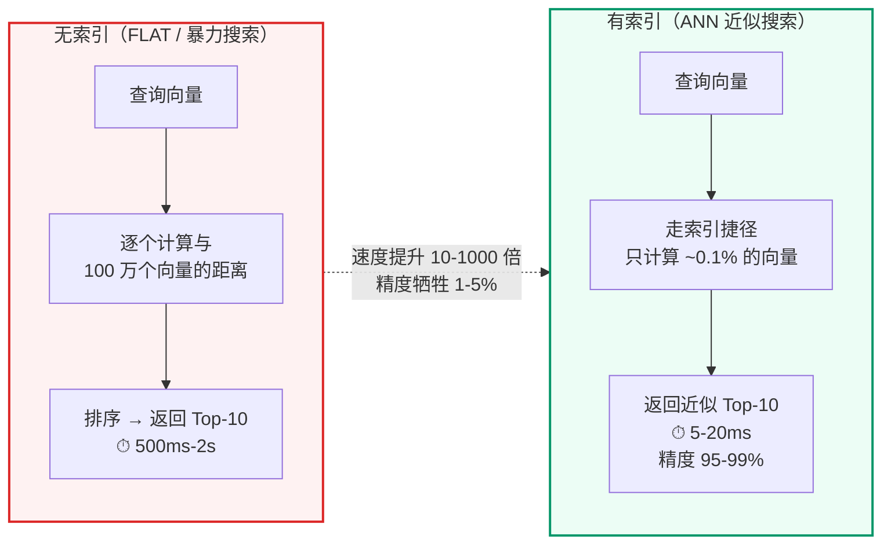
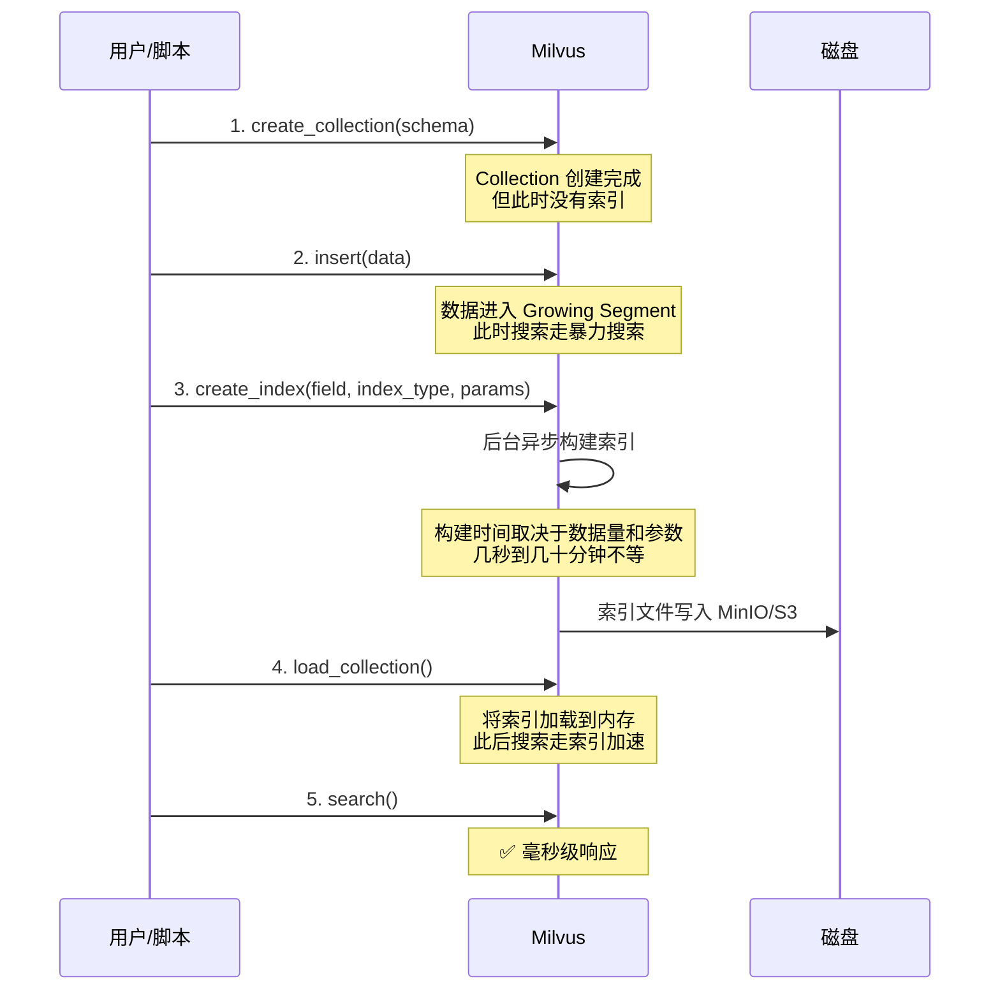
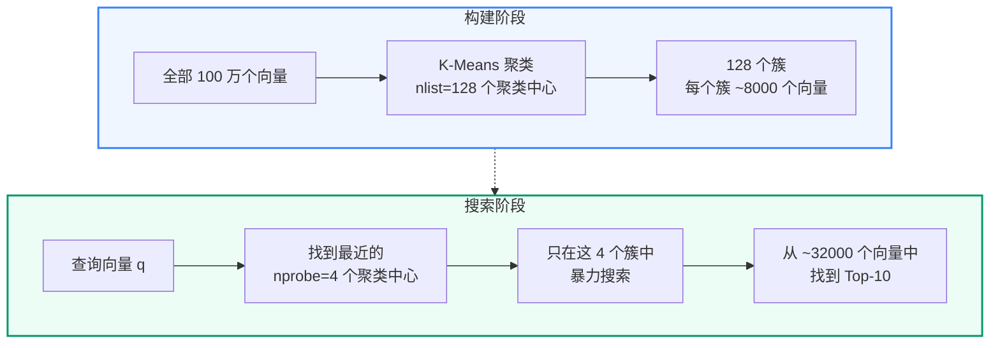
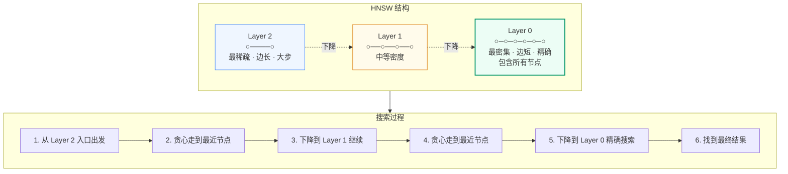
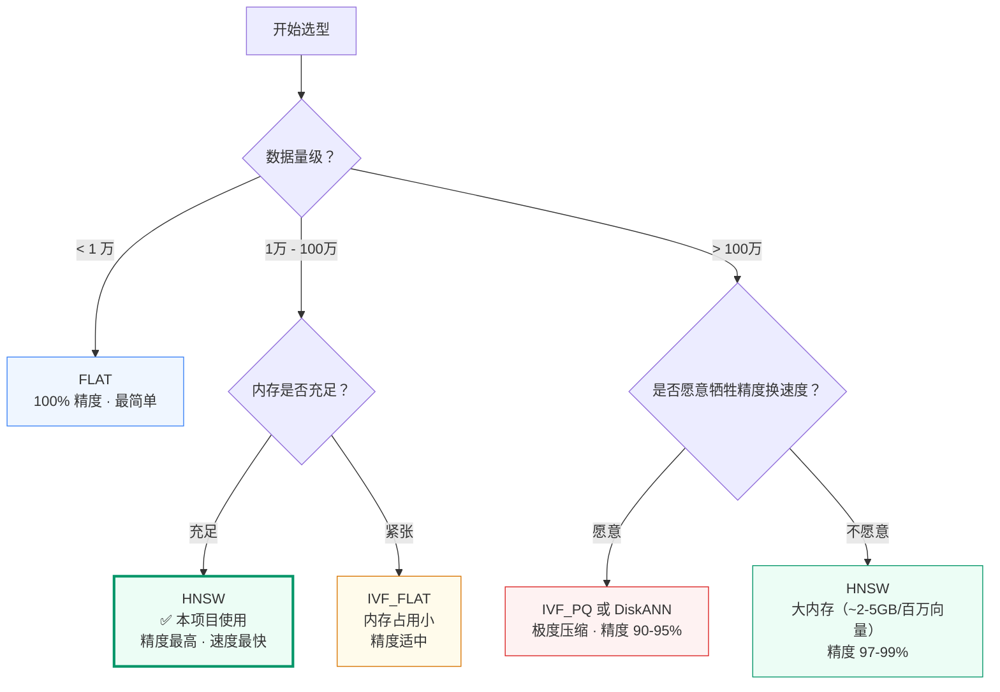
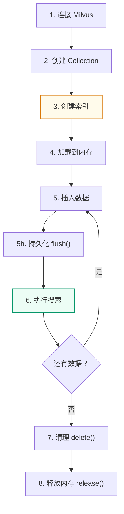
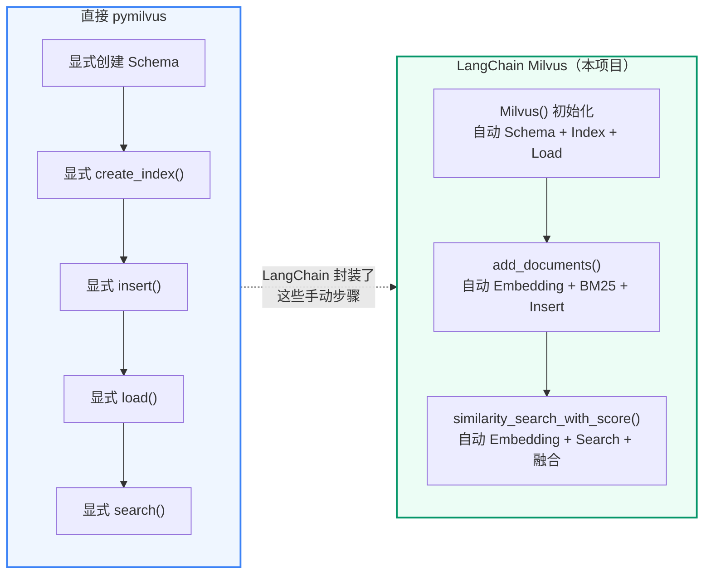

# 第4讲：Milvus 索引机制与基本操作

**上一讲**：[LangChain 生态系统](./03-langchain-ecosystem.md)  
**下一讲**：[意图分类](./05-intent-classification.md)

## 本讲目标

- 理解向量索引的本质：用空间和构建时间换查询速度
- 掌握四种主流索引类型（FLAT / IVF_FLAT / IVF_PQ/SQ8 / HNSW）的工作原理和适用场景
- 能用 pymilvus 完成 Collection 创建、索引构建、数据插入、搜索的完整流程
- 理解 LangChain 在底层帮我们自动完成了哪些操作
- 了解索引构建的性能影响和选型决策

---

## 第一部分：向量索引的本质

### 1.1 为什么需要索引



**索引的本质**：用额外的存储空间和构建时间，换取查询时的大幅加速。类比：
- 无索引 = 在未排序的书架上逐本翻找
- 有索引 = 先查图书馆目录卡片，按索书号直接走到对应书架

### 1.2 索引在什么时候构建



**关键点**：
- 创建 Collection 时不会自动建索引——必须显式调用 `create_index()`
- 索引构建是**异步**的——调用 `create_index()` 后立即返回，Milvus 在后台构建
- 必须先 `load_collection()` 将索引加载到内存，才能使用索引加速搜索

---

## 第二部分：主流索引类型图解

### 2.1 FLAT — 暴力搜索

```
FLAT 不做任何索引优化。搜索时逐条计算距离。

数据: [v1, v2, v3, v4, v5, ..., v1000000]
查询: q
      ↓
      q 与 v1 计算距离
      q 与 v2 计算距离
      ...
      q 与 v1000000 计算距离
      ↓
      排序 → 取 Top-10

✅ 精度 100%（找到的一定是最近邻）
❌ 速度最慢 O(N×D)
🎯 适用：数据量 < 1 万，或需要 100% 精确结果
```

### 2.2 IVF_FLAT — 倒排索引 + 暴力搜索



**核心参数**：

| 参数 | 含义 | 推荐值 |
|------|------|--------|
| `nlist` | 聚类中心数 | sqrt(N) ≈ 1000（100万数据） |
| `nprobe` | 搜索时探测的聚类数 | nlist 的 1-10% |

```
✅ 速度比 FLAT 快 10-100 倍
✅ 内存占用比 HNSW 小
❌ 精度取决于 nprobe（可能漏掉边界附近的向量）
🎯 适用：内存有限，百万到千万级数据
```

### 2.3 IVF_SQ8 / IVF_PQ — 倒排索引 + 量化压缩

```
IVF_FLAT 的改进版：对向量做压缩，减少内存占用。

IVF_FLAT：
  每个向量以 1024 个 float32 存储 → 4096 字节/向量

IVF_SQ8（标量量化）：
  每个维度从 float32 压缩为 uint8 → 1024 字节/向量
  内存节省 75%，精度损失 < 2%

IVF_PQ（乘积量化）：
  将 1024 维切分为多段，每段独立量化
  可压缩到 128 字节/向量或更小
  内存节省 95%+，精度损失 3-10%

🎯 适用：内存极度受限，亿级数据
```

### 2.4 HNSW — 分层可导航小世界图



> 📖 **深入学习**：HNSW 图索引的理论原理详见 [附录C：HNSW 索引参数调优](./appendix/appendix-c-hnsw-index.md)。

**核心参数**：

| 参数 | 含义 | 默认值 | 调大效果 |
|------|------|--------|---------|
| `M` | 每个节点最大连接数 | 16 | 精度↑、内存↑ |
| `efConstruction` | 构建时搜索宽度 | 200 | 索引质量↑、构建慢 |
| `ef` | 查询时搜索宽度 | 64 | 召回率↑、搜索慢 |

### 2.5 索引选型决策树



**分支一：数据量 < 1 万 → FLAT**

FLAT 不做任何近似——逐条计算与全部向量的距离后排序返回。1 万条向量暴力计算在现代 CPU 上仅需 5-15ms，完全可接受。优势是 100% 精度，适合原型验证和小规模场景。本项目的单个场景 FAQ Collection 通常只有几十到几百条，在这个数量级上 FLAT 和 HNSW 的延迟几乎不可感知。

**分支二：1 万 - 100 万 + 内存充足 → HNSW（本项目选择）**

HNSW 是当前综合表现最好的 ANN 索引。预先构建多层"高速公路图"——上层节点少跳得远，下层节点密查得准。本项目的文档 Collection（每场景数千到数万 chunk，多场景+多版本总规模 10 万-50 万条）完美匹配 HNSW：内存需求约 1-2 GB，检索延迟 20-50ms，召回率 97-99%。

**分支三：1 万 - 100 万 + 内存紧张 → IVF_FLAT**

用 K-means 聚类分桶，检索时只搜最近 N 个桶。内存比 HNSW 小（不需要存储图结构），但精度略低——查询向量落在桶边界附近时可能漏掉相邻桶中的近邻。

**分支四：> 100 万 → IVF_PQ 或 DiskANN**

百万级以上向量即使 HNSW 也需 2-5 GB/百万条。IVF_PQ 将高维向量压缩为短编码（1024 维 → 64 字节），内存减少 10-20 倍，精度降至 90-95%。DiskANN 将部分索引卸载到 SSD。

---

## 第三部分：pymilvus 基本操作

以下代码展示不依赖 LangChain、直接用 pymilvus 操作 Milvus 的完整流程。理解这些后，再看第 8 讲中 LangChain 的封装就能知道底层发生了什么。

### 3.1 连接 Milvus

```python
from pymilvus import connections, MilvusClient

# 方式一：connections 模块（本项目 LangChain 使用的方式）
connections.connect(
    alias="default",
    uri="http://127.0.0.1:19530",
    db_name="",
)

# 方式二：MilvusClient（新版 API，更简洁）
client = MilvusClient(uri="http://127.0.0.1:19530")

# 查看所有 Collection
collections = client.list_collections()
```

### 3.2 创建 Collection 和 Schema

```python
from pymilvus import Collection, CollectionSchema, FieldSchema, DataType

# 定义字段
pk_field = FieldSchema(name="pk", dtype=DataType.VARCHAR, is_primary=True, max_length=128)
text_field = FieldSchema(name="text", dtype=DataType.VARCHAR, max_length=65535)
dense_field = FieldSchema(name="dense", dtype=DataType.FLOAT_VECTOR, dim=1024)
sparse_field = FieldSchema(name="sparse", dtype=DataType.SPARSE_FLOAT_VECTOR)
source_field = FieldSchema(name="source", dtype=DataType.VARCHAR, max_length=64)
kb_version_field = FieldSchema(name="kb_version", dtype=DataType.VARCHAR, max_length=128)

# 创建 Schema
schema = CollectionSchema(
    fields=[pk_field, text_field, dense_field, sparse_field, source_field, kb_version_field],
    description="教学用 FAQ 集合",
    enable_dynamic_field=True,
)

# 创建 Collection
collection = Collection(
    name="demo_collection",
    schema=schema,
    consistency_level="Session",
)
```

### 3.3 创建索引

```python
# 为 Dense 向量字段创建 HNSW 索引
dense_index_params = {
    "index_type": "HNSW",
    "metric_type": "COSINE",
    "params": {"M": 16, "efConstruction": 200},
}
collection.create_index(field_name="dense", index_params=dense_index_params)

# 为 Sparse 向量字段创建索引
sparse_index_params = {
    "index_type": "SPARSE_INVERTED_INDEX",
    "metric_type": "IP",
}
collection.create_index(field_name="sparse", index_params=sparse_index_params)
```

### 3.4 插入数据

```python
import numpy as np

entities = [
    ["doc_001", "doc_002", "doc_003"],  # pk
    [
        "入职流程包含以下步骤：1. 提交个人材料 2. 签订劳动合同 3. 办理社保",
        "员工报销需要准备发票原件、报销申请单、部门审批签字",
        "VPN 连接失败时，请先检查网络连接，然后尝试重启 VPN 客户端",
    ],  # text
    np.random.rand(3, 1024).tolist(),     # dense 向量（实际由 BGE-M3 生成）
    [{} for _ in range(3)],               # sparse 向量（实际由 BM25 生成）
    ["hr", "finance", "it"],              # source
    ["v1", "v1", "v1"],                   # kb_version
]

mr = collection.insert(entities)
print(f"插入了 {mr.insert_count} 条数据")
```

### 3.5 加载到内存并搜索

```python
# 必须先加载才能搜索
collection.load()

# 执行搜索
search_params = {"metric_type": "COSINE", "params": {"ef": 64}}
query_vector = np.random.rand(1, 1024).tolist()

results = collection.search(
    data=query_vector,
    anns_field="dense",
    param=search_params,
    limit=5,
    expr='source == "hr"',            # 标量过滤
    output_fields=["text", "source"],  # 返回字段
)

for hits in results:
    for hit in hits:
        print(f"  id={hit.id}, distance={hit.distance:.4f}")
        print(f"  text={hit.entity.get('text')[:50]}...")
```

### 3.6 删除数据

```python
# 按主键删除
collection.delete(ids=["doc_001", "doc_002"])

# 按表达式删除
collection.delete(expr='kb_version == "v1"')
```

### 3.7 完整流程串联



---

## 第四部分：LangChain 在底层做了什么

> **上下文**：[第3讲 §8](./03-langchain-ecosystem.md) 介绍了 LangChain Milvus 的 API 用法——`Milvus()` 构造、`add_documents()`、`similarity_search_with_score()`。本部分揭示这些 API 底层实际上执行了哪些 pymilvus 操作，帮助你理解"为什么项目代码中没有显式的 `create_collection()` 或 `create_index()` 调用"。

理解了上面的 pymilvus 基本操作后，再看第 8 讲中 LangChain Milvus 的封装，就能知道底层发生了什么。

### 4.1 初始化时的隐藏操作

```python
# 第 8 讲中的代码（qa_core/retrieval/store.py）
self._store = Milvus(
    embedding_function=get_embeddings(),
    builtin_function=bm25_function(),
    collection_name=self.collection_name,
    vector_field=["dense", "sparse"],
    text_field="text",
    primary_field="pk",
    auto_id=False,
    enable_dynamic_field=True,
    consistency_level="Session",
    drop_old=False,
)
```

**LangChain 在初始化 `Milvus()` 时自动完成**：

```
1. 用 pymilvus 连接到 Milvus
2. 检查 Collection 是否存在
   ├─ 不存在 → 自动创建 Collection + Schema + HNSW 索引 + SPARSE_INVERTED_INDEX + load()
   └─ 存在 → 直接使用现有 Collection
3. 如果 drop_old=True → 先 drop 再重建（⚠️ 本项目设为 False）
```

**这就是为什么项目代码中没有显式的 `create_collection()` 或 `create_index()` 调用**——LangChain 在首次访问时自动完成。

### 4.2 add_documents() 的隐藏操作

```python
store.add_documents(documents=docs, ids=ids)
```

底层实际执行：

```
1. 对每个 doc.page_content 调用 embedding_function → 生成 Dense 向量
2. Milvus 服务端 BM25BuiltInFunction 对 text 字段 → 生成 Sparse 向量
3. 将 Dense + Sparse + text + metadata 包装为 insert 请求
4. collection.insert(entities) → collection.flush()
```

### 4.3 similarity_search_with_score() 的隐藏操作

```python
store.similarity_search_with_score(query, k=20, expr=expr)
```

底层实际执行：

```
1. embedding_function 将 query 文本 → Dense 向量
2. 内置 BM25Function 将 query 文本 → Sparse 向量
3. collection.search() 执行标量过滤 → Dense ANN → Sparse 评分 → 加权融合
4. 结果包装为 [(Document, score), ...]
```

### 4.4 对比总结



**何时用 pymilvus vs LangChain**：

| 场景 | 推荐 |
|------|------|
| 快速原型、教学 Demo | LangChain（少写代码） |
| 需要精细控制索引参数 | pymilvus（LangChain 用默认 HNSW 参数） |
| 需要性能调优（改 M/ef/nlist/nprobe） | pymilvus |
| 需要管理 Collection 生命周期 | pymilvus |
| 生产环境大规模部署 | pymilvus（更灵活） |

---

## 第五部分：langchain-milvus 与 PyMilvus 的兼容边界

### 5.1 问题场景

本项目最终选择：**继续使用 langchain-milvus 作为业务检索入口，保留 pymilvus 作为底层连接与兼容适配，不迁移为纯 pymilvus 实现。**

原因是 `langchain-milvus` 不是独立驱动——它是套在 PyMilvus 之上的 LangChain VectorStore。业务代码面向 langchain-milvus，但底层 hybrid search 路径仍然会落到 PyMilvus 的连接管理。

### 5.2 不兼容时会发生什么

```text
langchain-milvus.Milvus
  → pymilvus.MilvusClient 已能访问 Milvus
  → 某个 ORM 风格调用需要 alias="xxx_alias"
  → 去 pymilvus.connections 里找这个 alias
  → alias 没登记
  → connection not found ❌
```

这不是 Milvus 不可用，而是：**客户端 A 创建了连接，客户端 B 的连接登记表不知道这个连接。**

### 5.3 本项目的兼容修复

兼容代码集中在 `qa_core/retrieval/milvus_compat.py`：

```python
def collection_alias(collection_name: str) -> str:
    return f"{collection_name}_alias"

def ensure_orm_alias_connection(alias: str, uri: str | None = None) -> None:
    if connections.has_connection(alias):
        return
    connections.connect(alias=alias, uri=target_uri)
```

`MilvusHybridStore.store` 在首次创建 wrapper 时做三件事：

```python
if self._store is None:
    patch_milvus_client_connection()
    ensure_milvus_database()
    alias = collection_alias(self.collection_name)
    ensure_orm_alias_connection(alias)
    self._store = Milvus(...)
```

教学价值：

```text
store.py 仍表达"业务检索走 langchain-milvus"
milvus_compat.py 表达"底层连接问题在这里收口"
学生不需要把整个项目改成纯 PyMilvus
```

> 课堂提问：如果已经用了 LangChain Milvus，为什么还要导入 PyMilvus？  
> 答案：LangChain Milvus 是抽象层，不是底层驱动。抽象层让 RAG 好写，底层驱动让 Milvus 真连上，兼容层把两者之间的连接别名对齐。

---

## 第六部分：索引构建的性能影响

### 6.1 索引构建耗时估算

```
数据量        索引类型    构建时间      索引大小       搜索延迟
────────────────────────────────────────────────────────────
1 万条        HNSW       ~1 秒         ~50 MB        < 1 ms
10 万条       HNSW       ~10 秒        ~500 MB       ~2 ms
100 万条      HNSW       ~2 分钟       ~5 GB         ~5 ms
1000 万条     HNSW       ~30 分钟      ~50 GB        ~15 ms

1 万条        IVF_FLAT   ~2 秒         ~30 MB        ~2 ms
100 万条      IVF_FLAT   ~5 分钟       ~3 GB         ~8 ms
1000 万条     IVF_FLAT   ~30 分钟      ~30 GB        ~20 ms
```

本项目的场景数据量在 1 万 - 10 万级别，HNSW 索引构建只需几秒，搜索延迟在 5ms 以内。这也是为什么项目中不需要关心索引参数——默认值在当前规模下就是最优的。

### 6.2 本项目为什么感觉不到索引的存在

```
实际流程：
  1. rebuild_kb_version.py 调用 store.add_documents()
  2. LangChain Milvus 自动完成 insert → flush → 后台构建索引
  3. 入库完成时，索引可能还没构建完
  4. 但数据量小（<10万），Growing Segment 暴力搜索也不慢（~10ms）
  5. 几秒后索引构建完成，后续搜索自动走 HNSW 加速

→ 学生体验：入库后立刻就能搜索，感觉不到索引的存在
→ 实际原因：数据量小 + Growing Segment 暴力搜索兜底
→ 生产环境：必须等索引构建完成再开放搜索
```

---

## 重点掌握

| 优先级 | 内容 | 原因 |
|--------|------|------|
| ★★★ 必会 | 索引的本质：用空间和构建时间换查询速度 | 理解为什么需要专门学这一讲 |
| ★★★ 必会 | 四种索引类型（FLAT/IVF_FLAT/IVF_PQ/HNSW）的差异和适用场景 | 索引选型是面试高频题 |
| ★★★ 必会 | HNSW 的工作原理：分层图 + 贪心搜索 | 本项目使用的索引，也是第 2 讲 HNSW 概念的落地 |
| ★★ 理解 | pymilvus 基本操作六步走：连接→创建Collection→建索引→加载→插入→搜索 | 理解底层 API，知道 LangChain 封装了什么 |
| ★★ 理解 | LangChain Milvus 在初始化/add_documents/search 时自动做了什么 | 理解第 8 讲中为什么看不到 create_collection/create_index |
| ★ 了解 | langchain-milvus 与 PyMilvus 的兼容边界和本项目修复方案 | 实际工程踩坑经验 |
| ★ 了解 | 索引构建耗时估算 | 了解即可，本项目规模下不用关心 |

## 本讲小结

- **索引的本质**：用空间和构建时间换查询速度。没索引走暴力搜索（FLAT），有索引走 ANN 近似搜索
- **四种主流索引**：FLAT（100% 精度/最慢）、IVF_FLAT（聚类加速）、IVF_PQ（压缩+聚类）、HNSW（图搜索/本项目使用）
- **选型决策**：<1万→FLAT，1万-100万+内存足→HNSW，1万-100万+内存紧→IVF_FLAT，>100万→IVF_PQ/DiskANN
- **pymilvus 基本操作**：连接 → 创建 Collection → 创建索引 → 加载 → 插入 → 搜索
- **LangChain 自动帮我们做了**：初始化时自动 Schema+Index+Load；add_documents 时自动 Embedding+BM25+Insert；search 时自动 Embedding+混合融合
- **本项目不需要调参**：十万级数据 + HNSW 默认参数 = 毫秒级搜索

**下一讲**：[意图分类](./05-intent-classification.md) — 6 种意图类型、规则优先+LLM 补充、structured output
