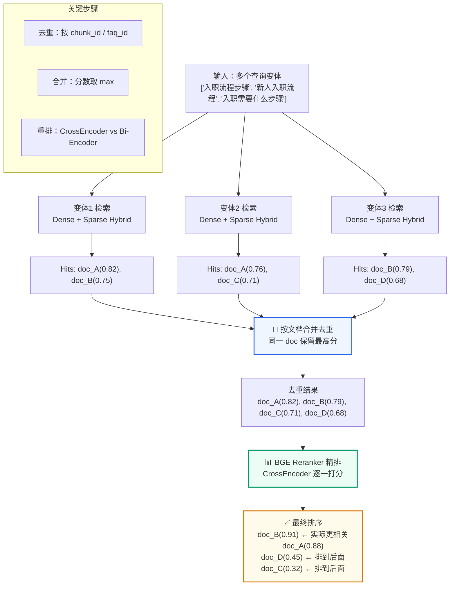
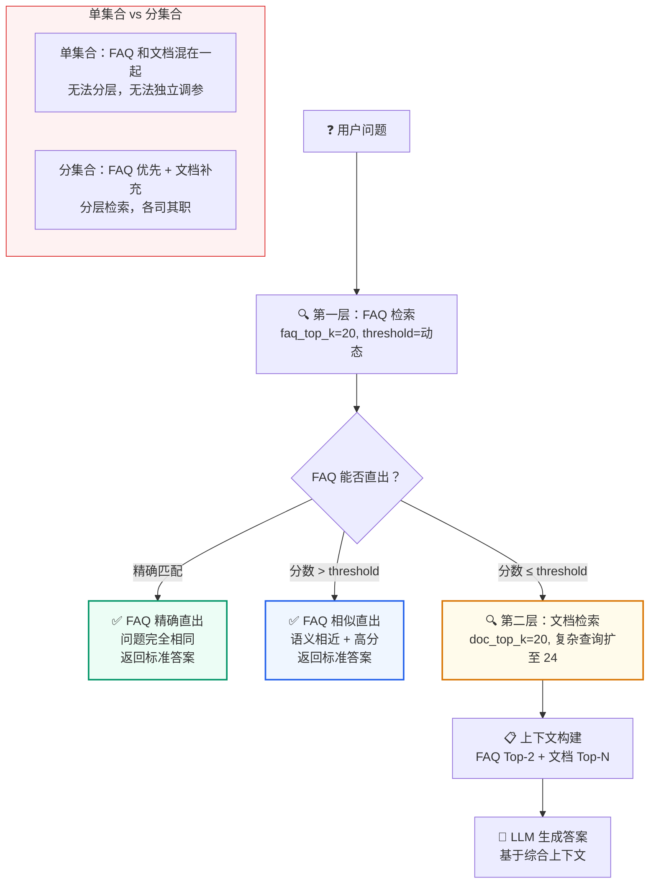

# 第8讲：Milvus 混合检索深度解析

**上一讲**：[查询改写与变体生成](./07-query-rewrite-variants.md)  
**下一讲**：[QAService 核心编排](./09-qaservice-orchestration.md)

## 本讲目标

- 深入理解 Milvus Dense + Sparse Hybrid Search 的实现细节
- 掌握 Milvus 过滤表达式的构建规则和安全校验
- 理解 Reranker 在检索链路中的角色和实现
- 了解多查询变体合并去重的完整流程

> 📖 **前置阅读**：如果你不熟悉 HNSW 索引原理或想看 pymilvus 基本操作（创建 Collection、建索引、插入、搜索），请先阅读 [第4讲：Milvus 索引机制与基本操作](./04-milvus-index-and-operations.md)。

---
## 第一部分：前置知识 — BM25 算法原理

### 1.1 什么是 BM25

**BM25（Best Matching 25）** 是信息检索领域最经典的关键词匹配算法，可以看作是 TF-IDF 的改进版。

BM25 的核心思想：**一个词在一篇文档中出现的频率越高，这篇文档与该词的关联度越大；但如果这个词在很多文档中都出现（如"的"、"是"），它区分文档的能力就弱**。

$$\text{BM25}(D, Q) = \sum_{i=1}^{n} \text{IDF}(q_i) \times \frac{f(q_i, D) \times (k_1 + 1)}{f(q_i, D) + k_1 \times (1 - b + b \times \frac{|D|}{\text{avgdl}})}$$

虽然公式看起来复杂，但理解它做什么即可：

- **IDF（逆文档频率）**：稀有词（如"入职"、"Webhook"）贡献高，常见词（如"的"、"这个"）贡献低
- **TF 归一化**：词频高不一定分数高，BM25 对 TF 做了饱和处理（出现 3 次和出现 30 次的分差不大）
- **长度归一化**：长文档不天然比短文档更有优势

### 1.2 Dense vs Sparse 互补

回顾第 2 讲的内容，这里做更深入的对比：

| | Dense（BGE-M3 Embedding） | Sparse（BM25） |
|---|---|---|
| 表示方式 | 1024 维浮点数向量 | 稀疏向量（大部分维度为 0） |
| 强项 | 语义相似、同义词、改写 | 精确关键词、专业术语、编号 |
| 弱项 | 专业术语可能召回不精准 | 不理解语义，"改密码"≠"重置密码" |
| 计算 | 需要 Embedding 模型（GPU 友好） | 纯统计计算（CPU 即可） |
| 例子 | "入职需要什么" → 召回"报到材料" | "HS 编码 8471.30" → 精确匹配 |

---

## 第二部分：Milvus 混合检索实现

### 2.1 双向量字段的 Schema

在 Milvus 中，每个 collection 有两个向量字段：

```
Collection Schema:
┌──────────────┬──────────────┬──────────────────────────────┐
│ 字段名        │ 类型          │ 说明                          │
├──────────────┼──────────────┼──────────────────────────────┤
│ pk           │ VARCHAR      │ 主键（稳定 chunk_id）          │
│ text         │ VARCHAR      │ 原始文本（检索输入 + 生成展示） │
│ dense        │ FLOAT_VECTOR │ BGE-M3 生成的 1024 维向量      │
│ sparse       │ SPARSE_VECTOR│ Milvus 服务端 BM25 生成         │
│ source       │ VARCHAR      │ 业务分类（用于过滤）           │
│ kb_version   │ VARCHAR      │ 知识库版本（用于过滤）         │
│ scenario_id  │ VARCHAR      │ 场景 ID（用于过滤）            │
│ tenant_id    │ VARCHAR      │ 租户 ID（用于过滤）            │
│ ...          │ ...          │ 更多标量过滤字段               │
└──────────────┴──────────────┴──────────────────────────────┘
```

### 2.2 LangChain Milvus 初始化

```python
# qa_core/retrieval/store.py
from langchain_milvus import Milvus

self._store = Milvus(
    embedding_function=get_embeddings(),      # BGE-M3 → 生成 dense 向量
    builtin_function=bm25_function(),          # Milvus 内置 BM25 → 生成 sparse 向量
    collection_name=self.collection_name,
    connection_args=connection_args,
    vector_field=["dense", "sparse"],          # 双向量字段
    text_field="text",
    primary_field="pk",
    auto_id=False,                             # 手动指定 ID
)
```

**关键参数分析**：

- `embedding_function`：当调用 `add_documents()` 写入数据时，LangChain 自动调用 BGE-M3 对 `text` 字段生成 Dense 向量
- `builtin_function`：Milvus 2.6.x 可用的服务端内置函数，在写入时自动对 `text` 字段执行中文分词 + BM25 编码，生成 Sparse 向量
- `vector_field=["dense", "sparse"]`：声明两个向量字段，相似度搜索时会**同时使用两者**，Milvus 内部自动加权融合分数
- `auto_id=False`：使用入库时生成的稳定 chunk_id 作为主键。这使得文档更新时可以按 ID `delete(ids=old_ids)` 再 `add_documents(new_chunks)`

### 2.3 BM25 中文分词配置

```python
# qa_core/retrieval/milvus_compat.py
def bm25_function():
    return BM25BuiltInFunction(
        input_field_names="text",        # 对哪个字段做 BM25
        output_field_names="sparse",     # 输出到哪个向量字段
        analyzer_params={"type": "chinese"},  # 使用中文分词器
        enable_match=True,               # 启用 BM25 match 评分
    )
```

`analyzer_params={"type": "chinese"}` 确保 BM25 使用中文分词器（而不是默认的英文空格分词）。这样"企业知识库智能问答"会被正确拆分为"企业/知识库/智能/问答"，而不是按空格当成一个整体。

### 2.4 Hybrid Search 的分数融合

当同时使用 Dense 和 Sparse 检索时，Milvus 内部如何融合两者的分数？

```
总分数 = w_dense × dense_score + w_sparse × sparse_score

默认权重：w_dense = 0.5, w_sparse = 0.5
          （可在搜索参数中调整）
```

本项目的 Milvus 配置使用默认权重 0.5 : 0.5，语义和关键词各占一半。对于特定场景（如法律文档更依赖精确关键词），可以调整权重。

---

## 第三部分：过滤表达式构建

### 3.1 为什么需要过滤表达式

向量检索是在整个 collection 中找最相似的内容。但实际业务中，我们需要限制搜索范围：

- 同一个 collection 中存了多个场景的数据 → 只搜当前场景的
- 同一个场景中有多个知识库版本 → 只搜 active 版本的
- 开启了数据隔离 → 只搜当前租户/数据集的
- 前端选择了业务分类 → 只搜该分类的

这些限制通过 Milvus 的**标量过滤表达式**实现。

### 3.2 build_source_expr() 实现

```python
# qa_core/retrieval/filters.py
def build_source_expr(
    source_filter: str | None,
    kb_version: str | None = None,
    valid_sources: list[str] | None = None,
    data_scope: DataScope | None = None,
) -> str | None:
    """把业务过滤条件转换为 Milvus 布尔表达式。

    表达式包含四类约束：
    - source：业务分类，例如 hr、billing、alarm
    - kb_version：知识库版本，支持灰度、回滚
    - tenant_id/dataset_id：轻量多租户和数据集隔离
    - visibility/allowed_roles：轻量可见性控制
    """
    clauses: list[str] = []

    # 1. 业务分类过滤
    if source_filter:
        # 白名单校验！防止无效值进入 Milvus
        if valid_sources is not None and source_filter not in valid_sources:
            raise ValueError(f"无效的业务分类：{source_filter}")
        safe_source = escape_expr_value(str(source_filter))
        clauses.append(f'source == "{safe_source}"')

    # 2. 知识库版本过滤
    if kb_version:
        safe_version = escape_expr_value(str(kb_version))
        clauses.append(f'kb_version == "{safe_version}"')

    # 3. 数据隔离过滤
    if data_scope is not None:
        clauses.extend(data_scope.expr_clauses())

    # 4. 用 AND 拼接所有条件
    return " and ".join(clauses) if clauses else None
```

### 3.3 拼接后的实际表达式

对于一次具体的查询，过滤表达式可能长这样：

```python
# 场景：ent知识助手，HR 分类，active 版本，默认租户
expr = (
    'source == "hr"'
    ' and kb_version == "kb_enterprise_knowledge_20260506_103000_9f2a1b3c"'
    ' and tenant_id == "default"'
    ' and dataset_id == "default"'
    ' and visibility in ["public", "internal"]'
)
```

这个表达式在 Milvus 内部先做标量过滤（缩小搜索范围），再做向量检索，大幅提升检索精度和效率。

### 3.4 安全转义

```python
# qa_core/governance/data_scope.py
def escape_expr_value(value: str) -> str:
    """转义 Milvus 表达式中的特殊字符。

    防止用户输入中包含双引号等特殊字符破坏表达式结构。
    例如 source_filter='hr" or 1==1 or "' 这种注入尝试必须被转义。
    """
    return str(value).replace('"', '\\"')
```

---

## 第四部分：多查询变体检索与合并

### 4.1 search_many() 的完整流程



```python
def search_many(
    self,
    queries: list[str],
    *,
    k: int,
    source_filter: str | None,
    kb_version: str | None = None,
    valid_sources: list[str] | None = None,
    data_scope: DataScope | None = None,
    source_type: Literal["faq", "doc"],
    rerank: bool = True,
) -> RetrievalResult:
    """对多个查询变体分别检索，合并结果后 rerank"""
    merged: dict[str, RetrievalHit] = {}
    searched_queries = normalize_queries(queries)

    for clean_query in searched_queries:
        # 对每个变体执行 Hybrid Search（关闭 rerank 避免重复重排）
        result = self.search(
            clean_query,
            k=k,
            source_filter=source_filter,
            kb_version=kb_version,
            valid_sources=valid_sources,
            data_scope=data_scope,
            source_type=source_type,
            rerank=False,
        )
        # 合并到全局结果（按文档去重，保留最高分）
        merge_hits_by_document(merged, result.hits)

    # 按分数排序
    hits = sort_hits_by_score(merged.values())

    # Rerank 重排（只对合并后的有限候选统一重排）
    if rerank and hits:
        hits = self._rerank(searched_queries[0], hits)

    return RetrievalResult(hits=hits[:k], ...)
```

### 4.2 文档去重逻辑

```python
def document_key(document: Document) -> str:
    """返回用于合并重复命中文档的稳定标识。

    优先级：
    1. chunk_id — 文档 chunk 的唯一 ID
    2. faq_id — FAQ 的唯一 ID
    3. 内容前 120 字符 — 最后兜底
    """
    metadata = document.metadata or {}
    return str(
        metadata.get("chunk_id")
        or metadata.get("faq_id")
        or document.page_content[:120]
    )

def merge_hits_by_document(merged, hits):
    """同一个文档被多个 query variant 命中时，只保留分数更高的那次。"""
    for hit in hits:
        key = document_key(hit.document)
        previous = merged.get(key)
        if previous is None or hit.score > previous.score:
            merged[key] = hit
```

**为什么需要去重？**

```
用户问："入职流程有哪些步骤"
变体 1："入职流程有哪些步骤" → 命中 chunk_A (分数 0.82)
变体 2："入职需要做什么"     → 命中 chunk_A (分数 0.76)  ← 重复！
变体 3："入职具体步骤"       → 命中 chunk_A (分数 0.79)  ← 重复！

去重后：chunk_A 只保留分数最高的那次 (0.82)
```

### 4.3 Reranker 重排实现

```python
def rerank_hits(
    query: str,
    hits: list[RetrievalHit],
    *,
    reranker: Any,
    top_n: int,
) -> list[RetrievalHit]:
    """使用 CrossEncoder 重排候选结果。

    与向量检索（Bi-Encoder）不同，CrossEncoder 将 query 和 passage
    拼接后一起编码，通过交叉注意力获得更精确的相关性判断。
    """
    if not hits:
        return []
    if reranker is None:
        raise RuntimeError("Reranker 未初始化，但当前检索计划要求重排。")

    # 构建 (query, passage) 对
    pairs = [(query, hit.document.page_content) for hit in hits]

    # CrossEncoder 逐对打分
    scores = reranker.predict(pairs)

    # 按新分数重新排序
    reranked = [
        RetrievalHit(document=hit.document, score=float(score))
        for hit, score in sorted(
            zip(hits, scores),
            key=lambda item: float(item[1]),
            reverse=True
        )
    ]
    return reranked[:top_n]
```

**Reranker 的计算代价**：

- 向量检索（Bi-Encoder）：O(n) 次向量比较，n=候选数，每次都是快速的向量内积
- Reranker（CrossEncoder）：O(k) 次 Transformer 前向传播，k=候选数（通常 20-50），每次都需要模型推理

这就是为什么 Reranker 只对检索召回的前 k 个候选做重排，而不是对整个 collection 做。如果对整个 collection（可能有几十万条）做 CrossEncoder，一次查询就要几分钟。

---

## 第五部分：FAQ 与文档分集合设计

### FAQ 分层检索策略



### 5.1 为什么分集合

```
方案 A：把所有内容放一个集合
  FAQ chunk + 文档 chunk 混在一起
  → 检索时 FAQ 和文档同等对待
  → 无法实现"FAQ 优先"策略
  → 无法给 FAQ 和文档设置不同的阈值

方案 B（本项目）：分两个集合
  FAQ collection（如 enterprise_knowledge_faq）
  Doc collection（如 enterprise_knowledge_doc）
  → FAQ 先检索，高置信直接返回
  → FAQ 低置信时再查文档
  → 可以独立调整 FAQ 和文档的 top_k、阈值
```

### 5.2 两层检索的工作流

```
用户问题
    │
    ├─ FAQ 检索（faq_top_k = 20）
    │   └─ 精确匹配或分数 > faq_direct_threshold？
    │       ├─ 是 → 直接返回标准答案（不调用 LLM）
    │       └─ 否 → 继续文档检索
    │
    ├─ 文档检索（doc_top_k = 32）
    │   └─ Dense + Sparse Hybrid → Rerank → 去重
    │
    ├─ 上下文构建（FAQ Top-2 + 文档 Top-N）
    │   └─ 过滤低分、截断超长、去重
    │
    └─ LLM 生成
```

### 5.3 FAQ 的高置信直出

```python
# qa_core/pipeline/retrieval_steps.py
def get_faq_direct_answer(context, prepared, faq_result):
    """判断是否可以直出 FAQ 标准答案。

    只在整体分数最高的那条 FAQ 上判断直出，而非每条都试：
    - faq_direct_exact_only=True → threshold=inf，只允许精确匹配
    - faq_direct_exact_only=False → 相似分数超过 faq_direct_threshold 即可直出
    """
    threshold = float("inf") if prepared.plan.faq_direct_exact_only else prepared.plan.faq_direct_threshold
    return direct_faq_answer(
        context.query,
        faq_result.top_document,
        faq_result.top_score,
        threshold,
    )
```

---

## 第六部分：连接管理与数据库初始化

### 6.1 Milvus 数据库创建

```python
# qa_core/retrieval/milvus_compat.py
def ensure_milvus_database():
    """在服务端支持数据库时创建配置中的 Milvus database。"""
    settings = get_settings()
    client = MilvusClient(uri=settings.milvus_uri)
    databases = client.list_databases()

    # 如果配置了数据库名但不存在，自动创建
    if settings.milvus_database and settings.milvus_database not in databases:
        client.create_database(settings.milvus_database)
```

Milvus 2.4+ 引入了 Database 概念，类似于关系数据库的 Database。本项目的 `MILVUS_DATABASE` 默认为空，也就是使用 Milvus 默认 database；如果后续需要按环境或租户做更强隔离，可以在 `.env` 中显式配置数据库名。

### 6.2 连接别名补丁

```python
def patch_milvus_client_connection():
    """注册 MilvusClient 创建的 ORM 连接别名。

    部分 langchain-milvus 版本会通过 MilvusClient 创建集合，
    再通过 pymilvus ORM Collection API 检查集合。
    这个补丁确保两者使用同一个连接，避免"集合不存在"的误报。
    """
    original_init = pymilvus.MilvusClient.__init__

    def patched_init(self, *args, **kwargs):
        original_init(self, *args, **kwargs)
        # 注册连接别名
        if getattr(self, "_using", None):
            if not connections.has_connection(self._using):
                connections.connect(alias=self._using, uri=uri)

    pymilvus.MilvusClient.__init__ = patched_init
```

这是一个兼容性适配：LangChain 的 Milvus 封装内部同时使用了 `MilvusClient`（新 API）和 `Collection`（旧 ORM API），两者使用不同的连接对象。补丁确保它们共享连接，避免状态不一致。

---

## 重点掌握

| 优先级 | 内容 | 原因 |
|--------|------|------|
| ★★★ 必会 | Milvus Hybrid Search 的双向量字段 Schema：dense（BGE-M3 Embedding）+ sparse（BM25 BuiltInFunction） | 混合检索的底层实现基础 |
| ★★★ 必会 | 过滤表达式构建（build_source_expr）：source + kb_version + 数据隔离四字段拼成 Milvus expr | 确保检索不跨场景、不跨版本、不跨租户 |
| ★★★ 必会 | FAQ/文档分集合设计：FAQ 高置信直出（不调 LLM），FAQ 低分→文档检索 | 分层检索的核心架构 |
| ★★ 理解 | BM25 算法核心思想：稀有词贡献高、词频饱和处理、长度归一化 | 理解 Sparse 检索的原理 |
| ★★ 理解 | search_many() 多查询变体合并流程：各自检索→按文档去重保留最高分→统一 Rerank | 多查询变体如何产生最终候选 |
| ★★ 理解 | Reranker（CrossEncoder）重排的实现和代价 | 理解为什么只对 Top-K 做重排 |
| ★ 了解 | 白名单校验 + 安全转义（escape_expr_value）防止注入 | 安全设计了解即可 |
| ★ 了解 | 连接别名补丁（patch_milvus_client_connection）的原因 | 兼容性适配，了解即可 |

## 本讲小结

- **BM25** 是经典的词频-逆文档频率检索算法，擅长精确关键词匹配
- **Milvus Hybrid Search** 同时使用 Dense 向量（语义）和 Sparse 向量（关键词），默认 50:50 加权
- **过滤表达式**将 source、kb_version、tenant_id 等拼成 Milvus expr，在执行检索前缩小搜索范围
- **白名单校验 + 安全转义**防止无效值或注入攻击进入 Milvus 表达式
- **多查询变体**分别检索后按文档去重合并，保留最高分
- **Reranker**（CrossEncoder）对候选做精排，代价高但精度高，只对 Top-K 候选使用
- **FAQ/文档分集合**是实现分层检索和动态阈值的基础

**下一讲**：[QAService 核心编排](./09-qaservice-orchestration.md) — 服务门面模式、HTTP/WS 分工、事件生成器
