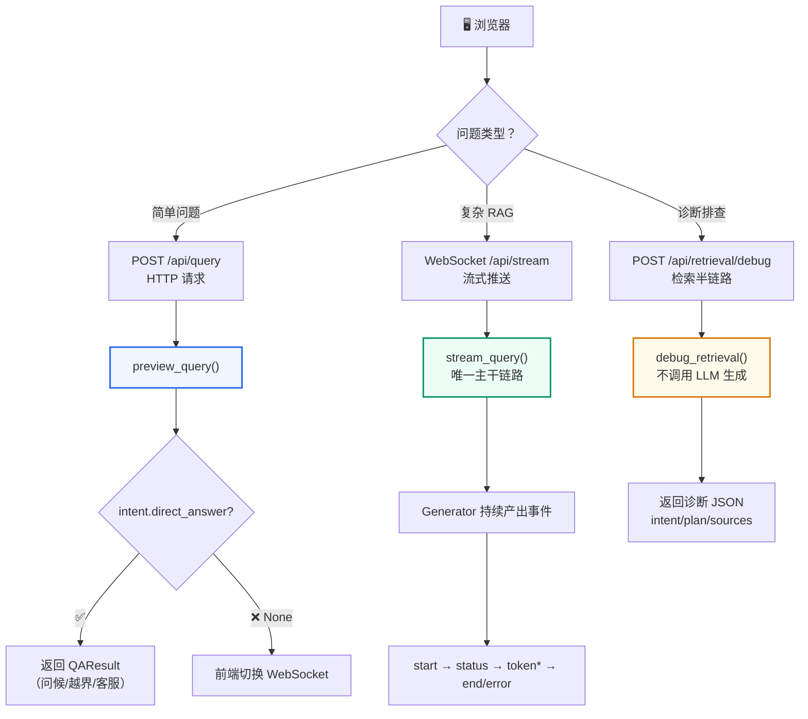

# 第9讲：QAService 核心编排

**上一讲**：[Milvus 混合检索深度解析](./08-milvus-hybrid-search.md)  
**下一讲**：[RAG Pipeline 主流程深度解析](./10-rag-pipeline.md)

## 本讲目标

- 理解 QAService 作为服务编排层（Orchestration Layer）的设计理念
- 掌握"服务门面"模式在 RAG 系统中的应用
- 理解三个核心方法的职责分工
- 理解 Generator（生成器）在流式问答中的角色

---
## 第一部分：前置知识 — 服务编排模式

### 1.1 什么是服务编排

**服务编排（Service Orchestration）** 是软件架构中的一种模式：用一个中心化的"编排器"来协调多个子服务的调用顺序和数据流转。

打个比方：
- **没有编排**：每个厨师自己决定做什么菜、用什么食材、先炒哪个后炒哪个 → 混乱
- **有编排**：主厨（编排器）决定菜单、分配任务、协调出菜顺序 → 有序

在 RAG 系统中，"子服务"包括：
- 意图识别 → 判断用户想干什么
- 历史读取 → 获取会话上下文
- 查询改写 → 补全追问
- 检索计划 → 决定如何检索
- FAQ 检索 → 查标准答案
- 文档检索 → 查业务资料
- 上下文构建 → 组织参考资料
- LLM 生成 → 产生答案
- 历史写入 → 保存对话

QAService 就是协调这些子服务的"主厨"。

### 1.2 QAService 不做什么（边界）

```python
class QAService:
    """
    这层代码承担的职责：
    1. 读取历史并决定是否需要改写追问
    2. 判断问题意图，过滤无需 RAG 的场景
    3. 根据意图构建检索计划
    4. 先查 FAQ，再查文档
    5. 生成最终上下文，调用 LLM 流式输出
    6. 保存历史，返回诊断信息

    这层不做的事情：
    1. 不创建 FastAPI 响应对象
    2. 不直接操作静态页面
    3. 不实现底层 Milvus 连接细节
    4. 不把旧版检索方式拉回主链路
    """
```

---

## 第二部分：QAService 的三个核心方法

### 2.1 方法职责对照



### 2.2 preview_query() 详解

```python
def preview_query(self, query, source_filter, session_id, ...) -> QAResult | None:
    """处理问候等可直接返回的答案。

    真正的 RAG 问题返回 None，前端会走 WebSocket 主链路。
    """
    scenario = resolve_scenario(scenario_id)
    data_scope = resolve_data_scope(...)
    session_id = session_id or str(uuid.uuid4())
    trace_id = str(uuid.uuid4())
    started = time.perf_counter()

    # Step 1: 校验 source 白名单
    self.validate_source(source_filter, scenario)

    # Step 2: 读历史
    history_messages = self.history.get_context_messages(session_id)

    # Step 3: 意图识别（规则优先 + LLM 补充）
    intent = classify_intent(query, history_messages, scenario)

    # Step 4: 判断是否可以直接返回
    if intent.direct_answer:
        # 直接答案也写入历史（保证后续追问有上下文）
        self.history.add_turn(session_id, query, intent.direct_answer)

        # 记录 trace（保证直接答案也可追踪）
        # RAGQueryContext.record_trace() 封装了 record_query_trace
        # 在 stream_query 主链路中通过 finish_success → context.record_trace() 调用
        context = RAGQueryContext(
            history=history_messages,
            validate_source=self.validate_source,
            query=query,
            source_filter=source_filter,
            scenario=scenario,
            data_scope=data_scope,
            session_id=session_id,
            trace_id=trace_id,
            started=started,
            active_kb_version=active_kb_version,
        )
        context.record_trace(answer=intent.direct_answer, elapsed_ms=...)

        return QAResult(
            answer=intent.direct_answer,
            hit_type=intent.intent.lower(),
            session_id=session_id,
            ...
        )

    # 复杂问题返回 None → 前端走 WebSocket
    return None
```

**关键设计**：

1. **直接答案也写历史**：用户说"你好"，AI 回复后，如果用户追问"入职流程呢"，历史中仍然能看到前面的问候。这很重要——很多 Demo 级系统在问候场景下不记录历史。

2. **直接答案也写 Trace**：保证了可观测性的完整性。即使是问候，也能在状态页看到完整的请求记录。

3. **返回 None 而非默认值**：`None` 是一个明确的信号——"这个问题不是我能直接回答的"。前端收到 `None` 后切换到 WebSocket。

### 2.3 stream_query() — 唯一主干链路

```python
def stream_query(self, query, source_filter, session_id, ...):
    """委托 RAGPipeline 执行完整流式问答。"""
    yield from rag_stream_query(
        self.history,        # 历史存储适配器
        self.validate_source, # source 校验函数
        query,
        source_filter,
        session_id,
        kb_version=kb_version,
        scenario_id=scenario_id,
        ...
    )
```

`yield from` 是 Python 的委托语法。`rag_stream_query` 是 `qa_core.pipeline.rag` 模块中 `stream_query` 函数的 import alias（`from qa_core.pipeline.rag import stream_query as rag_stream_query`），它是一个生成器函数，每次 `yield` 产生一个事件。`yield from` 把这些事件"透传"给调用方（FastAPI WebSocket 路由），所以 QAService 不需要自己维护生成循环。

### 2.4 source 白名单校验

```python
def validate_source(self, source_filter, scenario):
    """在访问 Milvus 之前拒绝不支持的业务分类过滤项。"""
    if source_filter and source_filter not in scenario.valid_sources:
        raise ValueError(
            f"无效的业务分类。当前场景支持: {scenario.valid_sources}"
        )
```

这个校验放在 QAService 层（而非 API 层或 retrieval 层）是经过考虑的：
- **API 层**：不应该知道 Milvus 过滤规则（它只管 HTTP 参数校验）
- **Retrieval 层**：不应该承担业务白名单判断（它只管执行检索）
- **QAService（编排层）**：最清楚"前端筛选项 + 意图推断分类"如何进入主链路

---

## 第三部分：Generator 模式在 RAG 中的应用

### 3.1 什么是 Generator

Generator（生成器）是 Python 的一个核心特性，使用 `yield` 关键字：

```python
def simple_generator():
    yield "第一步完成"
    yield "第二步完成"
    yield "第三步完成"

for event in simple_generator():
    print(event)  # 逐个输出，而不是等全部完成
```

Generator 的特点是**惰性求值**：每次只产生一个值，调用方可以在每个值之间做其他事情。

### 3.2 为什么 RAG 适合用 Generator

RAG 的问答过程不是一个"输入→等待→输出"的单步操作，而是一个**多阶段持续产出**的过程：

```python
def stream_query(...):
    # 阶段 1：快速路径尝试
    yield {"type": "status", "message": "正在快速匹配标准 FAQ..."}
    fast_answer = try_fast_faq_direct_answer(context)
    if fast_answer:
        yield {"type": "token", "token": fast_answer}
        yield {"type": "end", ...}
        return

    # 阶段 2：意图识别
    yield {"type": "status", "message": "正在识别问题意图..."}
    prepared = prepare_retrieval(context)

    # 阶段 3：处理直接答案（问候/越界/人工客服）
    if prepared.intent.direct_answer:
        yield {"type": "token", "token": prepared.intent.direct_answer}
        yield {"type": "end", ...}
        return

    # 阶段 4：FAQ 检索
    yield {"type": "status", "message": "正在检索业务 FAQ 知识库..."}
    faq_result = search_faq(context, prepared)

    # 阶段 5：文档 RAG
    yield {"type": "status", "message": "正在匹配相关业务资料..."}
    doc_result = search_doc(context, prepared)

    # 阶段 6：LLM 流式生成
    yield {"type": "status", "message": "正在生成回答..."}
    for chunk in stream_llm_answer(system_prompt, user_prompt):
        yield {"type": "token", "token": chunk.content}

    # 阶段 7：保存 + 收尾
    yield {"type": "end", "sources": [...], "retrieval": {...}}
```

每个 `yield` 都是**一个可以立即推送给前端的事件**。用户不需要等全部流程跑完才能看到任何东西。

### 3.3 前端接收到的体验

```
[0.0s] 用户点击发送 "入职流程有哪些步骤"
[0.1s] 页面显示 "正在快速匹配标准 FAQ..."
[0.5s] 页面显示 "正在识别问题意图..."
[1.2s] 页面显示 "正在检索业务 FAQ 知识库..."
[2.0s] 页面显示 "正在匹配相关业务资料..."
[3.5s] 页面显示 "正在生成回答..."
[3.8s] 页面开始逐字出现 "入" "职" "流" "程" "包" "括" ...
[6.0s] 回答完成，显示来源引用
```

如果不用 Generator 而是一次性返回：

```
[0.0s] 用户点击发送
[6.0s] 空白等待...
[6.0s] 整个答案突然出现
```

---

## 第四部分：应用工厂模式

### 4.1 get_qa_service() 工厂函数

```python
# qa_core/application/factory.py
from functools import lru_cache

@lru_cache(maxsize=1)
def get_qa_service() -> QAService:
    """返回进程级缓存的 QAService 实例。

    单例缓存确保了 settings 和 history store 在整个进程中只加载一次。
    QAService 本身不保存请求级状态（所有变量都在方法局部作用域内），
    所以多用户并发是安全的。
    """
    return QAService()
```

**为什么用单例**：
- `settings` 是只读配置，加载一次即可
- `history` 是历史存储适配器，本身负责按 session_id 隔离会话
- 每次请求创建新的 QAService 会重复加载配置，但没有好处

**为什么不担心并发**：
- QAService 只保存 `settings`（只读）和 `history`（线程安全适配器）
- 请求级变量（query、intent、plan、sources 等）都不在 QAService 上，而在方法局部变量中

### 4.2 在 API 中使用

```python
# qa_core/api/chat.py
from qa_core.application.factory import get_qa_service

@router.post("/api/query")
async def query(request: QueryRequest):
    service = get_qa_service()  # 获取单例
    result = service.preview_query(...)
    ...

@router.websocket("/api/stream")
async def websocket_endpoint(websocket: WebSocket):
    service = get_qa_service()  # 同一个单例
    generator = await asyncio.to_thread(
        lambda: service.stream_query(...)
    )
    ...
```

---

## 第五部分：错误处理与事件协议

### 5.1 异常不抛给 WebSocket 路由

```python
# qa_core/pipeline/rag.py
try:
    # 完整的 RAG 流程...
    for chunk in stream_llm_answer(...):
        yield build_token_event(token, context.session_id)
    yield finish_success(context, answer=answer)

except Exception as exc:
    logger.exception("QA stream failed")
    # 错误以事件形式返回给前端，不抛出到路由层
    yield finish_error(context, exc)
```

**设计意图**：如果抛出异常到 WebSocket 路由，前端收到的就是一个 WebSocket 协议级别的错误，页面无法优雅地展示错误信息。以事件形式返回错误，前端可以按同一套 UI 渲染错误信息，并允许用户继续下一轮提问。

### 5.2 事件类型汇总

| 事件类型 | 含义 | 前端处理 |
|---------|------|---------|
| `start` | 请求已接收 | 创建答案区域，显示加载状态 |
| `status` | 当前进行到哪个阶段 | 更新进度提示文字 |
| `token` | LLM 生成的一个 token | 追加到答案文本末尾 |
| `end` | 问答完成 | 显示来源引用、诊断信息、耗时 |
| `error` | 可恢复的错误 | 显示错误信息，允许继续提问 |

---

## 重点掌握

| 优先级 | 内容 | 原因 |
|--------|------|------|
| ★★★ 必会 | QAService 服务编排层的定位：协调意图识别、历史、检索、生成、存储，不直接处理 HTTP 或 Milvus 细节 | 理解"编排层"在分层架构中的角色，面试常问 |
| ★★★ 必会 | 三个核心方法：preview_query（简单问题直接返回，复杂返回 None）、stream_query（唯一主干链路，yield from 透传事件）、debug_retrieval（只查不生成） | QAService 对外的完整接口 |
| ★★★ 必会 | Generator（生成器）模式在流式问答中的应用：惰性求值，每个 yield 产生一个可立即推送给前端的事件 | 理解 RAG 流式体验的技术实现 |
| ★★ 理解 | preview_query 的设计要点：直接答案也写历史（保证追问上下文）、也写 Trace（可观测性） | 容易被忽视但重要的设计细节 |
| ★★ 理解 | 单例工厂 get_qa_service() + @lru_cache：只缓存 settings 和 history，请求级状态在局部变量中 | 并发安全的保证 |
| ★★ 理解 | 错误以事件（error 类型）形式返回给前端，不抛异常到 WebSocket 路由 | 用户体验和安全设计 |
| ★ 了解 | source 白名单校验放在 QAService 层的理由 | 理解分层职责的划分依据 |
| ★ 了解 | 事件类型汇总：start / status / token / end / error | 回顾第 11 讲的 WebSocket 事件协议 |

## 本讲小结

- **QAService 是服务编排层**，协调意图、历史、检索、生成、存储，但不直接处理 HTTP 或 Milvus 细节
- **preview_query** 处理简单问题，返回 None 表示需要完整 RAG 流程
- **stream_query** 是唯一主干链路，通过 Generator 持续产出事件
- **yield from** 将 RAG Pipeline 的事件透传给调用方
- **单例工厂**确保 settings 和 history 只加载一次，请求级状态全在局部变量中
- **错误以事件形式返回**，前端可以优雅展示并允许继续提问

**下一讲**：[RAG Pipeline 主流程深度解析](./10-rag-pipeline.md) — 七阶段事件生成、上下文构建、答案引用增强
