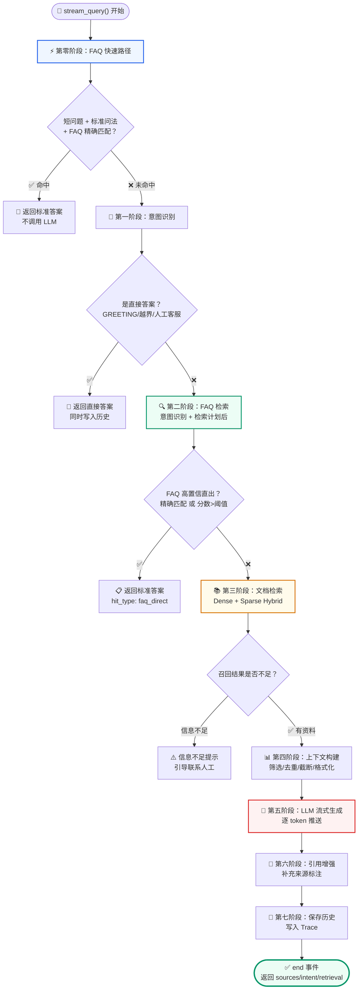
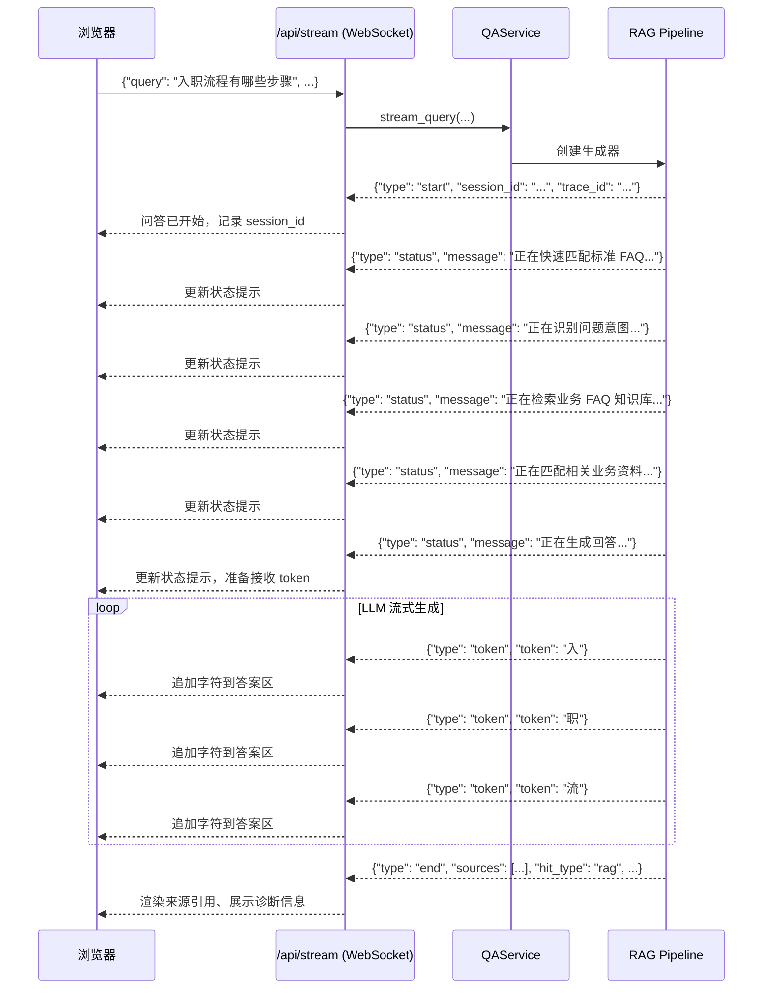
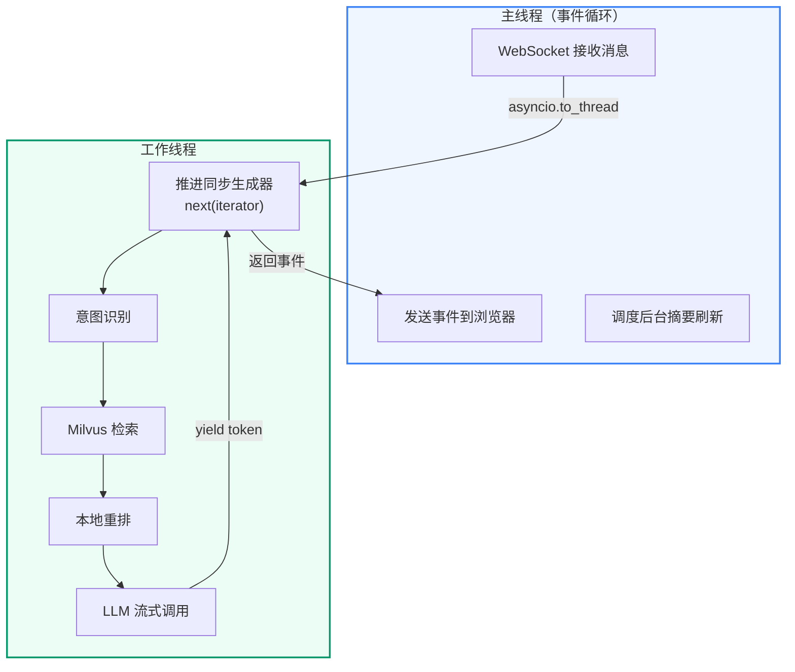

# 第10讲：RAG Pipeline 主流程深度解析

**上一讲**：[QAService 核心编排](./09-qaservice-orchestration.md)  
**下一讲**：[Prompt 工程与 Profile 系统](./11-prompt-engineering.md)

## 本讲目标

- 理解 RAG Pipeline 的七阶段事件生成模型
- 掌握 FAQ 快速路径和 FAQ 标准直出的区别
- 理解上下文构建中的筛选、去重、截断策略
- 理解答案引用增强的实现

---
## 第一部分：前置知识 — Pipeline 设计模式

### 1.1 Pipeline vs Chain

**Chain（链）**：固定的步骤序列，A → B → C → D，没有分支。

**Pipeline（管道）**：有分支、有快慢路径的流程。每一步可以提前结束（如 FAQ 命中时跳过文档检索），也可以根据上一步的结果调整下一步的参数。

本项目的 RAG 流程是 Pipeline 而非 Chain：

```
            → FAQ 快速路径（命中则结束）
           /
用户问题 → 意图识别 → 检索计划 → FAQ 检索 → 文档检索 → LLM 生成
           \         \                    /
            → 直接答案（结束）            /
                             FAQ 直出（结束）
```

### 1.2 Pipeline 的模块化拆分

项目将 Pipeline 拆分为多个职责单一的文件：

```
qa_core/pipeline/
├── rag.py          # 主流程编排（stream_query, debug_retrieval）
├── runtime.py      # 请求上下文（RAGQueryContext）和事件工具函数
├── steps.py        # 业务步骤（prepare, search, answer）
├── context.py      # 上下文构建（筛选、去重、格式化）
├── rewrite.py      # 查询改写
├── query_variants.py  # 查询变体生成
├── events.py       # 事件构造（start/status/token/end/error）
└── citations.py    # 答案引用增强
```

---

## 第二部分：七阶段主流程

### 七阶段可视化总览



### 2.1 完整流程代码（简化）

```python
# qa_core/pipeline/rag.py
def stream_query(history, validate_source, query, source_filter,
                 session_id, ...):
    # 创建请求上下文
    context = create_query_context(...)
    yield build_query_start_event(context)  # start 事件

    try:
        # === Stage 1: FAQ 快速路径 ===
        yield build_status_event("正在快速匹配标准 FAQ...", context.session_id)
        fast_answer = try_fast_faq_direct_answer(context)
        if fast_answer:
            yield from _finish_with_single_answer(context, history, query, fast_answer)
            return

        # === Stage 2: 意图识别 + 检索计划 ===
        yield build_status_event("正在识别问题意图...", context.session_id)
        prepared = prepare_retrieval(context)

        # === Stage 3: 非 RAG 类回答（问候/越界/转人工）===
        if prepared.intent.direct_answer:
            yield from _finish_with_single_answer(context, history, query, prepared.intent.direct_answer)
            return

        # === Stage 4-6: 检索 → 生成（提取为 _search_and_generate 辅助函数）===
        helper_result = yield from _search_and_generate(context, prepared, query, history)
        if helper_result is None:
            return  # 已在内部收尾（FAQ 直出或信息不足）

        # === 引用补强 ===
        answer = enforce_answer_citations(context.answer, helper_result.context_docs)

        # === Stage 7: 保存历史 + 写入 Trace + 结束事件 ===
        history.add_turn(context.session_id, query, answer)
        yield finish_success(context, answer=answer)

    except Exception as exc:
        yield finish_error(context, exc)


def _search_and_generate(context, prepared, query, history):
    """检索-生成核心链路：FAQ 检索 → 文档检索 → 上下文构建 → LLM 流式生成。

    提取为独立函数使 stream_query 主干更清晰，便于单步调试和异常定位。
    """
    # Stage 4: FAQ 检索 + 直出判断
    yield build_status_event("正在检索业务 FAQ 知识库...", context.session_id)
    faq_result = search_faq(context, prepared)
    direct_answer = get_faq_direct_answer(context, prepared, faq_result)
    if direct_answer:
        yield from _finish_with_single_answer(context, history, query, direct_answer)
        return None

    # Stage 5: 文档检索 + 上下文构建
    yield build_status_event("正在匹配相关业务资料...", context.session_id)
    doc_result = search_doc(context, prepared)
    answer_prepared = prepare_answer(context, prepared, faq_result, doc_result)
    context.sources = answer_prepared.sources
    context.hit_type = answer_prepared.hit_type

    if context.hit_type == "insufficient_context":
        answer = build_insufficient_context_answer(context)
        yield from _finish_with_single_answer(context, history, query, answer)
        return None

    # Stage 6: LLM 流式生成
    yield build_status_event("正在生成回答...", context.session_id)
    for chunk in stream_llm_answer(answer_prepared.system_prompt, answer_prepared.user_prompt):
        token = str(getattr(chunk, "content", "") or "")
        if not token:
            continue
        yield build_token_event(token, context.session_id)

    return answer_prepared
```

### 2.2 第零阶段：FAQ 快速路径

这是整个 RAG Pipeline 的第一个优化点。在**意图识别之前**，先尝试 FAQ 精确匹配。

```python
# qa_core/pipeline/steps.py
FAQ_FAST_PATH_HINTS = re.compile(
    r"(怎么办|如何|怎么|需要什么|需要哪些|需要谁|有哪些|"
    r"为什么|什么时候|能不能|可以吗|会不会|是否|吗|什么|谁|怎么处理)"
)

def should_try_faq_fast_path(query, scenario):
    """判断是否值得先尝试 FAQ 精确直出。

    快速路径只处理"短、完整、像标准问答"的问题。
    不是语义缓存，也不是跳过检索：仍然访问当前场景的 FAQ Milvus 集合，
    并带上 kb_version、tenant、dataset、visibility 和 role 过滤。
    """
    compact_query = (query or "").strip()
    if not compact_query or len(compact_query) > 48 or "\n" in compact_query:
        return False  # 长问题、多行问题不适合快速路径
    return bool(
        FAQ_FAST_PATH_HINTS.search(compact_query)
        or infer_source(compact_query, scenario)
    )

def try_fast_faq_direct_answer(context):
    """快速路径：只允许精确匹配，不允许相似直出。"""
    if not should_try_faq_fast_path(context.query, context.scenario):
        return None

    faq_store = get_faq_store(context.scenario.faq_collection)
    result = faq_store.search_many(
        [context.query],
        k=min(plan.faq_top_k, 12),
        source_filter=effective_source_filter,
        kb_version=context.active_kb_version,
        valid_sources=context.scenario.valid_sources,
        data_scope=context.data_scope,
        source_type="faq",
        rerank=False,
    )
    # 只允许精确匹配，分数阈值设为无穷大
    answer, _ = _exact_faq_answer(context.query, result)
    return answer  # 不是精确匹配就返回 None，继续主流程
```

### `_exact_faq_answer()` — 精确匹配实现

```python
def _exact_faq_answer(query: str, faq_result: RetrievalResult) -> tuple[str | None, RetrievalResult]:
    """从 FAQ 候选中找与标准问题完全一致的答案。

    快速路径只允许精确标准问答直出，不按相似分数直出。
    找到精确命中后会把该命中排到来源列表第一位，方便页面展示。
    """
    for index, hit in enumerate(faq_result.hits):
        answer = direct_faq_answer(query, hit.document, hit.score, threshold=float("inf"))
        if not answer:
            continue
        if index:
            reordered = [hit, *faq_result.hits[:index], *faq_result.hits[index + 1 :]]
            faq_result = RetrievalResult(
                hits=reordered,
                query=faq_result.query,
                source_type=faq_result.source_type,
                elapsed_ms=faq_result.elapsed_ms,
            )
        return answer, faq_result
    return None, faq_result
```

**为什么在意图识别之前做**：
- 减少首 token 延迟。标准 FAQ 的精确命中是最快的，不需要经过意图识别、改写、检索计划等步骤。
- FAQ 快速路径仍然访问 Milvus（带版本和数据隔离过滤），不是本地缓存。

**为什么只允许精确匹配**：
- 还没做意图识别，不知道这是 FAQ_QUERY 还是 KNOWLEDGE_QUERY
- 如果是知识咨询但 FAQ 相似分数高，可能误答。所以只允许用户问题和 FAQ 标准问题完全一致时才直出。

### 2.3 FAQ 标准直出 vs FAQ 快速路径

这是两个容易混淆的概念：

| | FAQ 快速路径（第零阶段） | FAQ 标准直出（第三阶段） |
|---|---|---|
| 时机 | 意图识别之前 | 意图识别 + 检索计划之后 |
| 匹配方式 | 仅精确匹配 | 精确匹配 + 相似分数阈值 |
| 阈值 | ∞（只精确） | 动态（0.62~0.86） |
| 适用 | 短标准问答 | 已确认 FAQ_QUERY 意图 |
| 风险 | 低（只精确） | 中（相似分数可能误命中） |

---

## 第三部分：上下文构建

### 3.1 select_context_docs() 的筛选策略

```python
# qa_core/pipeline/context.py
def select_context_docs(faq_hits: list, doc_hits: list, plan: RetrievalPlan) -> list[Document]:
    """筛选进入 Prompt 的文档片段（只依赖 plan 对象，不需要 scenario 参数）。

    执行流程：
    1. FAQ 命中：过滤分数 → 取前 2 条 → 转成"常见问题 + 标准答案"格式
    2. 文档命中：过滤分数 → prefer_table 时表格行优先 → 优先用 parent_content
    3. 每条追加受 final_context_top_n / max_context_chars / max_context_doc_chars 三重约束
    """
    selected = []
    seen_keys = set()
    used_chars = 0

    # ── FAQ 部分：过滤 min_context_score → 取前 2 条 → 转成标准问答格式 ──
    for hit in [h for h in faq_hits if h.score >= plan.min_context_score][:2]:
        answer = hit.document.metadata.get("answer")
        question = hit.document.metadata.get("standard_question") or hit.document.page_content
        if answer:
            _append_with_budget(
                Document(page_content=f"常见问题：{question}\n标准答案：{answer}"),
                f"faq:{document_key(hit.document)}",
                selected, seen_keys, used_chars, plan)

    # ── 文档部分：过滤分数 → prefer_table 排序 → 优先用 parent_content ──
    eligible = [h for h in doc_hits if h.score >= plan.min_context_score]
    if plan.prefer_table:
        # 表格行（content_type 以 table 开头）排到普通正文前面
        eligible = sorted(eligible,
            key=lambda h: (0 if is_table_document(h.document) else 1, -h.score))

    for hit in eligible:
        parent_content = hit.document.metadata.get("parent_content")
        key = str(hit.document.metadata.get("parent_id") or document_key(hit.document))
        _append_with_budget(
            Document(page_content=str(parent_content or hit.document.page_content)),
            f"doc:{key}",
            selected, seen_keys, used_chars, plan)
    return selected
```

### 3.2 build_context() 的格式化输出

```python
def build_context(docs: list[Document]) -> str:
    """构建最终上下文文本（只依赖 doc.metadata，不依赖 scenario 对象）。"""
    lines = []
    seen: set[str] = set()
    for i, doc in enumerate(docs):
        content = doc.page_content.strip()
        if not content or content in seen:
            continue  # 内容去重
        seen.add(content)
        source = _context_source_label(doc.metadata or {})

        # 格式：[编号] 来源：文件名 或 标准问题名 或 表格 sheet+行号
        header = f"[{i+1}] 来源：{source}"
        lines.append(f"{header}\n{content}")

    return "\n\n".join(lines)
```

输出示例：

```
[1] 来源：人事制度 / 入职管理
入职流程包括以下步骤：1. 提交入职材料（身份证复印件、学历证书...）

[2] 来源：人事制度 / 审批权限
部门经理负责审批本部门员工的入职申请，审批时限为 3 个工作日...

[3] 来源：行政管理 / 工位分配
新员工入职后由行政部统一分配工位和办公设备...
```

---

## 第四部分：信息不足处理

### 4.1 什么情况判定为信息不足

`prepare_answer` 在 `steps.py` 中定义，其内部的信息不足判定委托给 `_build_answer_context`：

```python
# qa_core/pipeline/steps.py
def prepare_answer(
    context: RAGQueryContext,
    prepared: RetrievalPreparation,
    faq_result: RetrievalResult,
    doc_result: RetrievalResult,
) -> AnswerPreparation:
    """将 FAQ + 文档检索结果整理为 LLM Prompt、引用来源列表和命中类型。

    信息不足判定委托给 _build_answer_context，prepare_answer 负责
    组装最终的 system_prompt 和 user_prompt。
    """
    context_docs, sources, hit_type, top_score = context.run_stage(
        "build_answer_context",
        lambda: _build_answer_context(prepared, faq_result, doc_result),
    )

    user_prompt = prepared.prompt_profile.user_template.format(
        history=format_messages(prepared.history_messages),
        question=prepared.rewritten_query,
        context=build_context(context_docs)
        or "无可用上下文。必须明确回答：信息不足，无法确认。",
    )
    return AnswerPreparation(
        context_docs=context_docs,
        sources=sources,
        hit_type=hit_type,
        system_prompt=prepared.prompt_profile.system_template,
        user_prompt=user_prompt,
    )
```

`_build_answer_context` 负责实际的上下文筛选和命中类型判定：

```python
def _build_answer_context(prepared, faq_result, doc_result):
    """整理上下文文档、引用来源列表、命中类型和最高分数。

    无上下文通过分数过滤时命中类型标记为 insufficient_context。
    """
    context_docs = select_context_docs(faq_result.hits, doc_result.hits, prepared.plan)
    if prepared.plan.prefer_table:
        sources = doc_result.source_payloads(limit=5) + faq_result.source_payloads(limit=2)
    else:
        sources = faq_result.source_payloads(limit=2) + doc_result.source_payloads(limit=5)
    top_score = max(
        [score for score in [faq_result.top_score, doc_result.top_score] if score is not None],
        default=0.0,
    )
    return context_docs, sources, "rag" if context_docs else "insufficient_context", top_score
```

### 4.2 信息不足的答案

```python
def build_insufficient_context_answer(context: RAGQueryContext) -> str:
    """无可用上下文时返回确定性"信息不足"回答，避免 LLM 幻觉。"""
    context.retrieval_info["insufficient_context_reason"] = "no_context_after_score_filter"
    return f"信息不足，无法确认。当前知识库没有召回到足够可靠的依据，请联系{context.scenario.support_contact}。"
```

**设计意图**：信息不足时，系统**明确告知用户**（而不是让 LLM 即兴发挥），避免 LLM 在没有可靠资料的情况下生成"幻觉"答案。

---

## 第五部分：答案引用增强

### 5.1 什么是引用增强

LLM 生成的答案可能引用上下文中的信息，但不会自动标注"这个信息来自哪个文档"。引用增强在 LLM 生成完答案后，检查答案是否提到了上下文中的关键信息，如果提到了就补充来源标注。

```python
# qa_core/pipeline/citations.py
CITATION_RE = re.compile(r"\[\d+\]")

def has_source_citation(answer: str) -> bool:
    """判断答案中是否已经包含 [数字] 形式的来源编号。"""
    return bool(CITATION_RE.search(answer or ""))

def source_reference_label(doc: Document, index: int) -> str:
    """生成简短来源标签（文件名/FAQ 标准问题；表格资料附加 sheet 和行号）。"""
    from qa_core.document_metadata import format_source_label
    return f"[{index}] {format_source_label(dict(doc.metadata or {}))}"

def enforce_table_row_details(answer: str, context_docs: list[Document]) -> str:
    """确保表格类答案在模型遗漏关键单元格时，确定性追加表格行要点。"""
    details = []
    for index, doc in enumerate(context_docs, start=1):
        if not is_table_document(doc) or not needs_table_row_detail(answer, doc):
            continue
        detail = build_table_row_detail(doc, index)
        if detail:
            details.append(detail)
        if len(details) >= 1:
            break
    if not details:
        return answer
    return f"{answer}\n\n" + "\n".join(details)

def enforce_answer_citations(answer: str, context_docs: list[Document]) -> str:
    """确保 RAG 答案带有可见来源编号：模型已写则保留，未写则末尾补充前 3 个来源。

    额外检查表格类答案：模型遗漏核心单元格值（状态/金额/责任人等）时
    确定性追加表格行要点，避免 LLM 忽略关键数据。
    """
    clean_answer = (answer or "").strip()
    if not clean_answer or not context_docs:
        return clean_answer  # 空答案或空来源时原样返回，不阻断流程

    # 确保表格类答案不丢失关键单元格信息
    clean_answer = enforce_table_row_details(clean_answer, context_docs)
    # 答案已包含 [数字] 来源编号时不重复添加
    if has_source_citation(clean_answer):
        return clean_answer

    # 为前 3 个上下文文档生成来源标签（文件名/FAQ 问题名/表格 sheet 和行号）
    references = "；".join(
        source_reference_label(doc, index)
        for index, doc in enumerate(context_docs[:3], start=1)
    )
    return f"{clean_answer}\n\n参考来源：{references}"
```

---

## 第六部分：性能追踪

### 6.1 阶段计时

```python
# qa_core/pipeline/runtime.py
class RAGQueryContext:
    """RAG 请求的运行时状态（dataclass，字段名与讲义一致）。"""
    started: float           # 请求开始时间戳（time.perf_counter()）
    stage_timings_ms: dict[str, float] = {}  # 各阶段耗时字典
    first_token_ms: float | None = None      # 首 token 到达时间（毫秒）

    @contextmanager
    def stage(self, name: str):
        """记录某个阶段的耗时。"""
        started = time.perf_counter()
        try:
            yield
        finally:
            self.record_stage(name, started)

    def record_stage(self, stage_name: str, started: float) -> float:
        """将阶段耗时写入 stage_timings_ms 字典。"""
        elapsed_ms = (time.perf_counter() - started) * 1000
        self.stage_timings_ms[stage_name] = round(elapsed_ms, 2)
        return elapsed_ms

    def mark_first_token(self):
        """记录首 token 时间（从请求 started 到首次推送 token 的毫秒数）。"""
        if self.first_token_ms is None:
            self.first_token_ms = round((time.perf_counter() - self.started) * 1000, 2)
```

追踪信息最终进入 `end` 事件：

```json
{
    "type": "end",
    "retrieval": {
        "first_token_ms": 2478.7,
        "stage_timings_ms": [
            {"stage": "intent", "elapsed_ms": 320.5},
            {"stage": "faq_search", "elapsed_ms": 450.2},
            {"stage": "doc_search", "elapsed_ms": 680.1},
            {"stage": "context_build", "elapsed_ms": 15.3},
            {"stage": "llm_generation", "elapsed_ms": 3200.8},
            {"stage": "save_history", "elapsed_ms": 45.2}
        ],
        "slowest_stage": {"stage": "llm_generation", "elapsed_ms": 3200.8}
    }
}
```

这些数据帮助性能优化：如果文档检索阶段总是很慢，可能需要调整 top_k 或索引参数；如果 LLM 生成阶段很慢，可能需要换更快的模型或调整 max_tokens。

---

## 第七部分：流式事件协议 — 前后端如何协作

### 7.1 事件驱动的问答模型

一次 RAG 问答不是"前端发请求 → 等 5 秒 → 收到完整答案"。实际的用户体验是：

```
前端发送问题 → 看到"正在快速匹配..." → 看到"正在检索 FAQ..." →
看到"正在匹配业务资料..." → 看到"正在生成回答..." → token 逐字出现 →
看到完整答案 + 来源引用
```

这就是**事件驱动模型**。后端通过 WebSocket 持续推送事件，前端根据事件类型更新 UI。

### 7.2 五种事件类型



### 7.3 每种事件的字段结构

**start 事件** — 请求已被接收：

```json
{
    "type": "start",
    "session_id": "abc123",
    "trace_id": "xyz789",
    "scenario_id": "enterprise_knowledge",
    "scenario_name": "企业内部知识助手",
    "data_scope": {"tenant_id": "default", "dataset_id": "default"},
    "kb_version": "20260515_a1b2c3d4"
}
```

**status 事件** — 阶段性进度通知：

```json
{
    "type": "status",
    "session_id": "abc123",
    "message": "正在检索业务 FAQ 知识库..."
}
```

前端通常将 `message` 显示为一个动态更新的状态栏或加载提示。

**token 事件** — 流式答案的片段：

```json
{
    "type": "token",
    "session_id": "abc123",
    "token": "入"
}
```

每个 token 是一个或多个中文字符。前端将这些 token 逐个追加到答案区域，实现打字机效果。

**end 事件** — 问答完成：

```json
{
    "type": "end",
    "session_id": "abc123",
    "hit_type": "rag",
    "answer": "入职流程包括以下步骤：1. 提交材料 ...",
    "sources": [
        {"file_name": "入职流程.md", "source": "hr", "score": 0.92},
        {"file_name": "FAQ", "standard_question": "入职需要哪些材料", "score": 0.88}
    ],
    "intent": {"intent": "KNOWLEDGE_QUERY", "confidence": 0.85},
    "retrieval": {
        "plan": {"faq_top_k": 20, "doc_top_k": 20, "rerank": true},
        "query_variants": ["入职流程", "入职步骤", "入职办理流程"],
        "faq_elapsed_ms": 45.2,
        "doc_elapsed_ms": 120.5,
        "stage_timings_ms": {...},
        "first_token_ms": 350.8,
        "total_elapsed_ms": 4520.3
    },
    "processing_time": 4.52,
    "trace_id": "xyz789"
}
```

**error 事件** — 异常恢复：

```json
{
    "type": "error",
    "session_id": "abc123",
    "error": "LLM 服务暂时不可用，请稍后重试。",
    "trace_id": "xyz789"
}
```

### 7.4 前端如何消费事件

```javascript
// static/js/chat.js（简化逻辑）

const ws = new WebSocket(`ws://${location.host}/api/stream`);

ws.onmessage = (event) => {
    const data = JSON.parse(event.data);

    switch (data.type) {
        case "start":
            state.sessionId = data.session_id;
            state.traceId = data.trace_id;
            break;

        case "status":
            updateStatusBar(data.message);  // "正在检索 FAQ..."
            break;

        case "token":
            appendToAnswer(data.content);    // 追加到答案区
            break;

        case "end":
            renderSources(data.sources);     // 渲染来源引用
            renderDiagnostics(data.retrieval); // 展示检索诊断
            updateStatusBar("");             // 清除状态栏
            state.inProgress = false;
            break;

        case "error":
            showError(data.error);           // 显示错误提示
            state.inProgress = false;
            break;
    }
};
```

### 7.5 后端如何推进生成器

关键问题：`QAService.stream_query()` 是**同步生成器**（它内部顺序执行意图识别、Milvus 检索、本地 rerank 和 LLM 流式调用），但 WebSocket 路由是**异步函数**。如果直接调用 `next(iterator)`，事件循环会被阻塞。

解决方案：`asyncio.to_thread` 将同步生成器的推进放到独立线程：

```python
# qa_core/api/chat.py
stream = get_qa_service().stream_query(*context.service_args())

while True:
    # 在线程中推进同步生成器，不阻塞事件循环
    has_event, event = await asyncio.to_thread(_next_stream_event, stream)
    if not has_event or event is None:
        break
    await websocket.send_json(event)

    if event.get("type") in {"end", "error"}:
        if event.get("type") == "end":
            # 后台异步刷新历史摘要（不阻塞用户看到结果）
            _schedule_summary_refresh(session_id)
        break
```



**为什么需要两个线程？** 这是一个 Python 异步编程中很经典的"同步生成器 + 异步 WebSocket"阻抗匹配问题。

`QAService.stream_query()` 是一个**同步生成器**——它内部顺序执行意图识别、Milvus 检索（gRPC 阻塞调用）、本地 Rerank（CPU 密集计算）、LLM 流式调用（HTTP 阻塞读取）。如果把这段逻辑直接放在主线程的事件循环中调用 `next(iterator)`，整个事件循环会在每次推进生成器时被阻塞，导致其他 WebSocket 连接、HTTP 请求全部卡住。

**解决方案：`asyncio.to_thread` 作为桥梁。** 主线程通过 `asyncio.to_thread` 把同步生成器的推进操作丢给线程池中的工作线程，自己立即返回并继续处理事件循环中的其他任务。工作线程推进完成后，结果通过 Future 传回主线程，主线程再 `await websocket.send_json(event)` 发给浏览器。

图中两条线程的分工：

| 职责 | 主线程（事件循环） | 工作线程 |
|------|---------------------|----------|
| WebSocket 收发 | ✅ 接收用户消息、发送事件 | ❌ |
| 意图识别 | ❌ | ✅ 同步调用 |
| Milvus 检索 | ❌ | ✅ gRPC 阻塞调用 |
| 本地 Rerank | ❌ | ✅ CPU 密集计算 |
| LLM 流式调用 | ❌ | ✅ HTTP 阻塞读取 |
| 后台摘要刷新 | ✅ 调度（不阻塞响应） | ❌ |

**事件如何跨线程**：工作线程每产出一个 token 或状态事件，生成器 yield 一次；主线程的 `_next_stream_event(stream)` 捕获这个值并通过 `asyncio.to_thread` 的返回值传回；主线程拿到事件后立即 `send_json` 给浏览器。这个过程对用户透明——浏览器看到的是连续的 `status → token... → end` 事件流。

**为什么不在 LLM 流式阶段回到主线程？** LLM 的 `llm.stream()` 本身返回一个迭代器，每次迭代都是阻塞的 HTTP 读取操作。如果回到主线程逐 token 读取，同样会阻塞事件循环。所以整个生成器——从意图识别到最后一个 token——全部留在工作线程中执行。

### 7.6 事件协议的设计原则

1. **类型安全**：每个事件都有 `type` 字段，前端用 `switch` 分派处理，不靠字段存在与否判断
2. **诊断信息附带**：`end` 事件携带完整的 retrieval 诊断信息，前端可以用 JS 渲染到页面上，帮助用户理解"系统为什么这样回答"
3. **错误不崩溃**：异常转为 `error` 事件，不抛到 WebSocket 路由。用户看到错误提示后可以继续下一轮提问
4. **历史写入在最后**：`end` 事件之后才写 MySQL 历史，确保历史记录的是完整答案（含引用增强后的来源）

---

## 重点掌握

| 优先级 | 内容 | 原因 |
|--------|------|------|
| ★★★ 必会 | 七阶段主流程：FAQ 快速路径（零阶段）→ 意图识别 → FAQ 检索 → 文档检索 → 上下文构建 → LLM 流式生成 → 保存历史 | RAG Pipeline 的完整骨架 |
| ★★★ 必会 | FAQ 快速路径（意图识别之前）vs FAQ 标准直出（意图识别+检索计划之后）的区别 | 两个容易混淆的概念，面试可能考 |
| ★★★ 必会 | 上下文构建（select_context_docs）的筛选策略：FAQ 前 2 条 → 分数过滤 → 去重 → 表格行优先 → 三重预算约束（条数/单条长度/总长度） | 决定 LLM 看到的上下文质量 |
| ★★★ 必会 | 流式事件协议的五种事件类型（start/status/token/end/error）及前后端协作方式 | 理解浏览器如何实时展示 RAG 进度 |
| ★★ 理解 | 信息不足（insufficient_context）时明确告知用户，不让 LLM 即兴发挥 | 避免幻觉的重要安全机制 |
| ★★ 理解 | 引用增强（enforce_answer_citations）：LLM 答案已有 [N] 则不重复，否则末尾补充前 3 个来源 | 保证答案可溯源 |
| ★★ 理解 | 阶段计时（RAGQueryContext.stage）追踪每个阶段耗时 | 性能优化的数据基础 |
| ★★ 理解 | asyncio.to_thread 桥接同步 Generator 和异步 WebSocket | Python 异步编程的关键模式 |
| ★ 了解 | Pipeline 的模块化拆分：rag.py / runtime.py / steps.py / retrieval_steps.py / context.py / events.py / citations.py | 了解文件职责划分 |

## 本讲小结

- **Pipeline > Chain**：RAG 是有分支、有快慢路径的管道，不是固定步骤的链
- **FAQ 快速路径**（第零阶段）在意图识别之前尝试精确匹配，减少标准 FAQ 的首 token 延迟
- **上下文构建**依次执行：FAQ 补充 → 分数过滤 → 去重 → 优先表格 → 截断 → 格式化
- **信息不足时明确告知用户**，而不是让 LLM 在没有资料的情况下生成幻觉
- **引用增强**在 LLM 生成的答案后补充来源标注
- **阶段计时**追踪每个阶段的耗时，帮助定位性能瓶颈

**下一讲**：[Prompt 工程与 Profile 系统](./11-prompt-engineering.md) — 提示词模板设计、Profile 选择策略、高风险问题安全约束
