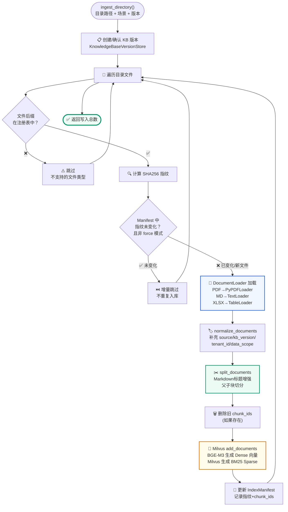

# 第16讲：文档入库与索引链路

**上一讲**：[数据隔离与多租户设计](./15-data-isolation.md)  
**下一讲**：[RAG 回归验收与入库质量](./17-quality-evaluation.md)

## 本讲目标

- 理解离线入库链路和在线问答链路的边界
- 掌握文档加载、标准化、切分的完整流程
- 理解 IndexManifest 的增量入库机制
- 掌握 FAQ 从 CSV 到 Milvus 的完整流程

> 📖 **前置阅读**：如果你想深入理解 Parent-Child Chunking 的设计原理和 chunk size 的选择依据，请先阅读 [附录H：文档切分策略](./appendix/appendix-h-chunking-strategy.md)。

---

## 第一部分：前置知识 — 离线 vs 在线链路

### 1.1 清晰的工程边界

```
离线链路（入库）                      在线链路（问答）
─────────────────                    ─────────────────
定时/手动执行                         每次用户提问时执行
修改 Milvus 数据                      只读 Milvus 数据
可以慢（几分钟到几十分钟）            必须快（秒级响应）
可以重试、可以回滚                    必须一次成功
解析文件、切分、向量化                只做检索、不解析文件
```

**关键原则：在线问答不解析文件、不执行 OCR、不写入知识库。**

### 1.2 为什么分开

如果把文档解析放在在线链路：
- 用户提问时临时解析 PDF → 首 token 延迟增加 5-10 秒
- 文件解析失败时用户看到的是"PDF 损坏"而非答案
- 无法做质量报告（因为解析是即时的，没有机会检查）

如果把向量化放在在线链路：
- 用户问题需要等 Embedding 模型加载（冷启动 10+ 秒）
- 无法预热 Embedding 模型

---

## 第二部分：文档加载器注册表

### 2.1 注册表设计

```python
# qa_core/indexing/document_loaders.py

# Loader 注册表：后缀 → 加载器工厂
DOCUMENT_LOADER_SPECS: tuple[DocumentLoaderSpec, ...] = (
    DocumentLoaderSpec(
        suffixes=(".txt", ".md"),
        factory=_utf8_text_loader,
        description="UTF-8 文本/Markdown"
    ),
    DocumentLoaderSpec(
        suffixes=(".pdf",),
        factory=_pdf_loader,
        description="PDF 文档"
    ),
    DocumentLoaderSpec(
        suffixes=(".docx",),
        factory=_docx_loader,
        description="Word 文档"
    ),
    DocumentLoaderSpec(
        suffixes=(".pptx", ".ppt"),
        factory=lambda p: UnstructuredPowerPointLoader(str(p)),
        description="PowerPoint"
    ),
    DocumentLoaderSpec(
        suffixes=(".csv", ".xlsx", ".xls"),
        factory=load_table_file,
        description="表格文件 — 按行解析"
    ),
)

DOCUMENT_LOADER_REGISTRY: dict[str, DocumentLoaderSpec] = {
    suffix: spec
    for spec in DOCUMENT_LOADER_SPECS
    for suffix in spec.suffixes
}

def get_document_loader_spec(path: Path) -> DocumentLoaderSpec | None:
    """根据文件后缀获取加载器注册项。"""
    return DOCUMENT_LOADER_REGISTRY.get(path.suffix.lower())
```

### 2.2 扩展性

新增文件格式只需添加一个注册项：

```python
# 新增：支持 .html 文件
DOCUMENT_LOADER_REGISTRY[".html"] = DOCUMENT_LOADER_REGISTRY[".htm"] = DocumentLoaderSpec(
    suffixes=(".html", ".htm"),
    factory=lambda p: UnstructuredHTMLLoader(str(p)),
    description="HTML 网页"
)
```

注册表模式比 `if/elif` 分支更可维护。当文件类型增长时，`if/elif` 会变成几百行难以维护的代码。

---

## 第三部分：文档入库主流程

### 3.1 ingest_directory() 完整流程



```python
# qa_core/indexing/service.py
def ingest_directory(
    directory_path: str,
    source: str | None = None,
    *,
    scenario_id: str | None = None,
    tenant_id: str | None = None,
    dataset_id: str | None = None,
    visibility: str | None = None,
    allowed_roles: list[str] | None = None,
    force: bool = False,
    kb_version: str | None = None,
    create_new_version: bool = False,
    activate: bool = False,
    description: str = "",
) -> int:
    """把目录中的业务文档增量写入 Milvus，逐文件委托 _ingest_single_file 处理。"""

    # Step 1：解析场景、构建数据域、确定业务分类
    scenario = resolve_scenario(scenario_id)
    data_scope = resolve_data_scope(
        tenant_id=tenant_id, dataset_id=dataset_id,
        visibility=visibility, user_roles=allowed_roles,
    )
    root = Path(directory_path)
    resolved_source = source or normalize_source_from_path(root)
    if resolved_source not in scenario.valid_sources:
        raise ValueError(f"无效的业务分类：{resolved_source}")

    # Step 2：创建/确认知识库版本
    version_store = get_kb_version_store(scenario.scenario_id)
    version = version_store.ensure_version(
        kb_version, create_new=create_new_version,
        description=description, created_by="ingest_directory",
    )
    active_kb_version = version.kb_version

    # Step 3：打开增量清单 + 文档存储
    manifest = IndexManifest(path=scenario.index_manifest_path)
    doc_store = get_doc_store(scenario.doc_collection)

    # Step 4：遍历目录，逐个文件委托给 _ingest_single_file
    total_chunks = 0
    skipped_files = 0
    for current_root, _, files in os.walk(root):
        for file_name in files:
            path = Path(current_root) / file_name
            chunks, skipped = _ingest_single_file(
                path, resolved_source, active_kb_version, scenario,
                data_scope, allowed_roles, doc_store, manifest, force,
            )
            if skipped:
                skipped_files += 1
            else:
                total_chunks += chunks

    # Step 5：持久化清单 + 记录入库统计
    manifest.save()
    version_store.record_ingest_result(
        active_kb_version, content_type="doc",
        count=total_chunks, source=resolved_source,
    )

    # Step 6：可选激活版本（需要 --activate 参数）
    if activate:
        version_store.activate_version(active_kb_version)

    return total_chunks
```

`_ingest_single_file()` 负责单个文件的增量入库逻辑，被 `ingest_directory` 的循环调用：

```python
def _ingest_single_file(
    path, resolved_source, active_kb_version, scenario,
    data_scope, allowed_roles, doc_store, manifest, force,
) -> tuple[int, bool]:
    """处理单个文件：未变化则跳过，否则删除旧 chunk 后重新入库。"""
    if get_document_loader_spec(path) is None:
        raise ValueError(f"不支持的文档类型：{path}")
    fingerprint = file_fingerprint(path)
    existing = manifest.get(
        resolved_source, path, active_kb_version, scenario.scenario_id
    )
    # 指纹、Embedding 模型版本、chunk schema 均未变化时跳过
    if (
        not force
        and existing
        and existing.fingerprint == fingerprint
        and existing.embedding_model_version == get_settings().embedding_model_version
        and existing.chunk_schema_version == get_settings().chunk_schema_version
    ):
        return 0, True

    # 存在旧 chunk 时先删除，再重新加载、标准化、切分
    if existing and existing.chunk_ids:
        doc_store.delete_ids(existing.chunk_ids)
    docs = normalize_documents(
        load_file(path), path, resolved_source,
        active_kb_version, scenario.scenario_id,
        data_scope, allowed_roles,
    )
    chunks, ids = split_documents(docs)
    if chunks:
        doc_store.add_documents(chunks, ids=ids)
        manifest.update(
            resolved_source, path, fingerprint, ids,
            scenario_id=scenario.scenario_id,
            kb_version=active_kb_version,
            embedding_model_version=get_settings().embedding_model_version,
            chunk_schema_version=get_settings().chunk_schema_version,
        )
        return len(chunks), False
    return 0, False
```

### 3.2 normalize_documents 的作用

```python
def normalize_documents(
    documents: list[Document],
    file_path: Path,
    source: str,
    kb_version: str | None = None,
    scenario_id: str | None = None,
    data_scope: DataScope | None = None,
    allowed_roles: list[str] | None = None,
) -> list[Document]:
    """为文档补充项目标准元数据，供过滤和引用使用。"""
    doc_id = file_fingerprint(file_path)
    scenario = resolve_scenario(scenario_id)
    scope = data_scope or resolve_data_scope()
    version_meta = version_metadata(kb_version, scenario.scenario_id)
    normalized: list[Document] = []
    for index, doc in enumerate(documents):
        metadata = dict(doc.metadata or {})
        metadata.update(
            {
                "source": source,
                "scenario_id": scenario.scenario_id,
                **scope.metadata(allowed_roles=allowed_roles),
                "file_path": str(file_path),
                "file_name": file_path.name,
                "file_type": file_path.suffix.lower(),
                "doc_id": doc_id,
                "page_index": metadata.get("page", index),
                "content_type": metadata.get("content_type") or "text",
                **version_meta,
            }
        )
        normalized.append(Document(page_content=doc.page_content, metadata=metadata))
    return normalized
```

---

## 第四部分：表格 CSV / Excel 专用入库设计

### 4.1 为什么表格不能按普通文本切分

普通制度、流程、手册是一段段自然语言，适合用 Parent-Child Chunking 按章节和字符长度切分。

但 CSV / Excel 表格不是自然段，而是一条条**行记录**。一行里多个单元格共同表达一个完整业务事实：

```text
材料名称=施工照片
状态=待补充
责任人=项目经理
截止日期=2026-05-30
```

如果把表格当普通文本递归切分，可能出现：

- 检索命中了“施工照片”，但状态被切到另一个 chunk；
- 检索命中了“金额”，但付款节点、责任人丢失；
- 两行不同记录被拼到同一个 chunk，答案把 A 行状态说成 B 行状态；
- 答案引用只能定位到文件，不能定位到工作表和行号。

所以本项目对表格资料的原则是：

> **一行表格 = 一个完整业务语义单元。**

### 4.2 文件读取策略

表格文件在 Loader 注册表中作为独立类型接入：

```python
# qa_core/indexing/document_loaders.py
DocumentLoaderSpec(
    suffixes=(".csv", ".xlsx", ".xls"),
    factory=_table_loader,
    description="CSV/Excel 表格解析；按行保留表头、sheet 和单元格键值。",
)
```

读取规则：

| 文件类型 | 读取方式 | 说明 |
|----------|----------|------|
| `.csv` | `pandas.read_csv(..., encoding="utf-8-sig")` | 兼容带 BOM 的中文 CSV |
| `.xlsx` | `pandas.read_excel(..., sheet_name=None, engine="openpyxl")` | 一次读取全部工作表 |
| `.xls` | `pandas.read_excel(..., sheet_name=None, engine="xlrd")` | 兼容旧版 Excel |

Excel 会逐个 sheet 处理，避免把多个业务表混成一张表。

### 4.3 表格清洗

表格入库前先做轻量清洗：

```python
def _normalize_frame(frame: pd.DataFrame) -> pd.DataFrame:
    """清理表格空行空列，并把缺失表头补成稳定列名。"""
    data = frame.dropna(how="all").dropna(axis=1, how="all").fillna("")
    columns = []
    for index, column in enumerate(data.columns, start=1):
        name = str(column).strip()
        if not name or name.lower().startswith("unnamed:"):
            name = f"列{index}"
        columns.append(name)
    data.columns = columns
    return data
```

清洗目标不是复杂 ETL，而是保证表格行进入 RAG 时不会因为空行、空列表头、`Unnamed` 列名造成检索噪声。

单元格值也会转成适合检索的短文本：

```python
def _cell_text(value: object) -> str:
    text = str(value).strip()
    if text.endswith(".0") and text[:-2].isdigit():
        return text[:-2]
    return text
```

这样 `1000.0` 会变成 `1000`，金额、编号、数量类问题更容易命中。

### 4.4 每行转换为 Document

表格 loader 会把每一行转换成一个 LangChain `Document`：

```python
content = "\n".join(
    [
        f"表格文件：{path.name}",
        f"工作表：{sheet_name}",
        f"表头：{' / '.join(headers)}",
        f"行号：{row_number}",
        "单元格：",
        *cell_lines,
    ]
)
```

生成后的正文类似：

```text
表格文件：验收清单.xlsx
工作表：材料验收
表头：材料名称 / 状态 / 责任人 / 截止日期
行号：3
单元格：
- 材料名称：施工照片
- 状态：待补充
- 责任人：项目经理
- 截止日期：2026-05-30
```

这样做有两个好处：

1. **语义完整**：同一行的字段和值不会被拆散；
2. **适合向量检索和 BM25**：既有自然语言标签，也有明确的列名和值。

### 4.5 metadata 设计

表格行必须携带可追溯 metadata：

```python
metadata={
    "content_type": "table_row",
    "table_id": table_id,
    "sheet_name": str(sheet_name),
    "row_number": row_number,
    "row_count": len(normalized),
    "column_count": len(headers),
    "table_headers": " | ".join(headers),
}
```

字段含义：

| 字段 | 作用 |
|------|------|
| `content_type=table_row` | 告诉切分、质量检测、检索上下文：这是表格行 |
| `table_id` | 标识同一个文件下的同一个工作表 |
| `sheet_name` | 支持答案引用到具体工作表 |
| `row_number` | 支持答案引用到具体行 |
| `row_count` / `column_count` | 质量报告和容量评估使用 |
| `table_headers` | 帮助回看表结构，也便于后续扩展表头召回 |

### 4.6 表格行不再递归切分

`split_documents()` 会识别 `content_type=table_row`：

```python
# qa_core/indexing/chunking.py
if is_table_metadata(doc.metadata):
    parent_docs = [doc]
else:
    parent_docs = parent_splitter.split_documents([doc])
```

也就是说，表格行不会再进入普通字符切分器。

原因是：表格行已经是完整业务单元，再切一次反而会破坏“列名 -> 单元格值”的关系。

### 4.7 检索策略中的 prefer_table

表格入库只是第一步。检索时还要识别用户是否在问表格问题。

本项目通过 `is_table_query()` 判断问题是否包含表格、清单、台账、字段、行号、工作表、状态、金额、责任人等表达：

```python
prefer_table = is_table_query(compact_query)
params = _apply_table_preference(prefer_table, params["run_doc"], params, settings)
```

当 `prefer_table=True` 时：

- 扩大 `doc_top_k`，多召回一些候选表格行；
- 扩大 `final_context_top_n`，给表格证据更多上下文空间；
- 设置 `faq_direct_exact_only=True`，禁止相似 FAQ 直接回答；
- 上下文构建时把表格行排在普通正文前。

为什么要禁用相似 FAQ 直出？

```text
用户问：验收材料清单里测试报告那一行是什么状态？
相似 FAQ：验收需要提交哪些材料？

这两个问题都包含“验收”“材料”“测试报告”，相似度可能不低。
但 FAQ 回答的是材料范围，用户问的是某一行字段值。
所以表格类问题只允许精确 FAQ 直出，相似 FAQ 必须让位给文档 RAG。
```

### 4.8 答案引用和兜底

表格资料的答案必须能回到原始证据。当前项目在来源标签中追加工作表和行号：

```text
[1] 验收清单.xlsx / 工作表：材料验收 / 第 3 行
```

另外，表格类问题经常涉及状态、金额、责任人、日期等精确值。LLM 有时会概括回答而漏掉某个关键单元格，所以项目里增加了表格行兜底：

```python
def enforce_table_row_details(answer: str, context_docs: list[Document]) -> str:
    """确保表格类答案在模型遗漏关键单元格时，确定性追加表格行要点。"""
```

如果模型回答没有覆盖表格行里的核心字段，系统会追加：

```text
表格行要点：状态：待补充；责任人：项目经理 [1]
```

这不是替代 LLM，而是对表格精确字段的一层确定性保护。

### 4.9 面试话术

如果面试官问“Excel 和 CSV 怎么入库”，可以这样回答：

> Excel 和 CSV 不能按普通文本切分。我们把每一行转成一个带表头、工作表、行号和单元格键值的 LangChain Document，并写入 `content_type=table_row`。切分阶段识别到表格行后不会再递归切分；检索阶段如果问题命中表格、清单、台账、金额、状态等关键词，会启用 `prefer_table`，扩大文档召回并优先保留表格行。答案引用会展示文件、工作表和行号，如果模型漏掉关键单元格，系统会追加表格行要点，保证表格类问题能追溯、能复核、字段不丢。

### 4.10 表格入库练习

这组练习用于确认“表格读取 → 行级 Document → 检索偏好 → 答案引用”已经闭环。

准备一个最小 CSV：

```csv
材料名称,状态,责任人,截止日期,备注
施工图纸,已提交,设计负责人,2026-05-10,版本为 V3
隐蔽工程照片,待补充,项目经理,2026-05-18,缺少二层西侧照片
验收测试报告,已通过,质量负责人,2026-05-20,检测编号 QA-2026-021
```

建议把它放到工程项目资料问答场景的数据目录中，并按常规知识库重建流程入库。学习时重点观察四件事：

| 检查点 | 期望结果 | 为什么检查 |
|--------|----------|------------|
| 入库后的 metadata | 包含 `content_type=table_row`、`sheet_name`、`row_number` | 证明表格行没有被当成普通正文。 |
| chunk 数量 | 每个有效数据行生成一个可检索 `Document` | 证明行级证据粒度正确。 |
| 检索计划 | 表格类问题命中 `prefer_table=True` | 证明检索策略知道当前问题更适合查表格。 |
| 答案来源 | 来源中能看到文件、工作表、行号 | 证明答案可以回到原始证据复核。 |

可以在页面或接口中提问：

```text
验收清单里隐蔽工程照片是什么状态，责任人是谁？
```

理想回答应该包含：

- 状态是“待补充”；
- 责任人是“项目经理”；
- 引用来源能定位到 CSV/Excel 的对应行；
- 如果模型遗漏状态或责任人，系统会追加“表格行要点”。

这个练习的目的不是测试模型文采，而是验证表格证据没有在切分和生成阶段丢失。

### 4.11 当前边界

一期表格入库只覆盖“规范二维表”。复杂 Excel 能力不能无边界扩散，否则会把 RAG 教学项目变成 Office 解析项目。

| 边界场景 | 一期处理策略 | 推荐做法 |
|----------|--------------|----------|
| 合并单元格 | 不默认还原层级语义 | 入库前整理成普通二维表。 |
| 多级表头 | 不自动推断复杂表头关系 | 人工扁平化字段名，比如“合同-金额”“合同-付款节点”。 |
| 公式单元格 | 读取解析后的单元格值，不重新计算业务公式 | 关键计算逻辑应在业务系统或数据准备阶段完成。 |
| 图表 | 不把柱状图、折线图直接转成结构化证据 | 导出图表背后的原始数据表再入库。 |
| 截图表格 | 不走 CSV/Excel 表格 loader | 进入 OCR/VLM 图文资料治理链路。 |
| 超大 Excel | 不在一期做复杂分布式解析 | 拆分工作表、拆分文件，或按业务周期归档。 |
| 隐藏行列和批注 | 不作为可信主证据 | 重要内容必须整理成显式列。 |
| 透视表 | 不直接作为原始证据 | 导出明细表或汇总表后再入库。 |

面试时可以这样说：

> 我们一期支持的是规范 CSV/Excel 的行级语义入库，不追求解析所有复杂 Office 特性。这样做是为了保证 RAG 主链路清晰可控：表格行能召回、字段能引用、来源能复核。合并单元格、截图表格、图表解释这类复杂资料会进入后续 OCR/VLM 和资料治理链路，而不是塞进普通表格 loader 里。

---

## 第五部分：IndexManifest 增量机制

### 5.1 为什么需要增量入库

假设知识库有 500 个 PDF 文件，每次修改一个文件就要全部重新入库：
- 耗时：500 个 PDF 全部解析、切分、向量化 → 可能 20-30 分钟
- 浪费：499 个未变化的文件被重复处理
- 风险：重新入库过程中如果出错，旧数据也会被删除

**增量入库**：只处理变化的文件，未变化的跳过。

### 5.2 Manifest 文件结构

```json
// .index_manifest/enterprise_knowledge/documents.json
{
    "scenario_id": "enterprise_knowledge",
    "last_full_ingest": "2026-05-07T15:00:00Z",
    "files": {
        "data/hr_data/入职流程.pdf": {
            "fingerprint": "a1b2c3d4e5f6...",
            "chunk_ids": ["chunk_001", "chunk_002", ...],
            "indexed_at": "2026-05-07T15:01:23Z",
            "doc_count": 12
        },
        "data/it_data/系统账号管理.md": {
            "fingerprint": "f6e5d4c3b2a1...",
            "chunk_ids": ["chunk_045", "chunk_046", ...],
            "indexed_at": "2026-05-07T15:02:45Z",
            "doc_count": 8
        }
    }
}
```

### 5.3 核心方法

```python
class IndexManifest(JsonFileStore):
    @staticmethod
    def key(source, file_path, kb_version=None, scenario_id=None):
        """根据来源、路径、版本和场景生成稳定清单键。"""
        return stable_hash(scenario_id or "", source, kb_version or "", str(Path(file_path).resolve()))

    def get(self, source, file_path, kb_version=None, scenario_id=None):
        """如果文件曾经入库，返回对应清单记录。"""
        key = self.key(source, file_path, kb_version, scenario_id)
        raw = self.data.get("files", {}).get(key)
        if not raw:
            return None
        return ManifestRecord(key=key, **raw)

    def is_unchanged(self, source, file_path, fingerprint, kb_version=None, scenario_id=None):
        """检查当前文件指纹是否与清单一致。"""
        record = self.get(source, file_path, kb_version, scenario_id)
        return bool(record and record.fingerprint == fingerprint)

    def update(self, source, file_path, fingerprint, chunk_ids, *, scenario_id="", kb_version="", embedding_model_version="", chunk_schema_version=""):
        """记录一次成功入库及其生成的 chunk id。"""
        key = self.key(source, file_path, kb_version, scenario_id)
        self.data.setdefault("files", {})[key] = {
            "scenario_id": scenario_id,
            "source": source,
            "path": str(Path(file_path).resolve()),
            "fingerprint": fingerprint,
            "chunk_ids": chunk_ids,
            "updated_at": utc_now(),
            "kb_version": kb_version,
            "embedding_model_version": embedding_model_version,
            "chunk_schema_version": chunk_schema_version,
        }

    def iter_records(self, *, scenario_id=None, source=None, kb_version=None):
        """按条件列出清单记录。"""
        records = []
        for key, raw in self.data.get("files", {}).items():
            record = ManifestRecord(key=key, **raw)
            if scenario_id and record.scenario_id != scenario_id:
                continue
            if source and record.source != source:
                continue
            if kb_version and record.kb_version != kb_version:
                continue
            records.append(record)
        return records
```

### 5.4 文件指纹计算

> **前置知识**：如果你不熟悉 SHA256 哈希和增量检测原理，请先阅读 [附录B：SHA256 内容指纹与增量检测](./appendix/appendix-b-sha256-fingerprint.md)

```python
def file_fingerprint(path: str | Path) -> str:
    """根据路径、修改时间和大小生成本地文件指纹，供增量入库使用。

    这里不读取文件全文，是为了让大文件入库前的变化判断更快。
    代价是极少数情况下如果内容变化但 mtime/size 不变，可能不会被识别；
    需要强制重建时使用 --force。
    """
    p = Path(path)
    stat = p.stat()
    return stable_hash(str(p.resolve()), stat.st_mtime_ns, stat.st_size)
```

基于路径、修改时间和大小的指纹确保文件元数据变化时被检测到，比全文 SHA256 更快且适合大文件场景（极端情况下内容变化但 mtime/size 不变时使用 --force 重建）。

---

## 第六部分：FAQ 入库流程

### 6.1 CSV 格式

FAQ 使用 CSV 文件管理，每行一个问答对：

```csv
source,question,answer
hr,入职需要准备哪些材料,入职当天需要携带：身份证原件及复印件、学历证书复印件、离职证明、体检报告、银行卡信息...
hr,试用期转正流程是什么,试用期转正流程：1. 员工提交转正申请 2. 直属领导评估 3. HR 审核 4. 部门负责人审批...
it,VPN 连接失败怎么办,请按以下步骤排查：1. 确认账号密码正确 2. 检查网络连接 3. 尝试切换 VPN 节点...
billing,如何申请发票,在订单页面点击"申请发票"，选择发票类型（电子/纸质），填写发票抬头...
```

### 6.2 入库实现

```python
# qa_core/indexing/faq_ingestion.py

def faq_documents_from_csv(
    csv_path: str,
    kb_version: str | None = None,
    scenario_id: str | None = None,
    tenant_id: str | None = None,
    dataset_id: str | None = None,
    visibility: str | None = None,
    allowed_roles: list[str] | None = None,
) -> tuple[list[Document], list[str]]:
    """把 FAQ CSV 转换为可写入 Milvus 的问题文档。

    FAQ 的 page_content 只放"标准问题"，答案放在 metadata.answer。这样检索时匹配的是
    用户问题和标准问题的相似度；一旦高置信命中，就可以直接返回 metadata.answer。
    """
    scenario = resolve_scenario(scenario_id)
    data_scope = resolve_data_scope(tenant_id=tenant_id, dataset_id=dataset_id, visibility=visibility, user_roles=allowed_roles)
    version_meta = version_metadata(kb_version, scenario.scenario_id)
    data = pd.read_csv(csv_path, encoding="utf-8")
    docs: list[Document] = []
    ids: list[str] = []
    seen_ids: set[str] = set()
    for _, row in data.iterrows():
        question = str(row.get("问题") or row.get("question") or "").strip()
        answer = str(row.get("答案") or row.get("answer") or "").strip()
        subject = str(
            row.get("source")
            or row.get("source_filter")
            or row.get("业务分类")
            or row.get("subject_name")
            or ""
        ).strip()
        if not question or not answer:
            continue

        source = normalize_faq_source(subject, scenario=scenario, question=question)
        faq_id = stable_hash(scenario.scenario_id, kb_version or "", source, question)
        if faq_id in seen_ids:
            faq_id = stable_hash(scenario.scenario_id, kb_version or "", source, question, answer)
        if faq_id in seen_ids:
            continue
        seen_ids.add(faq_id)
        docs.append(
            Document(
                page_content=question,
                metadata={
                    "faq_id": faq_id,
                    "scenario_id": scenario.scenario_id,
                    **data_scope.metadata(allowed_roles=allowed_roles),
                    "standard_question": question,
                    "answer": answer,
                    "source": source,
                    "subject_name": subject,
                    "status": "published",
                    **version_meta,
                },
            )
        )
        ids.append(faq_id)
    return docs, ids
```

**存储策略**：
- `page_content` = FAQ 标准问题 → 用于向量检索
- `metadata.answer` = 标准答案 → 检索命中后直接取 metadata 返回
- `metadata.source` = 当前场景 `valid_sources` 中的标准分类 → 用于 Milvus 过滤和数据隔离

这样 FAQ 直出时不需要再调用 LLM，直接从 metadata 读取答案即可。

`normalize_faq_source()` 只依赖当前场景包的 `valid_sources` 和 `source_patterns`。如果 CSV 中的分类无法映射到当前场景，系统会直接报错，而不是偷偷写入 Milvus。这样可以保证 FAQ 入库的业务边界和场景配置一致。

---

## 第七部分：清理与维护

### 7.1 清理已删除的本地文件

当本地文档被删除时，Milvus 中的旧 chunk 不会自动消失。需要运行清理脚本：

```bash
# 预览将要清理的内容（默认 dry-run）
python scripts/cleanup_missing_docs.py --scenario enterprise_knowledge

# 实际执行清理
python scripts/cleanup_missing_docs.py --scenario enterprise_knowledge --no-dry-run
```

### 7.2 cleanup_missing_document_chunks 原理

```python
def cleanup_missing_document_chunks(
    *,
    scenario_id: str | None = None,
    source: str | None = None,
    kb_version: str | None = None,
    dry_run: bool = True,
) -> dict[str, Any]:
    """清理 manifest 中已不存在本地文件的文档 chunk。

    该操作会删除 Milvus 数据，默认 dry-run 先预览再执行。
    """
    scenario = resolve_scenario(scenario_id)
    manifest = IndexManifest(path=scenario.index_manifest_path)
    records = manifest.iter_records(
        scenario_id=scenario.scenario_id,
        source=source,
        kb_version=kb_version,
    )
    missing = [r for r in records if r.path and not Path(r.path).exists()]

    if dry_run:
        return {
            "dry_run": True,
            "missing_file_count": len(missing),
            "affected_chunk_count": sum(len(r.chunk_ids) for r in missing),
            "missing_files": [
                {"path": r.path, "chunk_count": len(r.chunk_ids)}
                for r in missing
            ],
        }

    # 实际删除
    doc_store = get_doc_store(scenario.doc_collection)
    for record in missing:
        doc_store.delete_ids(record.chunk_ids)
        manifest.remove_by_key(record.key)

    manifest.save()
    return {
        "dry_run": False,
        "deleted_chunk_count": sum(len(r.chunk_ids) for r in missing),
        "deleted_file_count": len(missing),
    }
```

**默认 dry-run**：先预览再执行，防止误删。

---

## 第八部分：复杂图文资料入库治理

### 8.1 这属于多模态吗

导入文档中同时存在文字、图片、截图、扫描页、流程图、设备照片时，本质上已经进入了**多模态资料处理**范围。

但在当前一期项目里，它应该被定位为：

> **多模态入库治理**，不是多模态在线问答。

两者区别如下：

| 类型 | 做什么 | 当前一期定位 |
|------|--------|--------------|
| 多模态入库治理 | 离线解析图片、扫描件、图文 PDF，把结果转成可复核文本或图文块 | 可以讲清楚设计边界，谨慎接入 |
| 多模态在线问答 | 用户实时上传图片，模型现场看图回答 | 不放一期主链路 |
| 多模态检索 | 同时存文本向量和图片向量，用 CLIP/VLM 做跨模态召回 | 更适合二期或三期 |

这样设计的原因是：在线问答必须稳定、低延迟、可追踪；图片解析、OCR、VLM 描述成本高且失败率高，如果直接塞进在线链路，会让 RAG 主流程变慢、变重、变不可控。

### 8.2 为什么不能“图片 OCR 一下就入库”

真实企业资料中的图片经常包含：

- 合同扫描件；
- 审批截图；
- 设备告警截图；
- 流程图；
- 验收照片；
- 表格截图；
- 盖章文件；
- 票据和单证照片。

这些内容的风险不只是“能不能识别出文字”，而是：

| 风险 | 示例 |
|------|------|
| OCR 识别错误 | 金额 `8000` 被识别成 `B000` |
| 上下文断裂 | 图片中的“处理步骤”脱离前后正文后无法理解 |
| 来源不可追溯 | 回答引用了图片内容，但不知道来自第几页第几张图 |
| 证据未确认 | 扫描件内容未经人工复核，不能作为正式制度口径 |
| 图中信息不全 | 流程图箭头、颜色、图例无法仅靠 OCR 还原 |

所以复杂图文资料不能简单走“OCR -> 普通文本切分 -> 入库”。正确流程应该是：

```text
图文资料
  -> 抽取文本层
  -> 识别图片/扫描页
  -> OCR 或 VLM 生成候选说明
  -> 绑定附近正文、页码、图片编号
  -> 人工复核
  -> 生成 image_text_block
  -> 入库质量检查
  -> 新知识库版本激活
```

### 8.3 三类资料的处理策略

| 资料类型 | 处理方式 | 是否直接进入 active 知识库 |
|----------|----------|-----------------------------|
| 有文本层的 PDF / Word / PPT | 正文先按普通文档入库，图片进入风险报告 | 正文可以，图片不直接进 |
| 扫描件 / 图片 PDF | 进入离线 OCR，生成待复核 Markdown | 不直接进 |
| 图片和正文强相关资料 | 生成图文语义块 `image_text_block` | 复核后才可以进 |

当前项目已有离线 OCR 脚本：

```bash
python scripts/ocr/run_offline_ocr.py --input-dir incoming_scans --output-dir reports/ocr/batch_001
python scripts/ocr/promote_ocr_candidates.py --input-dir reports/ocr/batch_001 --scenario engineering_project_qa --source quality --apply
```

第一条命令只生成待复核资料，第二条命令才把复核后的 Markdown 提升到场景资料目录。提升后仍然要执行知识库版本重建、入库质量检查和RAG 回归验收。

### 8.4 image_text_block 推荐结构

对于图片和正文强相关的资料，不应该把 OCR 文本当成普通段落直接切分，而应该生成专门的图文块：

```text
page_content:
  第 3 页第 2 张图片说明：设备告警面板显示 E102，温度超过 85°C。
  图片附近正文：处理方式为先停机检查冷却风扇，再联系运维。

metadata:
  content_type: image_text_block
  file_name: equipment_alarm_manual.pdf
  page_index: 3
  image_index: 2
  ocr_confidence: 0.91
  review_status: reviewed
  parent_content: 第 3 页完整上下文
```

关键字段说明：

| 字段 | 作用 |
|------|------|
| `content_type=image_text_block` | 告诉检索和上下文构建：这是图文块，不是普通正文 |
| `page_index` / `image_index` | 支持答案引用到具体页和具体图片 |
| `ocr_confidence` | 用于入库质量检查，低置信度不能直接激活 |
| `review_status` | 只有 `reviewed` 才允许进入 active 知识库 |
| `parent_content` | 保留图片附近正文，避免图片文字脱离上下文 |

### 8.5 分块策略

图文混排资料的切分原则是：

1. **正文按章节或父子块切分**：继续复用当前 `split_documents()` 的 Parent-Child Chunking。
2. **表格按行切分**：CSV/Excel 仍然使用 `content_type=table_row`，不参与普通递归切分。
3. **图片 OCR 文本不单独裸切**：必须绑定页码、图片编号和附近正文。
4. **未复核图文块不进 active**：只能作为候选资料进入复核区或治理报告。
5. **低置信度图文块阻断激活**：避免把错误金额、日期、合同号写入正式知识库。

也就是说，图文资料的最小语义单元不是“识别出的一行字”，而是：

```text
图片 OCR 文本 + 图片附近正文 + 页码 + 图片编号 + 置信度 + 复核状态
```

### 8.6 检索策略

图文块进入知识库后，也不应该和普通正文完全同权。

推荐策略：

- 普通知识问题：优先使用文本 chunk 和表格 chunk。
- 用户问题包含“图片、截图、扫描件、照片、图中、流程图、告警面板”等表达时，提高 `image_text_block` 权重。
- 如果命中的图文块 `review_status != reviewed`，回答必须标记“未确认”，不能把它当成正式证据。
- 来源展示必须包含文件名、页码和图片编号。

这样既能让图文资料参与 RAG，又不会让未确认图片内容污染正式答案。

### 8.7 面试话术

如果面试官问“你们项目支持多模态吗”，可以这样回答：

> 我们一期没有做实时多模态对话，而是把多模态能力收敛在知识库入库治理侧。图片、扫描件、图文 PDF 会先通过离线 OCR 或 VLM 生成可复核文本，再绑定页码、图片编号、附近正文和置信度。只有人工复核通过的图文块才会以 `image_text_block` 形式进入知识库，并继续经过入库质量检查、版本激活和回归评测。这样既能处理企业资料中的多模态信息，又不会让在线问答链路变重、变慢、变不稳定。

这段话的重点不是“我接了 OCR”，而是说明你知道企业 RAG 里多模态资料必须经过治理、复核、入库质量检查和版本化上线。

---

## 重点掌握

| 优先级 | 内容 | 原因 |
|--------|------|------|
| ★★★ 必会 | 离线入库 vs 在线问答的清晰边界：入库修改数据（可慢可重试），问答只读（必须快） | 理解两条链路不能混淆的根本原因 |
| ★★★ 必会 | ingest_directory() 的完整流程：确认版本 → 遍历文件 → 指纹比对 → 加载/标准化 → 切分 → 写入 Milvus → 更新 Manifest | 文档入库的主流程 |
| ★★★ 必会 | IndexManifest 增量机制：通过文件指纹（路径+修改时间+大小）判断文件是否变化，未变化跳过 | 避免每次全量重建的关键设计 |
| ★★ 理解 | 注册表模式管理 Document Loaders：后缀→工厂函数的映射，扩展新格式只需添加注册项 | 可扩展性设计模式 |
| ★★ 理解 | normalize_documents() 补充项目标准元数据（source、scenario_id、kb_version、data_scope 等） | 保证每个 chunk 有完整的过滤字段 |
| ★★ 理解 | FAQ 入库：page_content 存问题、metadata.answer 存答案，检索命中后直接返回 | FAQ 直出不走 LLM 的实现基础 |
| ★★ 理解 | 表格 CSV/Excel 按行入库：每行为一个完整业务语义单元，不递归切分 | 表格资料的特殊处理策略 |
| ★ 了解 | 复杂图文资料的多模态入库治理流程 | 了解扩展方向 |
| ★ 了解 | cleanup_missing_document_chunks() 清理已删除文件对应的 Milvus chunk | 了解维护工具 |

## 本讲小结

- **离线入库 ≠ 在线问答**：入库负责解析文件、切分、向量化、写入 Milvus；问答只做检索和生成
- **注册表模式**管理文件格式→Loader 的映射，扩展新格式只需添加注册项
- **表格 CSV/Excel 按行入库**：每行是一个 `table_row`，保留表头、工作表、行号和单元格键值，不再递归切分
- **IndexManifest** 记录每个文件的指纹和 chunk ID，实现增量入库（只处理变化的文件）
- **FAQ 入库**将标准问题作为检索内容、标准答案存储在 metadata 中，检索命中后直接返回
- **复杂图文资料属于多模态入库治理**：OCR/VLM 结果必须绑定上下文、人工复核、入库质量检查和版本激活后才能进入 active 知识库
- **清理脚本默认 dry-run**，先预览再执行，防止误删

**下一讲**：[RAG 回归验收与入库质量](./17-quality-evaluation.md) — 入库质量报告、评测指标、回归验收体系、Bad Case 闭环
