# QA Core 全链路架构

---

## 一、在线问答主流程

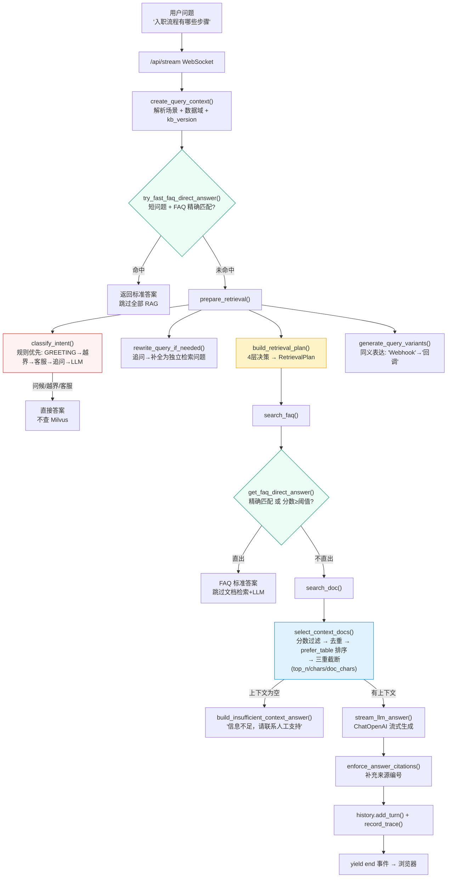

---

## 二、意图识别：6 级规则优先级

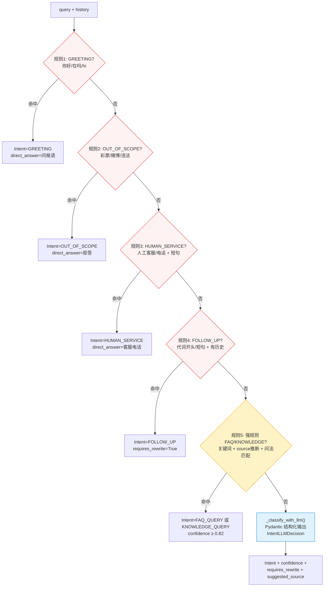

---

## 三、检索计划：4 层决策

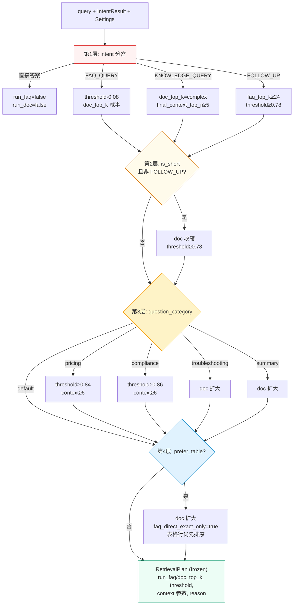

---

## 四、FAQ 三条路径对比

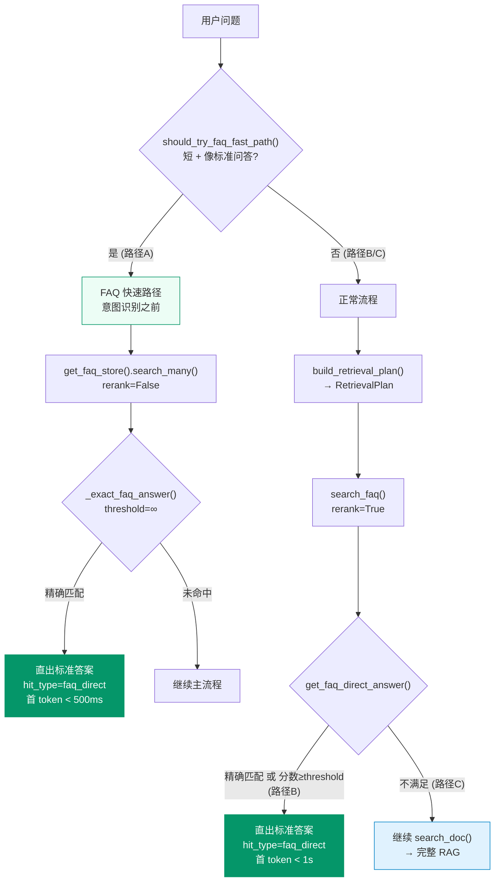

---

## 五、Milvus 检索执行

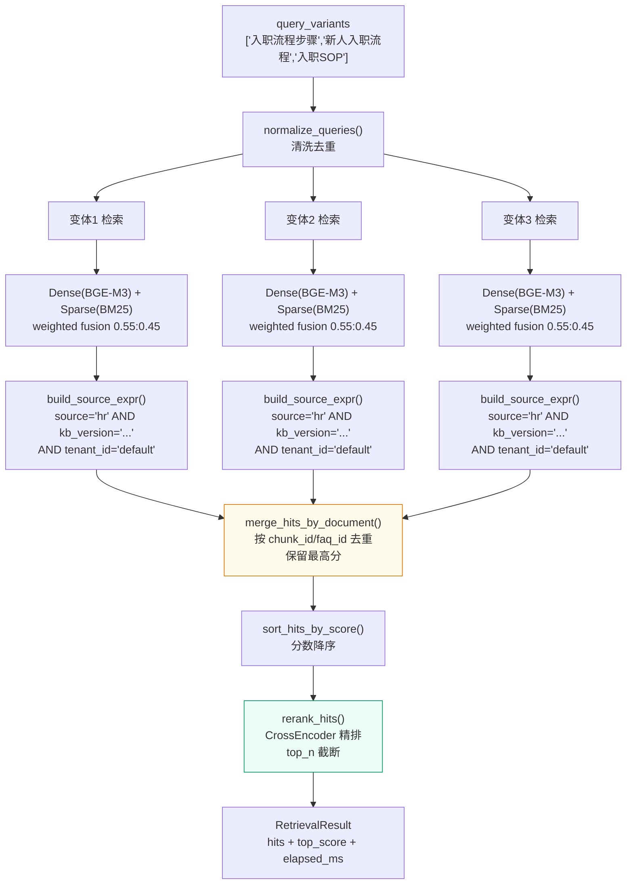

---

## 六、上下文构建：select_context_docs() 过滤链

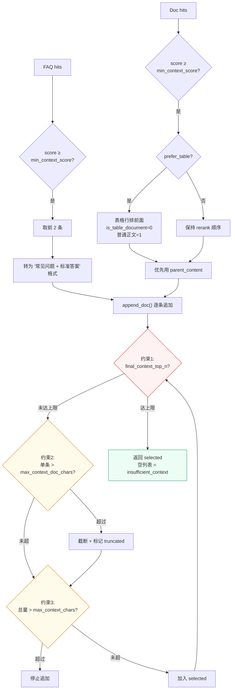

---

## 七、数据隔离模型

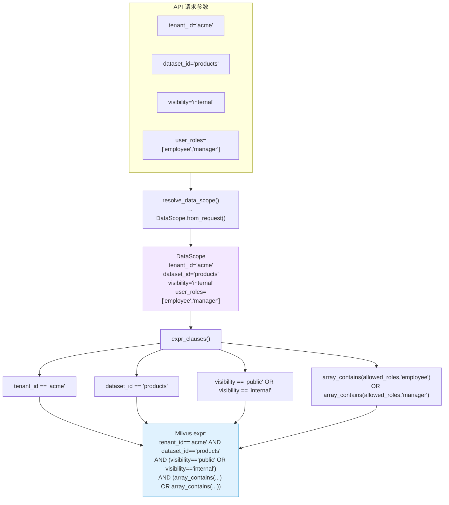

---

## 八、知识库版本生命周期

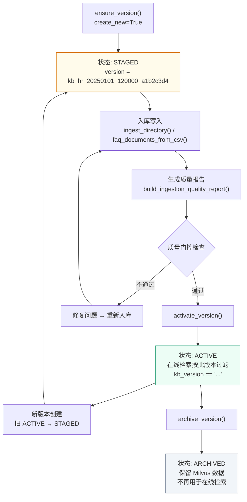

---

## 九、入库流程

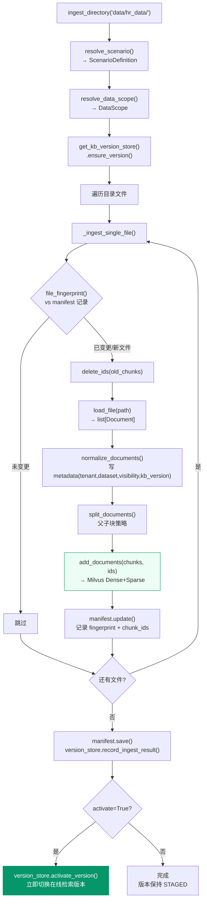

---

## 十、场景边界检测

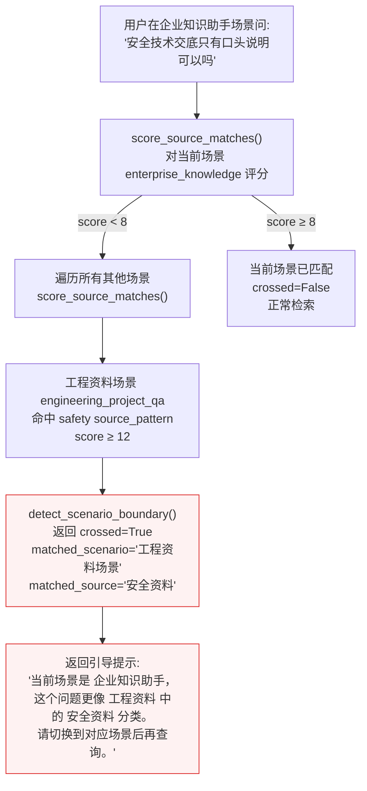

---

## 十一、历史压缩策略

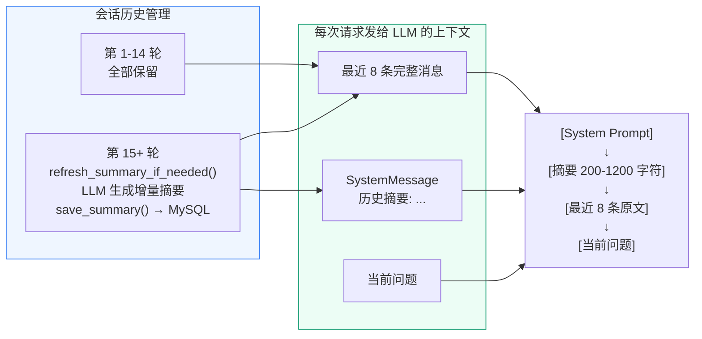

---

## 模块文件索引

| 层级 | 文件 | 核心职责 |
|------|------|---------|
| 入口 | `api/chat.py` | WebSocket + HTTP 路由，事件转发 |
| 应用 | `application/service.py` | QAService 编排门面 |
| 编排 | `pipeline/rag.py` | stream_query 7 阶段主流程 |
| 步骤 | `pipeline/steps.py` | prepare_retrieval / prepare_answer / stream_llm_answer |
| 检索步骤 | `pipeline/retrieval_steps.py` | search_faq / get_faq_direct_answer / search_doc |
| 上下文 | `pipeline/context.py` | select_context_docs / direct_faq_answer / build_context |
| 运行时 | `pipeline/runtime.py` | RAGQueryContext / create_query_context / record_trace |
| 改写 | `pipeline/rewrite.py` | rewrite_query_if_needed (追问→独立问题) |
| 变体 | `pipeline/query_variants.py` | generate_query_variants (同义检索表达) |
| 引用 | `pipeline/citations.py` | enforce_answer_citations / enforce_table_row_details |
| 事件 | `pipeline/events.py` | start / status / token / end / error 事件构造 |
| 意图 | `intent/classifier.py` | classify_intent (6级规则 + LLM) |
| 类别 | `intent/question_category.py` | infer_question_category / is_table_query |
| 检索 | `retrieval/store.py` | MilvusHybridStore (Dense+Sparse) |
| 策略 | `retrieval/strategy.py` | build_retrieval_plan (4层决策) |
| 排序 | `retrieval/ranking.py` | merge / sort / rerank |
| 过滤 | `retrieval/filters.py` | build_source_expr / validate_source_filter |
| 模型 | `retrieval/models.py` | get_embeddings / get_reranker |
| 工厂 | `retrieval/factory.py` | get_faq_store / get_doc_store / warmup |
| 数据域 | `governance/data_scope.py` | DataScope / resolve_data_scope / expr_clauses |
| 版本 | `governance/kb_versions.py` | KnowledgeBaseVersionStore / activate / archive / ensure |
| 场景 | `scenarios/registry.py` | ScenarioRegistry / ScenarioDefinition |
| 边界 | `scenarios/boundary.py` | detect_scenario_boundary / detect_source_boundary |
| LLM | `llm/client.py` | get_chat_model (ChatOpenAI) |
| 提示词 | `prompts/selector.py` | build_answer_prompt_profile (类别>意图>默认) |
| 历史 | `memory/history.py` | ChatHistoryStore (摘要+最近消息+写入) |
| 反馈 | `memory/feedback.py` | FeedbackStore |
| 入库 | `indexing/service.py` | ingest_directory (文档→Milvus) |
| 质量 | `quality/ingestion.py` | build_ingestion_quality_report |
| 追踪 | `observability/langsmith_adapter.py` | record_query_trace → LangSmith |
