# KnowForge RAG Platform — 课程大纲

本目录包含 18 讲系统化课程，从零开始讲解如何构建一个企业级多场景 RAG 知识平台。

## 如何使用本课程

- **零基础学生**：先学 P0 主链路（01-10）建立完整的 RAG 闭环，再学 11-12 的 Web 服务基础设施，最后学 13-18 的治理与运维。脚本不要逐个硬啃，按 `script_usage_guide.md` 的任务入口学习
- **有经验的开发者**：可以先看 `lecture_notes.md` 速览全貌（教师备课速查手册），再挑薄弱讲次精读
- **赶时间的面试准备**：优先看 01 → 02 → 03(LangChain) → 04 → 07 → 09 → 10 → 16 → 面试材料（`interview_playbook.md` 和 `interview_faq.md`）

## 主次分层

这套课程不是要求学生第一遍把所有内容都学到同一深度。推荐按四层吸收：

| 层级 | 内容范围 | 学习要求 |
|------|----------|----------|
| P0 主链路 | 01、02、03、04、05、06、07、08、09 | 第一遍必须掌握，能讲清一次在线问答闭环。 |
| P1 核心工程能力 | 10、11、12、13、14、15、16、18 | 第二阶段掌握，能讲清应用入口、框架生态、入库、版本、隔离、评测、测试和 Web 异步原理。 |
| P2 企业化增强 | 17、多场景、LangSmith Trace/Evaluation、企业 overlay | 面试加分，体现企业级项目经验。 |
| P3 扩展方向 | OCR/VLM、GraphRAG、LangGraph Agent、A2A、容量评估 | 知道边界和规划即可，不放进第一遍主线。 |

详细拆分见 [学习优先级与主次拆分](learning_priority.md) 和 [脚本使用主次指南](script_usage_guide.md)。

## 学习路线图

```mermaid
flowchart LR
    subgraph Phase1["第一阶段：基础概念"]
        L01["01 项目概述<br/>与环境搭建"]
        L02["02 RAG 核心<br/>概念深入"]
    end

    subgraph Phase2["第二阶段：核心 RAG 链路（P0）"]
        L03["03 LangChain<br/>生态系统 ⚠️"]
        L04["04 Milvus 索引<br/>机制与基本操作"]
        L05["05 意图<br/>分类"]
        L06["06 检索策略与<br/>动态计划"]
        L07["07 查询改写<br/>与变体生成"]
        L08["08 Milvus<br/>混合检索"]
        L09["09 QAService<br/>核心编排"]
        L10["10 RAG Pipeline<br/>主流程"]
        L11["11 Prompt 工程<br/>与 Profile"]
    end

    subgraph Phase3["第三阶段：Web 服务基础设施（P1）"]
        L12["12 FastAPI 与<br/>异步 Web 框架"]
        L13["13 应用入口与<br/>环境前置校验"]
    end

    subgraph Phase4["第四阶段：治理与运维（P1-P2）"]
        L14["14 知识库<br/>版本管理"]
        L15["15 数据隔离<br/>与多租户"]
        L16["16 文档入库<br/>与索引链路"]
        L17["17 RAG 回归验收<br/>与入库质量"]
        L18["18 测试与<br/>接口验收"]
        L19["19 LangSmith<br/>观测与 Trace"]
    end

    L01 --> L02 --> L03 --> L04 --> L05 --> L06 --> L07 --> L08 --> L09 --> L10 --> L11 --> L12 --> L13 --> L14 --> L15 --> L16 --> L17 --> L18 --> L19

    style L03 fill:#FFFBEB,stroke:#D97706,stroke-width:2px
    style Phase1 fill:#EFF6FF,stroke:#3B82F6,stroke-width:2px
    style Phase2 fill:#FEF2F2,stroke:#DC2626,stroke-width:2px
    style Phase3 fill:#ECFDF5,stroke:#059669,stroke-width:2px
    style Phase4 fill:#F5F3FF,stroke:#7C3AED,stroke-width:2px
    style Phase5 fill:#FFF7ED,stroke:#EA580C,stroke-width:2px
```

**路线图的设计逻辑**：18 讲遵循"基础概念 → 框架基础（LangChain）→ 核心链路 → Web 基础设施 → 治理运维"的递进。学生先建立 RAG 概念和 LangChain 体系认知，再在 7 讲实战中反复应用，最后补上 Web 服务层和企业级治理能力。

**第一阶段（基础概念 · 2 讲）**：01 和 02 不涉及任何代码，只建立心智模型。01 让你跑通项目、看到效果；02 深入理解 Embedding、向量检索、混合检索这些 RAG 最核心的概念。学完这两讲，你至少知道 RAG 是什么、为什么需要它。

**第二阶段（核心 RAG 链路 · 9 讲，P0）**：这是课程的**核心区**。03 到 11 构成了一个完整 RAG 问答的数据流：LangChain 生态系统（03）→ Milvus 索引机制（04）→ 意图分类（05）→ 检索计划（06）→ 查询改写 + 变体（07）→ Milvus 混合检索（08）→ QAService 编排（09）→ Pipeline 主流程（10）→ Prompt 模板（11）。03 先打 LangChain 基础，04 深入 Milvus 底层操作，后续 7 讲在真实链路中反复用到——这 9 讲之间的依赖是**严格线性**的，跳过任何一讲都会导致后续出现理解断层。

> **设计意图**：LangChain 放在 P0 最前面——学生先掌握 Runnable/LCEL/ChatOpenAI 的核心概念，再在后续链路中看到它们被实际使用（"意图识别用了 with_structured_output""QAService 用了 stream()"），形成"先学后用"的正向循环。

**第三阶段（Web 服务基础设施 · 2 讲，P1）**：12 深入 FastAPI 的 async/await 和 WebSocket——这是整个项目的"骨架"。13 深入 `app.py` 和 preflight check，理解项目为什么"不做技术降级"。学完这阶段，你能理解项目的 Web 服务层和启动流程。

**第四阶段（治理与运维 · 6 讲，P1-P2）**：14 到 19 覆盖了"让 RAG 系统能上线"所需的一切——知识库版本管理（14）、多租户数据隔离（15）、文档入库链路（16）、RAG 回归验收与入库质量（17）、测试与接口验收（18）、LangSmith 观测与 Trace（19）。14 → 15 → 16 建议按序学习（先入库再治理，版本是隔离的前提）。

**学习路径**：

| 路径 | 讲次 | 适合人群 |
|------|------|---------|
| 主链路路径 | 01 → 02 → 03 → 04 → 05 → 06 → 07 → 08 → 09 → 10 → 11 | 第一遍学习，先抓住 RAG 在线问答闭环（全 P0） |
| 框架深入路径 | 12 → 13 | 第二遍学习，理解 FastAPI 和应用入口原理 |
| 工程化路径 | 14 → 15 → 16 → 17 → 18 | 第二遍学习，补齐企业级工程能力 |
| 完整路径 | 01 → 19 顺序学 | 有充足时间，希望全面掌握 RAG 工程 |
| 速览路径 | 先读 `lecture_notes.md` 再挑薄弱讲次精读 | 有经验的开发者 |
| 面试路径 | 01 → 02 → 03 → 04 → 05 → 08 → 10 → 11 → 18 → 面试材料 | 赶时间准备面试 |

## 课程总览

| 讲次 | 主题 | 优先级 | 核心收获 |
|------|------|--------|---------|
| 01 | 项目概述与环境搭建 | P0 | 理解 RAG 基本概念，完成环境搭建，跑通项目 |
| 02 | RAG 核心概念深入 | P0 | 掌握 Embedding、Dense/Sparse 检索、Reranker 原理 |
| 03 | LangChain 生态系统 | P0 | 掌握 Runnable/LCEL、ChatOpenAI、VectorStore、Loader/Splitter |
| 04 | Milvus 索引机制与基本操作 | P0 | 掌握四种索引类型（FLAT/IVF/HNSW）、pymilvus 基本操作、LangChain 底层封装 |
| 05 | 意图分类 | P0 | 理解规则优先+LLM 补充的意图识别策略 |
| 06 | 检索策略与动态计划 | P0 | 掌握 RetrievalPlan，理解不同问题用不同检索参数 |
| 07 | 查询改写与变体生成 | P0 | 理解追问改写和 query variants 生成机制 |
| 08 | Milvus 混合检索 | P0 | 掌握 Dense+Sparse 混合检索、BM25、过滤表达式 |
| 09 | QAService 核心编排 | P0 | 理解服务门面模式、事件生成器、HTTP 与 WS 分工 |
| 10 | RAG Pipeline 主流程 | P0 | 掌握七阶段 Pipeline、FAQ 快速路径、引用增强、流式事件协议 |
| 11 | Prompt 工程与 Profile 系统 | P0 | 理解 Prompt Profile、问题类别与模板映射、安全约束 |
| 12 | FastAPI 与异步 Web 框架 | P1 | 理解 async/await、WebSocket、FastAPI 路由设计 |
| 13 | 应用入口与环境前置校验 | P1 | 理解 preflight check 设计模式，读懂 app.py |
| 14 | 知识库多版本管理 | P1 | 掌握版本状态机、激活/回滚、版本对比 |
| 15 | 数据隔离与多租户 | P1 | 理解 tenant/dataset/visibility/role 四维隔离 |
| 16 | 文档入库与索引链路 | P1 | 掌握文档加载、父子块切分、FAQ 入库、增量清单 |
| 17 | RAG 回归验收与入库质量 | P1 | 理解入库质量、领域指标、LangSmith Evaluation 和验收机制 |
| 18 | 测试与接口验收 | P1 | 理解测试金字塔、纯逻辑测试设计、验收测试 |
| 19 | LangSmith 观测与 Trace | P2 | 掌握 LangSmith Trace、业务 metadata、阶段耗时诊断 |

## 每讲详细内容

### 第一阶段：基础概念

#### 第 1 讲：项目概述与环境搭建
- **内容**：什么是 RAG、RAG 系统的基本组成、向量和向量检索的直观理解、8 个业务场景介绍、技术架构总览、环境搭建与验证
- **学完后**：能启动项目，在页面上完成一次完整问答
- **关键代码**：`docker-compose.yml`、`.env`

#### 第 2 讲：RAG 核心概念深入
- **内容**：Embedding 模型工作机制、向量相似度计算（余弦/欧几里得/内积）、BGE-M3 模型介绍、Dense 检索与 Sparse 检索对比、Reranker 原理、混合检索策略
- **学完后**：理解为什么 RAG 需要混合检索 + 重排
- **前置知识**：第 1 讲（了解 RAG 基本概念即可）

### 第二阶段：核心 RAG 链路（P0）

#### 第 3 讲：LangChain 生态系统 ⚠️ 篇幅较长
- **内容**：Runnable 统一接口、LCEL 管道语法、ChatOpenAI（invoke/stream/with_structured_output）、Message 类型系统、PromptTemplate/ChatPromptTemplate/MessagesPlaceholder、Output Parser、SQLChatMessageHistory、Milvus VectorStore 封装、Document Loaders 注册表模式、Text Splitters 父子块策略
- **学完后**：全面掌握本项目使用的 LangChain 组件，为后续讲次打下"语言基础"
- **建议**：分两次学习（前半 1-6 部分 + 后半 7-11 部分）

#### 第 4 讲：Milvus 索引机制与基本操作
- **内容**：向量索引的本质（空间换时间）、四种索引类型图解（FLAT/IVF_FLAT/IVF_PQ/HNSW）、索引选型决策树、pymilvus 基本操作（连接→Schema→建索引→插入→搜索）、LangChain 底层隐藏操作、兼容边界修复
- **学完后**：能写 pymilvus 代码操作 Milvus，理解 LangChain 封装了什么
- **前置知识**：第 2 讲（HNSW 概念）、第 3 讲（LangChain Milvus 封装）

#### 第 5 讲：意图分类
- **内容**：6 种意图类型、6 步决策顺序、规则优先 + LLM 补充策略、source 自动推断、structured output
- **学完后**：理解意图如何驱动后续检索策略
- **关键代码**：`qa_core/intent/classifier.py`

#### 第 6 讲：检索策略与动态计划
- **内容**：RetrievalPlan 数据结构、动态阈值设计、不同问题类别的参数分支、为什么不能所有问题用一套参数
- **学完后**：理解检索参数是如何按问题类型动态生成的
- **关键代码**：`qa_core/retrieval/strategy.py`

#### 第 7 讲：查询改写与变体生成
- **内容**：追问改写（代词消解）、query variants 生成（启发式+LLM）、多轮对话历史管理、历史摘要压缩
- **学完后**：理解"审批呢"如何变成"入职审批流程需要多长时间"
- **关键代码**：`qa_core/pipeline/rewrite.py`、`qa_core/pipeline/query_variants.py`

#### 第 8 讲：Milvus 混合检索
- **内容**：Milvus 2.6.x BM25BuiltInFunction、Collection Schema 设计、双向量字段（dense+sparse）、权重融合（0.55/0.45）、过滤表达式构建、多查询变体合并、CrossEncoder 重排
- **学完后**：理解一次混合检索的完整链路
- **关键代码**：`qa_core/retrieval/store.py`、`qa_core/retrieval/filters.py`

#### 第 9 讲：QAService 核心编排
- **内容**：服务门面模式、HTTP preview 与 WebSocket stream 的分工、事件生成器（start/status/token/end/error）、`asyncio.to_thread` 桥接
- **学完后**：理解 QAService 如何编排整个 RAG 流程
- **关键代码**：`qa_core/application/service.py`、`qa_core/api/chat.py`

#### 第 10 讲：RAG Pipeline 主流程
- **内容**：七阶段主流程（FAQ 快速路径 → 意图识别 → FAQ 检索 → 文档检索 → 上下文构建 → LLM 生成 → 引用增强）、FAQ fast path 复用机制、上下文筛选/去重/截断策略、答案引用增强、流式事件协议
- **学完后**：能完整追踪一个用户问题从输入到流式返回的全过程
- **关键代码**：`qa_core/pipeline/rag.py`、`qa_core/pipeline/steps.py`、`qa_core/pipeline/context.py`

#### 第 11 讲：Prompt 工程与 Profile 系统
- **内容**：System Prompt 编写原则（身份/边界/约束）、8 种 Prompt Profile、问题类别与模板映射、场景变量注入、高风险问题的安全约束
- **学完后**：理解费用/合规/安全类问题的回答边界控制
- **关键代码**：`qa_core/prompts/profiles.py`、`qa_core/prompts/selector.py`

### 第三阶段：Web 服务基础设施（P1）

#### 第 12 讲：FastAPI 与异步 Web 框架
- **内容**：Python async/await 机制、FastAPI 路由与依赖注入、WebSocket 通信原理
- **学完后**：理解 FastAPI 如何支撑 HTTP + WebSocket 双通道
- **关键代码**：`app.py`、`qa_core/api/`

#### 第 13 讲：应用入口与环境前置校验
- **内容**：preflight check 设计模式、启动校验链（LLM/Milvus/MySQL/模型/场景配置/active KB 版本）、检索栈预热、为什么"不允许降级启动"
- **学完后**：理解 app.py 的每一行代码和启动流程
- **关键代码**：`app.py`、`qa_core/config/preflight.py`

### 第四阶段：治理与运维

#### 第 14 讲：知识库多版本管理
- **内容**：版本状态机（STAGED→ACTIVE→ARCHIVED）、激活与回滚、版本对比、metadata 版本字段（kb_version/embedding_model_version/chunk_schema_version）
- **学完后**：理解如何安全地更新知识库而不影响在线服务
- **关键代码**：`qa_core/governance/kb_versions.py`

#### 第 15 讲：数据隔离与多租户
- **内容**：DataScope 四维隔离（tenant/dataset/visibility/role）、Milvus 表达式过滤、array_contains 角色过滤、场景配置全貌（scenario.toml → ScenarioDefinition → 既有场景维护）
- **学完后**：理解同一套 collection 如何实现多租户数据隔离
- **关键代码**：`qa_core/governance/data_scope.py`

#### 第 16 讲：文档入库与索引链路
- **内容**：离线入库 vs 在线问答的边界、Loader 注册表、文档标准化、父子块切分、CSV/Excel 表格行入库、表格练习与边界、FAQ CSV 入库、IndexManifest 增量机制
- **学完后**：理解如何把一份新文档变成可检索的知识
- **关键代码**：`qa_core/indexing/`

#### 第 17 讲：RAG 回归验收与入库质量
- **内容**：三层保障体系（入库质量 → LangSmith Evaluation → 质量检查）、评测指标（Recall@K/MRR/关键词覆盖/场景隔离率）、验收机制、Bad Case 沉淀
- **学完后**：理解如何用数据证明 RAG 系统的效果
- **关键代码**：`scripts/evaluate_core_chain.py`、`scripts/check_*_gate.py`

#### 第 18 讲：测试与接口验收
- **内容**：测试金字塔（纯逻辑/API 保护/E2E）、意图识别测试、检索过滤测试、Prompt 选择测试、验收逻辑测试、104 个 pytest 用例的组织方式
- **学完后**：理解 RAG 系统如何做分层测试
- **关键代码**：`tests/`

#### 第 19 讲：LangSmith 观测与 Trace
- **内容**：LangSmith Trace、业务 metadata、trace 字段含义、阶段耗时诊断、Bad Case 沉淀与复盘
- **学完后**：能通过 trace 定位"为什么这次答得不好"
- **关键代码**：`qa_core/observability/`

## 附录

| 附录 | 主题 | 相关讲次 |
|------|------|---------|
| A | Pydantic 数据校验 | 第 3、4、8 讲 |
| B | SHA256 稳定指纹 | 第 15 讲（文档去重） |
| C | HNSW 索引算法 | 第 4、8 讲（HNSW 理论深入） |
| D | CrossEncoder 重排器 | 第 2、6、8 讲 |
| E | RecursiveCharacterTextSplitter 详解 | 第 3、16 讲 |
| F | Milvus 索引机制与基本操作 | ⚠️ 已提升为 [第4讲](04-milvus-index-and-operations.md)，本附录仅保留跳转 |
| G | Embedding 模型深入 | 第 2 讲（文本→向量的完整过程） |
| H | 文档切分策略（Parent-Child Chunking） | 第 3、16 讲（切分策略设计 + 参数选择） |

## 配套资源

- **教师备课速查手册**：`lecture_notes.md`（13 章凝练版，含教学要点提示）
- **面试准备材料**：`interview_playbook.md`（面试讲解主线）、`interview_faq.md`（20 个高频面试问答）
- **简历包装指南**：`resume_project_pack.md`（8 个业务场景的简历表达方式）
- **项目架构文档**：`PROJECT_ARCHITECTURE.md`、`current_architecture_flow.md`
- **知识点笔记**：另行提供，包含每讲练习题和常见面试题

## 关于 lecturer_notes.md 与本课程的关系

`lecture_notes.md` 是**教师备课用的速查手册**，它将项目核心内容浓缩为 13 章，每章以代码片段 + 教学要点为主，适合有经验的开发者快速浏览全貌。

`docs/` 根目录下的 19 讲是**学生自学教材**，每讲包含前置知识讲解、类比说明、Mermaid 图解和代码详解，适合零基础学生循序渐进学习。

两者**内容互补但独立**：
- 想快速了解全貌 → 看 `lecture_notes.md`
- 想深度系统学习 → 看 18 讲
- 想准备面试 → 先看 18 讲的 01/02/03/06/08/09/16，再看面试材料
