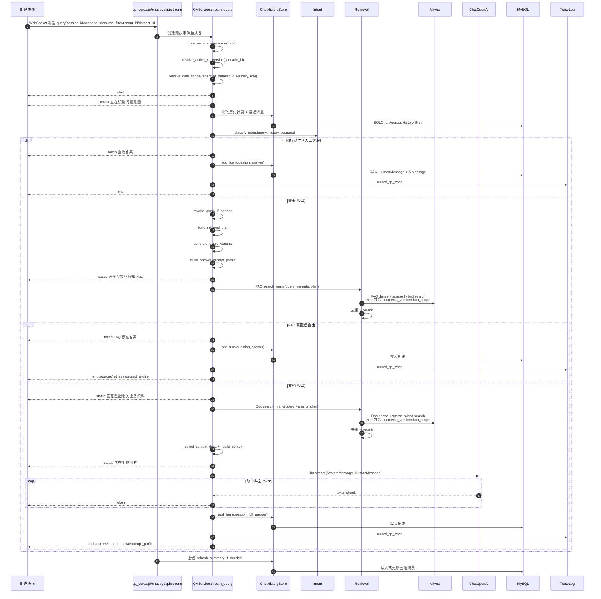
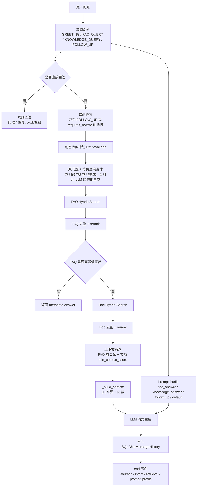
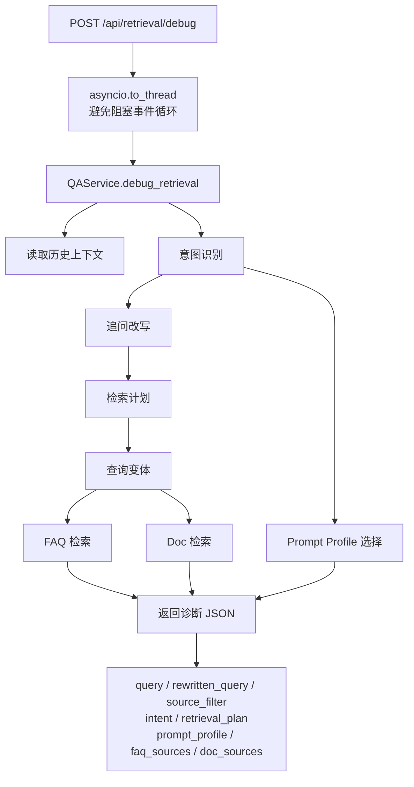
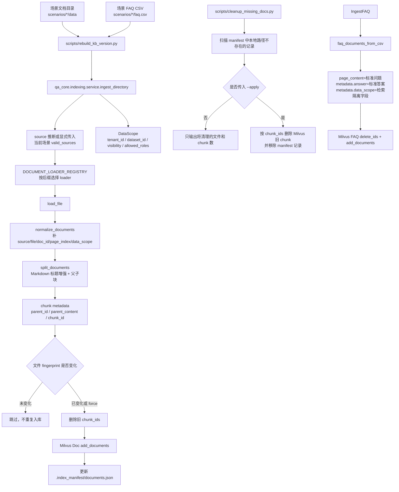
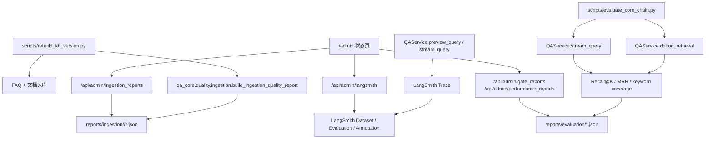
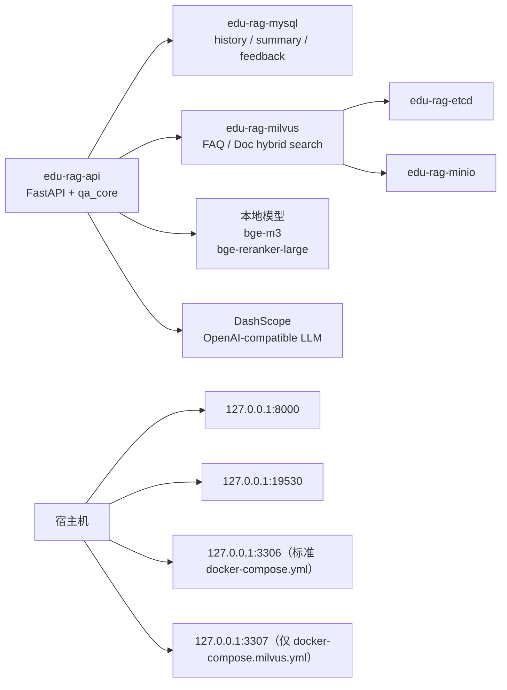

# KnowForge RAG Platform 当前架构详细流程图

本文档只描述优化后架构。边界是：`app.py + qa_core/api + qa_core` 是当前主链路；
旧版 `mysql_qa`、`rag_qa` 代码已经从工程中移除，只在文档中保留迁移前实现对照，
不进入在线请求主流程。

## 1. 总体架构

```mermaid
flowchart TD
    User["浏览器用户"] --> Page["static/index.html"]
    Page --> ScenariosApi["GET /api/scenarios"]
    Page --> CreateSession["POST /api/create_session"]
    Page --> Stream["WebSocket /api/stream"]
    Page --> HistoryApi["GET /api/history/{session_id}"]
    Page --> FeedbackApi["POST /api/feedback"]
    Page --> DebugApi["POST /api/retrieval/debug"]
    AdminPage["static/admin.html"] --> AdminApi["GET /api/admin/*"]

    Stream --> ApiChat["qa_core.api.chat<br/>问答 / 历史 / 反馈 / debug"]
    DebugApi --> ApiChat
    HistoryApi --> ApiChat
    FeedbackApi --> ApiChat
    ScenariosApi --> ApiChat
    CreateSession --> ApiPages["qa_core.api.pages<br/>页面 / 健康检查 / 会话"]
    AdminApi --> ApiAdmin["qa_core.api.admin<br/>trace / 报告"]
    KbApi["GET/POST /api/kb_versions*"] --> ApiVersions["qa_core.api.kb_versions<br/>版本查看 / 激活 / 归档"]

    App["app.py 应用入口<br/>CORS / 静态资源 / 路由注册"] --> ApiPages
    App --> ApiChat
    App --> ApiAdmin
    App --> ApiVersions
    ApiChat --> Factory["qa_core.application.factory.get_qa_service"]
    ApiChat --> ScenarioRegistry["qa_core.scenarios.registry.ScenarioRegistry"]
    ApiAdmin --> AdminReports["qa_core.observability / ingestion_quality"]
    Factory --> Service["qa_core.application.service.QAService"]

    Service --> Scenario["qa_core.scenarios.registry.resolve_scenario"]
    Service --> History["qa_core.memory.history.HistoryStore"]
    Service --> Intent["qa_core.intent.classifier.classify_intent"]
    Service --> Rewrite["qa_core.pipeline.rewrite.rewrite_query_if_needed"]
    Service --> Plan["qa_core.retrieval.strategy.build_retrieval_plan"]
    Service --> Variants["qa_core.pipeline.query_variants.generate_query_variants"]
    Service --> PromptProfile["qa_core.prompts.selector.build_answer_prompt_profile"]
    Service --> LLM["qa_core.llm.client.get_chat_model"]
    Service --> DataScope["qa_core.governance.data_scope.DataScope"]
    Service --> Retrieval["qa_core.retrieval.store.MilvusHybridStore"]
    Service --> Trace["qa_core.observability.langsmith_adapter.record_query_trace"]

    Retrieval --> MilvusFAQ["场景 FAQ Hybrid Collection"]
    Retrieval --> MilvusDoc["场景 Doc Hybrid Collection"]
    Retrieval --> Embedding["BGE-M3 Embedding"]
    Retrieval --> Reranker["CrossEncoder Reranker"]

    History --> MySQL["edu-mysql / MySQL<br/>chat_messages<br/>chat_session_summaries"]
    FeedbackApi --> Feedback["qa_core.memory.feedback.FeedbackStore"]
    Feedback --> MySQL
    Trace --> TraceLog["LangSmith Trace"]
    AdminReports --> TraceLog
    AdminReports --> Reports["reports/ingestion<br/>reports/evaluation"]

    LLM --> DashScope["DashScope OpenAI-compatible API"]
    MilvusFAQ --> Milvus["edu-milvus 2.6.4"]
    MilvusDoc --> Milvus
```

## 2. 在线问答主流程

## 3. 检索与生成细节

## 4. 检索诊断流程

## 5. 文档与 FAQ 入库流程

## 6. 质量治理与管理流程

这部分能力补齐的是“可证明”和“可排查”：

- 入库质量报告证明知识库资料是否解析成功、切分是否健康；
- 评测报告证明检索策略和回答效果是否退化；
- LangSmith Trace 证明一次线上回答的意图、检索计划、来源和耗时；
- 状态页只展示版本、入库、回归报告和 LangSmith 状态，便于面试演示和本地排查。

## 7. 运行依赖关系

## 8. 关键边界

- 在线问答不解析文件、不执行 OCR、不写入知识库。
- 入库链路负责 loader、切分、metadata、manifest 和 Milvus 写入。
- 本地文件删除后，通过 `scripts/cleanup_missing_docs.py` 离线清理旧 chunk；默认 dry-run，不在在线请求中触发。
- MySQL 只负责聊天历史、摘要、反馈，不承担 FAQ/文档检索。
- RedisSearch 不进入当前核心链路。
- 旧 `mysql_qa` / `rag_qa` 代码已移除，不进入 `app.py -> qa_core/api -> qa_core` 主请求链路。
- 配置主链路统一读取 `.env + scenario.toml`，不再引入额外配置入口。
- `ADMIN_API_TOKEN` 是必需配置；问答/调试/反馈接口有轻量进程内限流。
- Milvus、MySQL、本地模型、LLM Key、场景配置和 active 知识库版本都是启动前置条件。
- 业务场景已经冻结为 8 个，`scripts/check_project_guardrails.py` 会阻止继续新增未评审场景包。
- 表格行解析和表格类检索已经进入一期主入库与检索闭环；复杂 OCR 仍是离线治理能力，必须人工复核后再通过资料提升、版本重建和入库质量检查进入 active 知识库。
- 入库质量报告、召回评测和LangSmith 观测已经进入当前工程闭环，但都不在用户在线提问时触发高成本入库或评测。
