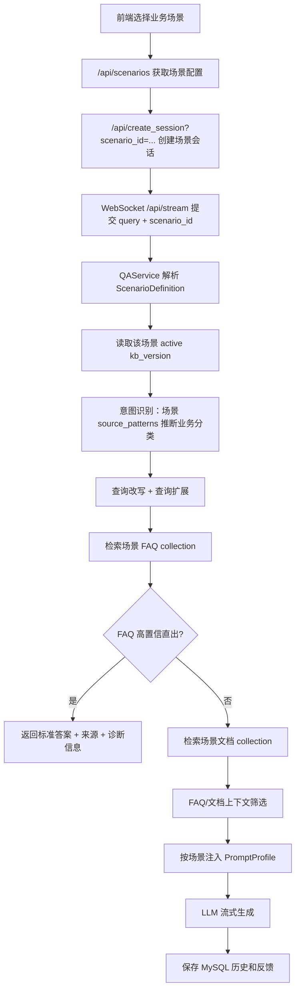

# 多场景知识问答教学项目实施说明

本文档说明当前项目如何从单一教育问答系统升级为“多场景 RAG 教学平台”。目标不是扩散非核心业务功能，而是让同一套 LangChain + Milvus Hybrid + 多版本知识库能力，可以通过配置切换到多个行业背景，帮助学生把工程能力转换成不同简历项目。

## 1. 设计目标

核心能力保持一套：

- 本地文档加载、切分、向量化、Milvus Hybrid 入库；
- FAQ 与文档分集合检索；
- Milvus 2.6.x 内置 BM25 + dense 向量混合召回；
- CrossEncoder rerank；
- 意图识别、追问改写、查询扩展；
- 多版本知识库管理；
- WebSocket 流式回答；
- MySQL 聊天历史、摘要和反馈。

变化的是业务配置：

- 不同场景使用不同 `scenario_id`；
- 不同场景使用不同 FAQ collection、文档 collection；
- 不同场景使用独立知识库版本清单；
- 不同场景使用独立文档目录和 FAQ CSV；
- 不同场景使用自己的业务分类、分类中文名和关键词推断规则；
- 同一套提示词模板根据场景注入助手身份、业务域、行业和人工支持方式。

## 2. 当前已内置场景

| 场景 ID | 场景名称 | 业务背景 | 可包装的简历项目 |
| --- | --- | --- | --- |
| `enterprise_knowledge` | 企业内部知识助手 | 企业制度、HR、IT 支持、流程 SOP | 企业内部知识库智能问答平台 |
| `saas_support` | SaaS 客服知识助手 | 账号、计费、权限、集成、售后 | SaaS 客服智能问答与工单辅助平台 |
| `equipment_ops` | 设备运维知识助手 | 巡检、告警、维修、备件、安全 | 工业设备运维知识库与故障诊断助手 |
| `compliance_qa` | 合规风控知识助手 | 隐私、合同、审计、政策、风险 | 企业合规风控知识问答平台 |
| `cross_border_risk` | 跨境贸易风控助手 | 海关申报、制裁筛查、信用证、贸易术语、单证一致性 | 跨境贸易风控 RAG 知识问答平台 |
| `tender_contract_risk` | 招投标与合同履约风控助手 | 招标文件、投标响应、合同条款、交付验收、履约风险 | 招投标合规与合同履约 RAG 风控平台 |
| `insurance_claims` | 保险理赔审核助手 | 保单条款、理赔材料、责任认定、除外责任、赔付结算 | 保险理赔材料审核与 RAG 知识问答助手 |
| `engineering_project_qa` | 工程项目资料问答助手 | 设计图纸、施工规范、进度计划、质量验收、安全资料 | 工程项目资料与施工规范 RAG 问答助手 |

这些场景不是八套代码，而是八套配置和样例数据。学生掌握的是一套可迁移的 RAG 工程能力。

其中 `cross_border_risk`、`tender_contract_risk`、`insurance_claims` 和 `engineering_project_qa` 是更有辨识度的差异化场景包，用来避免项目只停留在企业制度、客服、运维这类常见背景。前三个强调风控边界，工程项目场景强调多文档、多版本、图纸/规范冲突、标准规范检索和验收资料追溯。它们都不扩散到真实外部系统调用，只把行业资料、风险边界和审核依据沉淀为 FAQ、文档和场景配置，保持一期 RAG 主线干净。

## 3. 目录结构

```text
scenarios/
  enterprise_knowledge/
    scenario.toml
    faq.csv
    data/
      hr_data/
      it_data/
  saas_support/
    scenario.toml
    faq.csv
    data/
      billing_data/
      integration_data/
  equipment_ops/
  compliance_qa/
  cross_border_risk/
  tender_contract_risk/
  insurance_claims/
  engineering_project_qa/
```

每个场景目录包含：

- `scenario.toml`：场景运行配置；
- `faq.csv`：标准问答数据；
- `data/<source>_data/`：本地文档资料目录。

## 4. 场景配置字段

`scenario.toml` 的关键字段如下：

```toml
scenario_id = "saas_support"
display_name = "SaaS 客服知识助手"
industry = "企业 SaaS 服务"
description = "面向账号、计费、权限、集成和售后的客服知识问答场景。"
assistant_name = "SaaS 客服助手"
business_domain = "SaaS 产品账号、计费、权限、集成和售后知识库"
support_contact = "support@example.com"
faq_collection = "saas_faq_hybrid_v1"
doc_collection = "saas_doc_hybrid_v1"
valid_sources = ["account", "billing", "permission", "integration", "support"]
```

`valid_sources` 是当前场景的业务分类白名单，也代表 source 匹配优先级。在线检索、前端下拉框、入库校验、意图识别 source 推断都会使用它。

每个 `valid_sources` 都必须同时满足：

- `source_labels` 中有中文标签；
- `source_patterns` 中有可编译的推断规则；
- `faq.csv` 中至少有一条该 source 的标准问答；
- `data/<source>_data/` 中至少有一份可入库文档。

不允许为了让前端下拉框看起来更丰富而配置空 source。没有 FAQ 和文档支撑的分类，会增加学习成本和检索误导，应等资料补齐后再加入。

`source_patterns` 用于从用户问题中自动推断分类，例如 SaaS 场景中“发票、账单、续费”会推断为 `billing`。

## 5. 主链路流程



## 6. 入库和版本管理

为某个场景完整重建知识库：

```powershell
python scripts\rebuild_kb_version.py --scenario saas_support --new-version --force --activate --description "SaaS 场景全量重建"
```

只入库 FAQ：

```powershell
python scripts\rebuild_kb_version.py --scenario saas_support --new-version --force --quality-gate --activate --skip-docs
```

只入库文档：

```powershell
python scripts\rebuild_kb_version.py --scenario saas_support --new-version --force --quality-gate --activate --skip-faq
```

查看某个场景的版本：

```powershell
python scripts\manage_kb_versions.py --scenario saas_support list
```

每个场景的版本清单默认保存到：

```text
.index_manifest/<scenario_id>/kb_versions.json
```

每个场景的文档增量入库清单默认保存到：

```text
.index_manifest/<scenario_id>/documents.json
```

## 7. 前端交互

页面新增“业务场景”下拉框：

- 切换场景后会重新创建会话，避免不同业务背景的历史混在一起；
- 业务分类下拉框会从 `/api/sources?scenario_id=...` 动态加载；
- WebSocket 请求会携带 `scenario_id`；
- 反馈请求也会携带 `scenario_id`，便于后续按场景统计 bad case。

## 8. 场景扩展冻结与维护方式

当前业务场景已经冻结为 8 个，不再继续新增行业场景包。这个限制已经写入
`scripts/check_project_guardrails.py`，如果后续误加新的 `scenarios/<scenario_id>`，守护检查会失败。

这样做的原因是：一期目标是把 RAG 主链路、入库质量检查、评测、版本和隔离讲透，而不是继续堆业务外壳。继续新增场景会稀释学习重点，增加文档、评测和入库维护成本。

允许继续维护的内容包括：

- 给已有 8 个场景补充更高质量 FAQ 和业务文档；
- 扩充 `eval_sets/multi_scenario_smoke.json` 中的标准评测问题；
- 优化每个场景的 `source_patterns`，提升 source 推断准确率；
- 优化同一场景下的多版本资料，例如工程项目图纸版本、合同版本、保单版本；
- 为二期 Agent 增加工具调用和流程编排，但不新增一期业务场景包。
- 为二期 Agent 增加 Skill 能力包，例如合同风险审查、理赔材料核查、工程资料完整性核查。

如果确实要临时实验新行业，应在分支或独立教学副本中验证，不并入当前主项目。

历史上新增场景的做法是复制已有目录：

```powershell
Copy-Item scenarios\saas_support scenarios\medical_qa -Recurse
```

但当前主项目不再推荐这样扩展。已有场景的维护重点是修改 `scenario.toml`、`faq.csv` 和
`data/<source>_data/`，然后重新入库和跑评测。

维护后执行：

```powershell
python scripts\rebuild_kb_version.py --scenario engineering_project_qa --new-version --force --quality-gate --activate
python scripts\evaluate_core_chain.py --dataset eval_sets\multi_scenario_smoke.json --limit 40 --output reports\evaluation\multi_scenario_smoke_live_40.json
python scripts\evaluate_core_chain.py --dataset eval_sets\multi_scenario_interview_regression.json --limit 16 --output reports\evaluation\multi_scenario_interview_regression_live_16_final.json
```

## 9. 简历转换方式

同一套代码可以包装成不同业务项目，但简历描述要突出“场景差异 + 工程能力”：

- 企业知识库：强调 SOP、内部服务台、权限/制度问答、多版本知识库；
- SaaS 客服：强调 FAQ 直出、计费/账号/集成知识库、客服降本、工单辅助；
- 设备运维：强调告警解释、巡检 SOP、维修手册检索、故障诊断辅助；
- 合规风控：强调隐私合规、合同审核、来源引用、强口径回答和风险控制。
- 跨境贸易风控：强调海关申报、制裁筛查、信用证不符点、贸易术语风险和单证一致性，比普通客服场景更适合讲“业务风险 + RAG 可信边界”。
- 招投标履约风控：强调投标文件合规、合同付款条款、交付延期、验收材料和履约风险预警。
- 保险理赔审核：强调保单条款、理赔材料清单、责任认定、除外责任和赔付金额不能提前承诺。
- 工程项目资料问答：强调设计图纸版本、施工规范冲突处理、进度延期资料、隐蔽验收资料和安全交底资料，适合讲多文档、多版本和标准规范检索。

不能把同一项目简单改名字。面试时应能解释：

- 这个行业的文档结构是什么；
- source 分类如何设计；
- FAQ 和正文为什么分集合；
- 为什么要多版本知识库；
- 意图识别如何影响检索计划和提示词；
- 哪些回答必须强制“未确认”。

增强回归集专门服务这些面试点：

- 不传 `source_filter`，让系统自己根据问题推断 source，避免学生只会“手动选分类”；
- 对合同、回款、制裁名单、强制性规范等问题断言 Prompt Profile，证明高风险问题不是普通模板；
- 同时覆盖 FAQ 直出和文档 RAG，说明项目不是只靠 FAQ 表格硬凑答案。

## 10. 当前边界

已经闭环：

- 场景注册表；
- 场景化 collection；
- 场景化 source 白名单；
- 场景化知识库版本清单；
- 数据域隔离检索；
- 场景化入库目录和 FAQ；
- 场景化提示词注入；
- 场景化前端切换；
- 场景化反馈记录；
- 跨境贸易风控、招投标履约风控、保险理赔审核、工程项目资料问答场景已进入多场景评测集；
- 业务场景扩展已冻结，后续优化只围绕现有场景的数据质量、评测质量、版本治理和二期 Agent 能力。

数据域隔离说明见：

- `docs/data_scope_isolation.md`

仍不默认扩散：

- 复杂 OCR 不进入核心链路；
- 多模态、GraphRAG 不进入一期主链路，后续只作为二期后半或三期增强层；
- 业务系统动作执行不进入主链路；
- RedisSearch 不作为必需组件；
- 每个行业的专业规则不写死在 `qa_core`，应优先沉淀到场景文档、FAQ 和配置中。

## 11. 后续智能化增强路线

当前 8 个场景不再扩展数量，后续通过能力升级提升项目含金量：

| 阶段 | 能力 | 说明 |
| --- | --- | --- |
| 二期首版 | LangGraph Agent | 在一期 RAG 证据之上做任务规划、工具调用、人工确认和结构化输出 |
| 二期首版 | Skill Registry | 把合同风险审查、理赔材料核查、工程资料核查等沉淀为可复用能力包 |
| 二期后半 | A2A Adapter | 支持跨 Agent 或跨系统任务协作 |
| 二期后半 | MCP Adapter | 标准化接入外部工具和资源 |
| 三期 | 多模态入库 | 处理复杂 PDF、扫描件、图纸、票据、验收照片 |
| 三期 | GraphRAG | 用于合同、保单、工程规范等关系推理问题 |

这条路线的重点不是继续新增行业外壳，而是让同一套场景具备从“能问答”到“能核查、能生成
流程草稿、能跨 Agent 协作”的能力升级。
